---
format:
  html: {toc: true, toc-location: right, toc-depth: 4, theme: cosmo}
code-block-background: true

---
<style></style><style>.printedClojure .sourceCode {
  background-color: transparent;
  border-style: none;
}
</style><style>.clay-limit-image-width .clay-image {max-width: 100%}
.clay-side-by-side .sourceCode {margin: 0}
.clay-side-by-side {margin: 1em 0}
</style>
<script src="https://code.jquery.com/jquery-3.6.0.min.js" type="text/javascript"></script><script src="https://code.jquery.com/ui/1.13.1/jquery-ui.min.js" type="text/javascript"></script>

# Vega

The examples of the [Vega-Lite](https://vega.github.io/vega-lite/examples/) and
[Vega](https://vega.github.io/vega/examples/) galleries, rebuilt with cljplot2 - Vega-Lite's categories first, then
the Vega-only ones; an example in both galleries appears once, linking both.

The charts show the same information as the originals; styling differs (cljplot2's theme, not Vega's colours and
padding), and the code is cljplot2's own. Vega-Lite's transforms (`filter`, `calculate`, `aggregate`, `window`,
`fold`, `bin`, `timeUnit`, ...) become plain Clojure data preparation before the plot map; its layers are chart
vectors, its concatenations `plot/arrange`, its facets cljplot2 facets. Only static images: interactive, animated
and geographic examples are left out - the closing "Not reproduced" table lists them with the reason (two
interactive examples appear as static variants). Categorical y axes list their levels top-down, as Vega-Lite does
(`:reverse true` on the y scale - cljplot2's bands start at the bottom).

Data are the [vega-datasets](https://github.com/vega/vega-datasets) files (version 3.3.1), exported by
`dev/vega_data.clj` with kebab-case keys and ISO dates (`"2000-01-01"`, parsed here with `java.time`); a dataset whose
name was taken in the book has the suffix `-vega` (`:seattle-weather-vega`). Each block names its dataset and licence;
where vega-datasets lists no licence, the source is Vega.


::: {.sourceClojure}
```clojure
(ns galleries.vega
  (:require [clojure.string :as str]
            [clojure2d.color :as c]
            [clojure2d.core :as c2d]
            [fastmath.core :as m]
            [fastmath.random :as r]
            [fastmath.signal :as sig]
            [fastmath.stats :as stats]
            [cljplot2.chart :as chart]
            [cljplot2.core :as plot]
            [cljplot2.data.tree :as tree]
            [notebook-utils :as nu])
  (:import [java.time LocalDate]
           [java.time.format DateTimeFormatter]
           [java.time.temporal TemporalAccessor]
           [java.util Locale]))
```
:::


::: {.sourceClojure}
```clojure
(defn- vl-url
  "Page of the Vega-Lite example `name`."
  [name]
  (str "https://vega.github.io/vega-lite/examples/" name ".html"))
```
:::


::: {.printedClojure}
```clojure
#'galleries.vega/vl-url

```
:::


::: {.sourceClojure}
```clojure
(defn- vg-url
  "Page of the Vega example `name`."
  [name]
  (str "https://vega.github.io/vega/examples/" name "/"))
```
:::


::: {.printedClojure}
```clojure
#'galleries.vega/vg-url

```
:::


::: {.sourceClojure}
```clojure
(defn- local-date
  "`java.time.LocalDate` of an ISO date (or date-time) string."
  [s]
  (LocalDate/parse (subs s 0 10)))
```
:::


::: {.printedClojure}
```clojure
#'galleries.vega/local-date

```
:::


::: {.sourceClojure}
```clojure
(def month-names ["Jan" "Feb" "Mar" "Apr" "May" "Jun" "Jul" "Aug" "Sep" "Oct" "Nov" "Dec"])
```
:::


::: {.sourceClojure}
```clojure
(defn- month-name
  "Abbreviated month name of an ISO date string."
  [s]
  (month-names (dec (.getMonthValue (local-date s)))))
```
:::


::: {.printedClojure}
```clojure
#'galleries.vega/month-name

```
:::


::: {.sourceClojure}
```clojure
(def cars (nu/dataset :cars))
```
:::


::: {.sourceClojure}
```clojure
(def population (nu/dataset :population))
```
:::


::: {.sourceClojure}
```clojure
(def movies (nu/dataset :movies))
```
:::


::: {.sourceClojure}
```clojure
(def seattle (nu/dataset :seattle-weather-vega))
```
:::


::: {.sourceClojure}
```clojure
(def barley (nu/dataset :barley-vega))
```
:::


::: {.sourceClojure}
```clojure
(def stocks (mapv #(update % :date local-date) (nu/dataset :stocks)))
```
:::


::: {.sourceClojure}
```clojure
(def goog (filterv #(= "GOOG" (:symbol %)) stocks))
```
:::


::: {.sourceClojure}
```clojure
(def yearly-stocks
  "Mean price per symbol and year (Vega-Lite's `timeUnit` year + `aggregate` mean), at January 1."
  (for [[[symbol year] rows] (group-by (juxt :symbol #(.getYear ^LocalDate (:date %))) stocks)]
    {:symbol symbol :date (LocalDate/of (int year) 1 1) :price (stats/mean (map :price rows))}))
```
:::


::: {.sourceClojure}
```clojure
(def penguins (nu/dataset :penguins))
```
:::


::: {.sourceClojure}
```clojure
(def normal-2d (nu/dataset :normal-2d))
```
:::


::: {.sourceClojure}
```clojure
(def imdb
  "Movies with an IMDB rating."
  (filterv #(number? (:imdb-rating %)) movies))
```
:::


::: {.sourceClojure}
```clojure
(defn- bin-start
  "Start of the bin of width `step` (from 0) holding `v`."
  [step v]
  (* (double step) (m/floor (/ (double v) (double step)))))
```
:::


::: {.printedClojure}
```clojure
#'galleries.vega/bin-start

```
:::


::: {.sourceClojure}
```clojure
(def population-2000
  "Population rows of the year 2000 with `:gender` (`sex` 1 - Male, 2 - Female)."
  (->> population
       (filter #(= 2000 (:year %)))
       (mapv #(assoc % :gender (if (= 2 (:sex %)) "Female" "Male")))))
```
:::


::: {.sourceClojure}
```clojure
(def gender-colors {:domain ["Female" "Male"] :range [[103 81 147] [202 136 97]]})
```
:::


::: {.sourceClojure}
```clojure
(defn- millions
  "Tick label of a count in millions (`12M`), magnitude only."
  [v]
  (str (m/round (/ (m/abs (double v)) 1.0e6)) "M"))
```
:::


::: {.printedClojure}
```clojure
#'galleries.vega/millions

```
:::


::: {.sourceClojure}
```clojure
(defn- billions
  "Tick label of an amount in billions (`12B`)."
  [v]
  (str (m/round (/ (double v) 1.0e9)) "B"))
```
:::


::: {.printedClojure}
```clojure
#'galleries.vega/billions

```
:::


## Bar Charts


### Simple Bar Chart

One bar per category.

Source: Vega-Lite - Simple Bar Chart ([1](https://vega.github.io/vega-lite/examples/bar.html), [2](https://vega.github.io/vega/examples/bar-chart/)).


::: {.sourceClojure}
```clojure
(def abc [{:a "A" :b 28} {:a "B" :b 55} {:a "C" :b 43} {:a "D" :b 91} {:a "E" :b 81} {:a "F" :b 53} {:a "G" :b 19}
          {:a "H" :b 87} {:a "I" :b 52}])
```
:::


::: {.sourceClojure}
```clojure
(plot/render-image
 {:data abc :mapping {:x :a :y :b} :charts [(chart/bar)] :labels {:x "a" :y "b"}}
 {:width 500 :height 300})
```
:::


::: {.clay-image}

:::


### Responsive Bar Chart

The number of cars per origin (the original resizes with its container - not a property of a static image).

Source: [Vega-Lite - Responsive Bar Chart](https://vega.github.io/vega-lite/examples/bar_size_responsive.html). Data: Car specifications and fuel economy, vega-datasets 3.3.1 `cars.json` (https://cdn.jsdelivr.net/npm/vega-datasets@3.3.1/data/cars.json); original: StatLib Datasets Archive; licence: notspecified (vega-datasets `datapackage.json`).


::: {.sourceClojure}
```clojure
(plot/render-image
 {:data cars :mapping {:x :origin} :charts [(chart/bar {:stat :count})] :labels {:x "Origin" :y "Number of Cars"}}
 {:width 600 :height 300})
```
:::


::: {.clay-image}
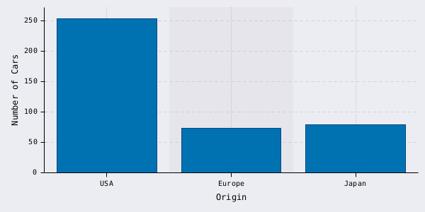
:::


### Aggregate Bar Chart

The US population of 2000 summed per age group.

Source: [Vega-Lite - Aggregate Bar Chart](https://vega.github.io/vega-lite/examples/bar_aggregate.html). Data: U.S. population by age, sex and census year, vega-datasets 3.3.1 `population.json` (https://cdn.jsdelivr.net/npm/vega-datasets@3.3.1/data/population.json); original: IPUMS USA; licence: notspecified (vega-datasets `datapackage.json`).


::: {.sourceClojure}
```clojure
(plot/render-image
 {:data population-2000 :mapping {:y :age :x :people}
  :charts [(chart/bar)]
  :scales {:y {:type :categorical :reverse true} :x {:formatter millions}}
  :labels {:x "population" :y "age"}}
 {:width 500 :height 450})
```
:::


::: {.clay-image}
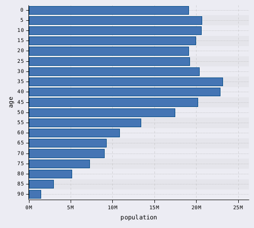
:::


### Aggregate Bar Chart (Sorted)

The same bars ordered by population (largest on top).

Source: [Vega-Lite - Aggregate Bar Chart (Sorted)](https://vega.github.io/vega-lite/examples/bar_aggregate_sort_by_encoding.html). Data: U.S. population by age, sex and census year, vega-datasets 3.3.1 `population.json` (https://cdn.jsdelivr.net/npm/vega-datasets@3.3.1/data/population.json); original: IPUMS USA; licence: notspecified (vega-datasets `datapackage.json`).


::: {.sourceClojure}
```clojure
(let [totals (update-vals (group-by :age population-2000) #(reduce + (map :people %)))]
  (plot/render-image
   {:data population-2000 :mapping {:y :age :x :people}
    :charts [(chart/bar)]
    :scales {:y {:type :categorical :domain (vec (sort-by (comp - totals) (keys totals))) :reverse true}
             :x {:formatter millions}}
    :labels {:x "population" :y "age"}}
   {:width 500 :height 450}))
```
:::


::: {.clay-image}
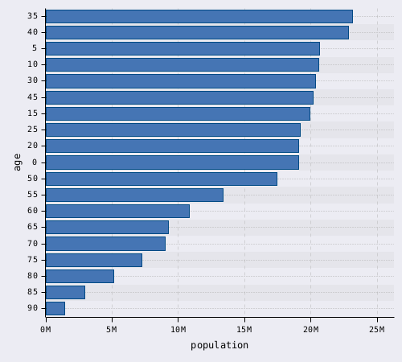
:::


### Grouped Bar Chart

Bars of three groups side by side in every category.

Source: Vega-Lite - Grouped Bar Chart ([1](https://vega.github.io/vega-lite/examples/bar_grouped.html), [2](https://vega.github.io/vega/examples/grouped-bar-chart/)).


::: {.sourceClojure}
```clojure
(plot/render-image
 {:data (for [[category values] [["A" [0.1 0.6 0.9]] ["B" [0.7 0.2 1.1]] ["C" [0.6 0.1 0.2]]]
              [group value] (map vector ["x" "y" "z"] values)]
          {:category category :group group :value value})
  :mapping {:x :category :y :value :color :group}
  :charts [(chart/bar {:position :dodge})]}
 {:width 500 :height 300})
```
:::


::: {.clay-image}
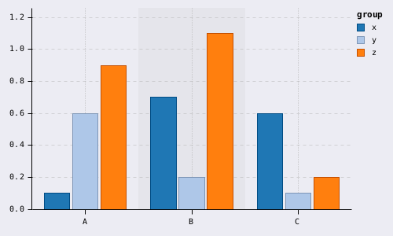
:::


### Grouped Bar Chart (Multiple Measure with Repeat)

Worldwide and US gross summed per genre - the two measures folded into rows (Vega-Lite's `repeat` over layers).

Source: [Vega-Lite - Grouped Bar Chart (Multiple Measure with Repeat)](https://vega.github.io/vega-lite/examples/bar_grouped_repeated.html). Data: Movie box office, budgets and ratings, vega-datasets 3.3.1 `movies.json` (https://cdn.jsdelivr.net/npm/vega-datasets@3.3.1/data/movies.json); licence: none listed - see vega-datasets (cite Vega as the source).


::: {.sourceClojure}
```clojure
(plot/render-image
 {:data (for [movie movies
              :when (:major-genre movie)
              [measure k] [["Worldwide Gross" :worldwide-gross] ["US Gross" :us-gross]]
              :when (number? (k movie))]
          {:genre (:major-genre movie) :gross (k movie) :measure measure})
  :mapping {:y :genre :x :gross :color :measure}
  :charts [(chart/bar {:position :dodge})]
  :scales {:color {:title "Gross"} :x {:formatter billions} :y {:reverse true}}
  :labels {:y "Major Genre" :x "Total Gross"}}
 {:width 800 :height 500})
```
:::


::: {.clay-image}
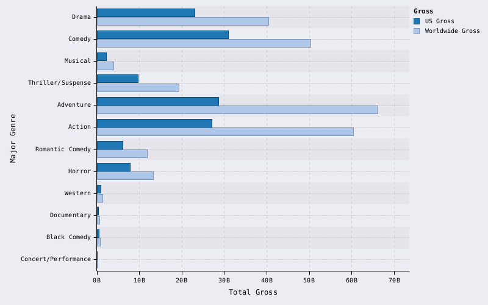
:::


### Stacked Bar Chart

Days of each weather type per month (Seattle 2012-2015), in the original's colours.

Source: Vega-Lite - Stacked Bar Chart ([1](https://vega.github.io/vega-lite/examples/stacked_bar_weather.html), [2](https://vega.github.io/vega/examples/stacked-bar-chart/)). Data: Seattle daily weather from 2012–2015, vega-datasets 3.3.1 `seattle-weather.csv` (https://cdn.jsdelivr.net/npm/vega-datasets@3.3.1/data/seattle-weather.csv); original: NOAA National Climatic Data Center; licence: other-pd (vega-datasets `datapackage.json`).


::: {.sourceClojure}
```clojure
(def weather-colors {:domain ["sun" "fog" "drizzle" "rain" "snow"]
                     :range [[231 186 82] [199 199 199] [174 199 232] [31 119 180] [148 103 189]]})
```
:::


::: {.sourceClojure}
```clojure
(def seattle-months (mapv #(assoc % :month (month-name (:date %))) seattle))
```
:::


::: {.sourceClojure}
```clojure
(plot/render-image
 {:data seattle-months :mapping {:x :month :color :weather}
  :charts [(chart/bar {:stat :count :position :stack})]
  :scales {:x {:domain month-names} :color (assoc weather-colors :title "Weather type")}
  :labels {:x "Month of the year" :y "Count of Records"}}
 {:width 700 :height 400})
```
:::


::: {.clay-image}

:::


### Stacked Bar Chart with Rounded Corners

The same counts, every segment rounded at its top (`:corner-radius-end`).

Source: [Vega-Lite - Stacked Bar Chart with Rounded Corners](https://vega.github.io/vega-lite/examples/stacked_bar_count_corner_radius_mark.html). Data: Seattle daily weather from 2012–2015, vega-datasets 3.3.1 `seattle-weather.csv` (https://cdn.jsdelivr.net/npm/vega-datasets@3.3.1/data/seattle-weather.csv); original: NOAA National Climatic Data Center; licence: other-pd (vega-datasets `datapackage.json`).


::: {.sourceClojure}
```clojure
(plot/render-image
 {:data seattle-months :mapping {:x :month :color :weather}
  :charts [(chart/bar {:stat :count :position :stack :corner-radius-end 3 :stroke-color :white})]
  :scales {:x {:domain month-names} :color {:domain (:domain weather-colors)}}
  :labels {:x "month" :y "Count of Records"}}
 {:width 700 :height 400})
```
:::


::: {.clay-image}
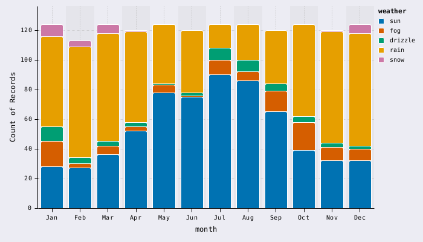
:::


### Horizontal Stacked Bar Chart

Barley yields summed per variety, stacked by site.

Source: [Vega-Lite - Horizontal Stacked Bar Chart](https://vega.github.io/vega-lite/examples/stacked_bar_h.html). Data: Minnesota barley yields by variety and trial site, vega-datasets 3.3.1 `barley.json` (https://cdn.jsdelivr.net/npm/vega-datasets@3.3.1/data/barley.json); original: The Design of Experiments Reference, Wiebe, G. A., Reinbach-Welch, L., Cowan, P. R. (1940). Yields of Barley Varieties in the United States and Canada, 1932-36. United States: U.S. Department of Agriculture.; licence: notspecified (vega-datasets `datapackage.json`).


::: {.sourceClojure}
```clojure
(plot/render-image
 {:data barley :mapping {:y :variety :x :yield :color :site}
  :charts [(chart/bar {:position :stack})]
  :scales {:y {:domain (vec (sort (distinct (map :variety barley)))) :reverse true}}
  :labels {:x "Sum of yield" :y "variety"}}
 {:width 700 :height 400})
```
:::


::: {.clay-image}

:::


### Normalized (Percentage) Stacked Bar Chart

The share of women and men in every age group (2000).

Source: [Vega-Lite - Normalized (Percentage) Stacked Bar Chart](https://vega.github.io/vega-lite/examples/stacked_bar_normalize.html). Data: U.S. population by age, sex and census year, vega-datasets 3.3.1 `population.json` (https://cdn.jsdelivr.net/npm/vega-datasets@3.3.1/data/population.json); original: IPUMS USA; licence: notspecified (vega-datasets `datapackage.json`).


::: {.sourceClojure}
```clojure
(plot/render-image
 {:data population-2000 :mapping {:x :age :y :people :color :gender}
  :charts [(chart/bar {:position :normalize})]
  :scales {:x {:type :categorical} :color gender-colors}
  :labels {:x "age" :y "population"}}
 {:width 700 :height 350})
```
:::


::: {.clay-image}

:::


### Normalized (Percentage) Stacked Bar Chart With Labels

Horizontal, every segment labelled with its population.

Source: [Vega-Lite - Normalized (Percentage) Stacked Bar Chart With Labels](https://vega.github.io/vega-lite/examples/stacked_bar_h_normalized_labeled.html). Data: U.S. population by age, sex and census year, vega-datasets 3.3.1 `population.json` (https://cdn.jsdelivr.net/npm/vega-datasets@3.3.1/data/population.json); original: IPUMS USA; licence: notspecified (vega-datasets `datapackage.json`).


::: {.sourceClojure}
```clojure
(let [sums (update-vals (group-by (juxt :age :gender) population-2000) #(reduce + (map :people %)))]
  (plot/render-image
   {:data population-2000 :mapping {:y :age :x :people :color :gender}
    :charts [(chart/bar {:position :normalize :value-label #(str (sums [(:level %) (get-in % [:group :color])]))
                         :label-position :center})]
    :scales {:y {:type :categorical :reverse true} :color gender-colors}
    :labels {:x "population" :y "age"}}
   {:width 700 :height 600}))
```
:::


::: {.clay-image}

:::


### Gantt Chart (Ranged Bar Marks)

Tasks as ranges from start to end (rects between two data positions).

Source: [Vega-Lite - Gantt Chart (Ranged Bar Marks)](https://vega.github.io/vega-lite/examples/bar_gantt.html).


::: {.sourceClojure}
```clojure
(plot/render-image
 {:data [{:task "A" :start 1 :end 3} {:task "B" :start 3 :end 8} {:task "C" :start 8 :end 10}]
  :charts [(chart/rect {:mapping {:x0 :start :x1 :end :y0 :task :y1 :task} :fill [76 120 168] :band-width 0.8})]
  :scales {:y {:domain ["A" "B" "C"] :reverse true}}
  :labels {:x "start" :y "task"}}
 {:width 500 :height 200})
```
:::


::: {.clay-image}

:::


### A Bar Chart Encoding Color Names in the Data

The bar colours are the data's values (an identity colour scale).

Source: [Vega-Lite - A Bar Chart Encoding Color Names in the Data](https://vega.github.io/vega-lite/examples/bar_color_disabled_scale.html).


::: {.sourceClojure}
```clojure
(plot/render-image
 {:data [{:color "red" :b 28} {:color "green" :b 55} {:color "blue" :b 43}]
  :mapping {:x :color :y :b :color :color}
  :charts [(chart/bar)]
  :scales {:color {:kind :identity}}
  :labels {:x "color" :y "b"}}
 {:width 400 :height 300})
```
:::


::: {.clay-image}
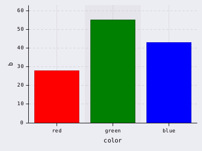
:::


### Layered Bar Chart

Women and men per age group as overlapping translucent bars (not stacked).

Source: [Vega-Lite - Layered Bar Chart](https://vega.github.io/vega-lite/examples/bar_layered_transparent.html). Data: U.S. population by age, sex and census year, vega-datasets 3.3.1 `population.json` (https://cdn.jsdelivr.net/npm/vega-datasets@3.3.1/data/population.json); original: IPUMS USA; licence: notspecified (vega-datasets `datapackage.json`).


::: {.sourceClojure}
```clojure
(plot/render-image
 {:data population-2000 :mapping {:x :age :y :people :color :gender}
  :charts [(chart/bar {:position :overlay :alpha 0.7})]
  :scales {:x {:type :categorical} :y {:formatter millions} :color gender-colors}
  :labels {:x "age" :y "population"}}
 {:width 700 :height 350})
```
:::


::: {.clay-image}
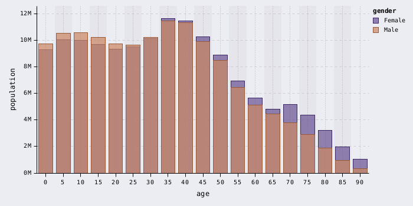
:::


### Diverging Stacked Bar Chart (Population Pyramid)

Women to the left, men to the right of 0 (women's counts negated), ages upward.

Source: Vega-Lite - Diverging Stacked Bar Chart (Population Pyramid) ([1](https://vega.github.io/vega-lite/examples/bar_diverging_stack_population_pyramid.html), [2](https://vega.github.io/vega/examples/population-pyramid/)). Data: U.S. population by age, sex and census year, vega-datasets 3.3.1 `population.json` (https://cdn.jsdelivr.net/npm/vega-datasets@3.3.1/data/population.json); original: IPUMS USA; licence: notspecified (vega-datasets `datapackage.json`).


::: {.sourceClojure}
```clojure
(plot/render-image
 {:data (map #(cond-> % (= "Female" (:gender %)) (update :people -)) population-2000)
  :mapping {:y :age :x :people :color :gender}
  :charts [(chart/bar {:position :stack})]
  :scales {:y {:type :categorical :domain (vec (sort > (distinct (map :age population-2000)))) :reverse true}
           :x {:formatter millions} :color gender-colors}
  :labels {:x "population" :y "age"}}
 {:width 600 :height 450})
```
:::


::: {.clay-image}

:::


### Diverging Stacked Bar Chart (with Neutral Parts)

Survey answers per question as percentages, centred on the middle of the neutral answer: the stack offsets are
computed in Clojure (Vega-Lite's `stack` and `joinaggregate`) and drawn as rects.

Source: [Vega-Lite - Diverging Stacked Bar Chart (with Neutral Parts)](https://vega.github.io/vega-lite/examples/bar_diverging_stack_transform.html).


::: {.sourceClojure}
```clojure
(def survey-answers ["Strongly disagree" "Disagree" "Neither agree nor disagree" "Agree" "Strongly agree"])
```
:::


::: {.sourceClojure}
```clojure
(def survey
  (let [rows [["Question 1" 0.7 9.1 18.5 59.9 11.7] ["Question 2" 18.2 18.2 0 63.6 0] ["Question 3" 20 0 20 40 20]
              ["Question 4" 0 12.5 6.3 43.8 37.5] ["Question 5" 0 4.2 12.5 66.7 16.7] ["Question 6" 6.3 6.3 12.5 56.3 18.8]
              ["Question 7" 0 0 20 80 0] ["Question 8" 0 0 0 0 100]]]
    (vec (for [[question & ps] rows
               :let [offset (+ (nth ps 0) (nth ps 1) (/ (nth ps 2) 2.0))
                     ends (reductions + 0 ps)]
               [answer lo hi] (map vector survey-answers ends (rest ends))]
           {:question question :answer answer :x0 (- lo offset) :x1 (- hi offset)}))))
```
:::


::: {.sourceClojure}
```clojure
(plot/render-image
 {:data survey
  :charts [(chart/rect {:mapping {:x0 :x0 :x1 :x1 :y0 :question :y1 :question :color :answer} :band-width 0.8})]
  :scales {:color {:domain survey-answers :range [[195 13 36] [243 165 131] [204 204 204] [148 198 218] [23 112 171]]
                   :title "Response"}
           :y {:domain (vec (distinct (map :question survey))) :reverse true}}
  :labels {:x "Percentage" :y "Question"}}
 {:width 700 :height 350})
```
:::


::: {.clay-image}

:::


### Simple Bar Chart with Labels

Each bar labelled with its value past its end.

Source: [Vega-Lite - Simple Bar Chart with Labels](https://vega.github.io/vega-lite/examples/layer_bar_labels.html).


::: {.sourceClojure}
```clojure
(plot/render-image
 {:data (take 3 abc) :mapping {:y :a :x :b}
  :charts [(chart/bar {:value-label true})]
  :scales {:x {:domain [0 60]} :y {:reverse true}}
  :labels {:x "b" :y "a"}}
 {:width 500 :height 200})
```
:::


::: {.clay-image}

:::


### Bar Chart with Label Overlays

Mean IMDB rating per genre - grey bars, the genre names written over them (no y axis).

Source: [Vega-Lite - Bar Chart with Label Overlays](https://vega.github.io/vega-lite/examples/layer_bar_labels_grey.html). Data: Movie box office, budgets and ratings, vega-datasets 3.3.1 `movies.json` (https://cdn.jsdelivr.net/npm/vega-datasets@3.3.1/data/movies.json); licence: none listed - see vega-datasets (cite Vega as the source).


::: {.sourceClojure}
```clojure
(let [rated (filter #(and (:major-genre %) (number? (:imdb-rating %))) movies)]
  (plot/render-image
   {:data rated :mapping {:y :major-genre :x :imdb-rating}
    :charts [(chart/bar {:stat :mean :color [221 221 221] :stroke-color :none})
             (chart/text {:data (map (fn [g] {:genre g :x 0.1}) (distinct (map :major-genre rated)))
                          :mapping {:x :x :y :genre :label :genre} :anchor [:left :middle]})]
    :scales {:x {:domain [0 10]} :y {:axis false :domain (vec (sort (distinct (map :major-genre rated)))) :reverse true}}
    :labels {:x "Mean IMDB Ratings" :y nil}}
   {:width 500 :height 400}))
```
:::


::: {.clay-image}

:::


### Bar Chart showing Initials of Month Names

Mean daily precipitation per month, the months labelled by their initials.

Source: [Vega-Lite - Bar Chart showing Initials of Month Names](https://vega.github.io/vega-lite/examples/bar_month_temporal_initial.html). Data: Seattle daily weather from 2012–2015, vega-datasets 3.3.1 `seattle-weather.csv` (https://cdn.jsdelivr.net/npm/vega-datasets@3.3.1/data/seattle-weather.csv); original: NOAA National Climatic Data Center; licence: other-pd (vega-datasets `datapackage.json`).


::: {.sourceClojure}
```clojure
(plot/render-image
 {:data seattle-months :mapping {:x :month :y :precipitation}
  :charts [(chart/bar {:stat :mean})]
  :scales {:x {:domain month-names :formatter #(subs % 0 1)}}
  :labels {:x "date (month)" :y "Mean of precipitation"}}
 {:width 500 :height 300})
```
:::


::: {.clay-image}

:::


### Bar Chart with bars center-aligned with time unit ticks

The same means on a time axis: each month's bar centred on its first day (rects a month wide).

Source: [Vega-Lite - Bar Chart with bars center-aligned with time unit ticks](https://vega.github.io/vega-lite/examples/bar_month_temporal_band_center.html). Data: Seattle daily weather from 2012–2015, vega-datasets 3.3.1 `seattle-weather.csv` (https://cdn.jsdelivr.net/npm/vega-datasets@3.3.1/data/seattle-weather.csv); original: NOAA National Climatic Data Center; licence: other-pd (vega-datasets `datapackage.json`).


::: {.sourceClojure}
```clojure
(let [means (update-vals (group-by #(.getMonthValue (local-date (:date %))) seattle) #(stats/mean (map :precipitation %)))]
  (plot/render-image
   {:data (for [[month mean] means :let [start (LocalDate/of 2000 (int month) 1)]]
            {:x0 (.minusDays start 13) :x1 (.plusDays start 13) :y0 0.0 :y1 mean})
    :charts [(chart/rect {:mapping {:x0 :x0 :x1 :x1 :y0 :y0 :y1 :y1} :fill [76 120 168]})]
    :scales {:x {:formatter #(.format (DateTimeFormatter/ofPattern "MMM" Locale/ENGLISH) ^TemporalAccessor %)}}
    :labels {:x "date (month)" :y "Mean of precipitation"}}
   {:width 600 :height 300}))
```
:::


::: {.clay-image}

:::


### Bar Chart with Negative Values and a Zero-Baseline

Bars below and above a black line at 0.

Source: [Vega-Lite - Bar Chart with Negative Values and a Zero-Baseline](https://vega.github.io/vega-lite/examples/bar_negative.html).


::: {.sourceClojure}
```clojure
(def abc-negative (mapv (fn [row v] (assoc row :b v)) abc [-28 55 -33 91 81 53 -19 87 52]))
```
:::


::: {.sourceClojure}
```clojure
(plot/render-image
 {:data abc-negative :mapping {:x :a :y :b}
  :charts [(chart/bar) (chart/rule {:y 0 :color :black})]
  :labels {:x "a" :y "b"}}
 {:width 500 :height 300})
```
:::


::: {.clay-image}
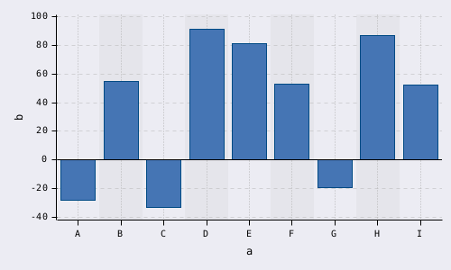
:::


### Horizontal Bar Chart with Negative Values and Labels

Labels past each bar's end - on the left of negative bars.

Source: [Vega-Lite - Horizontal Bar Chart with Negative Values and Labels](https://vega.github.io/vega-lite/examples/bar_negative_horizontal_label.html).


::: {.sourceClojure}
```clojure
(plot/render-image
 {:data abc-negative :mapping {:y :a :x :b}
  :charts [(chart/bar {:value-label true}) (chart/rule {:x 0 :color :black})]
  :scales {:y {:reverse true}}
  :labels {:x "b" :y "a"}}
 {:width 500 :height 350})
```
:::


::: {.clay-image}

:::


### Bar Chart with a Spacing-Saving Y-Axis

The origin labels sit above their bars at the start of the value axis - text at x = 0, the y axis hidden (a
recipe: cljplot2 has no labels-inside axis option).

Source: [Vega-Lite - Bar Chart with a Spacing-Saving Y-Axis](https://vega.github.io/vega-lite/examples/bar_axis_space_saving.html). Data: Car specifications and fuel economy, vega-datasets 3.3.1 `cars.json` (https://cdn.jsdelivr.net/npm/vega-datasets@3.3.1/data/cars.json); original: StatLib Datasets Archive; licence: notspecified (vega-datasets `datapackage.json`).


::: {.sourceClojure}
```clojure
(plot/render-image
 {:data cars :mapping {:y :origin}
  :charts [(chart/bar {:stat :count :width 0.45 :corner-radius-end 2})
           (chart/text {:data (map (fn [o] {:origin o :x 0}) (distinct (map :origin cars)))
                        :mapping {:x :x :y :origin :label :origin} :anchor [:left :bottom] :offset [2 12]})]
  :scales {:y {:axis false :domain ["Europe" "Japan" "USA"] :reverse true}}
  :labels {:x "Number of Cars" :y nil}}
 {:width 500 :height 250})
```
:::


::: {.clay-image}

:::


### Heat Lane Chart

Cars per horsepower bin as a lane: each bin a rounded rect, as tall as its count and centred on 0, coloured by the
count (the user's variant: plain rounded bars, without the original's outer band).

Source: [Vega-Lite - Heat Lane Chart](https://vega.github.io/vega-lite/examples/bar_heatlane.html). Data: Car specifications and fuel economy, vega-datasets 3.3.1 `cars.json` (https://cdn.jsdelivr.net/npm/vega-datasets@3.3.1/data/cars.json); original: StatLib Datasets Archive; licence: notspecified (vega-datasets `datapackage.json`).


::: {.sourceClojure}
```clojure
(let [hp (keep :horsepower cars)
      bins (->> hp (group-by #(* 20 (quot (long %) 20))) (map (fn [[lo vs]] {:lo lo :n (count vs)})))]
  (plot/render-image
   {:data (map (fn [{:keys [lo n]}] {:x0 (+ lo 1) :x1 (+ lo 19) :y0 (- (/ n 2.0)) :y1 (/ n 2.0) :count n}) bins)
    :charts [(chart/rect {:mapping {:x0 :x0 :x1 :x1 :y0 :y0 :y1 :y1 :color :count} :corner-radius 3})]
    :scales {:x {:domain [0 240]} :y {:axis false} :color {:range [[222 238 238] [44 120 150]] :title "count"}}
    :labels {:title "Heat Lane of Horsepower" :x "Horsepower" :y nil}}
   {:width 700 :height 250}))
```
:::


::: {.clay-image}

:::


## Histograms, Density Plots, and Dot Plots


### Histogram

IMDB ratings of the movies in bins of 1 (the Vega example bins 500 normal values - right).

Source: Vega-Lite - Histogram ([1](https://vega.github.io/vega-lite/examples/histogram.html), [2](https://vega.github.io/vega/examples/histogram/)). Data: Movie box office, budgets and ratings, vega-datasets 3.3.1 `movies.json` (https://cdn.jsdelivr.net/npm/vega-datasets@3.3.1/data/movies.json); licence: none listed - see vega-datasets (cite Vega as the source).


::: {.sourceClojure}
```clojure
(plot/render-image
 (plot/arrange
  [{:data imdb :mapping {:x :imdb-rating}
    :charts [(chart/histogram {:bins (vec (range 1 11)) :y :count})]
    :labels {:x "IMDB Rating (binned)" :y "Count of Records"}}
   {:data normal-2d :mapping {:x :u}
    :charts [(chart/histogram {:bins (mapv #(/ (double %) 10.0) (range -8 9)) :y :count})]
    :labels {:x "u" :y "count"}}]
  {:columns 2})
 {:width 900 :height 320})
```
:::


::: {.clay-image}

:::


### Histogram (from Binned Data)

Counts already binned in the data: a rect per bin.

Source: [Vega-Lite - Histogram (from Binned Data)](https://vega.github.io/vega-lite/examples/bar_binned_data.html).


::: {.sourceClojure}
```clojure
(plot/render-image
 {:data (map (fn [lo n] {:lo lo :hi (+ lo 2) :y0 0 :count n}) (range 8 24 2) [7 29 71 127 94 54 17 5])
  :charts [(chart/rect {:mapping {:x0 :lo :x1 :hi :y0 :y0 :y1 :count} :fill [76 120 168] :stroke-color :white
                        :stroke-width 1})]
  :scales {:x {:ticks (vec (range 8 25 2))}}
  :labels {:x "bin_start" :y "count"}}
 {:width 500 :height 300})
```
:::


::: {.clay-image}

:::


### Log-scaled Histogram

Values spanning five orders of magnitude, binned by powers of ten on a log axis.

Source: [Vega-Lite - Log-scaled Histogram](https://vega.github.io/vega-lite/examples/histogram_log.html).


::: {.sourceClojure}
```clojure
(plot/render-image
 {:data (map (fn [x] {:x x}) [0.01 0.1 1 1 1 1 10 10 100 500 800])
  :mapping {:x :x}
  :charts [(chart/histogram {:bins [0.01 0.1 1 10 100 1000] :y :count})]
  :scales {:x {:kind :log}}
  :labels {:x "x1" :y "Count of Records"}}
 {:width 500 :height 300})
```
:::


::: {.clay-image}

:::


### Non-linear Histogram

Share of frames by render time: bins of unequal width, each bar labelled by the frame rate at its start (`∞` - the
slowest bin's open end).

Source: [Vega-Lite - Non-linear Histogram](https://vega.github.io/vega-lite/examples/histogram_nonlinear.html).


::: {.sourceClojure}
```clojure
(let [starts [0 8.33 12.5 16.67 33.33 50 66.67 83.33]
      fps (fn [ms] (if (zero? (double ms)) "∞" (str (m/round (/ 1000.0 (double ms))))))]
  (plot/render-image
   {:data (map (fn [ms residency] {:fps (fps ms) :residency residency}) starts [0 0 31.17 38.96 6.49 2.9 2.6 16.88])
    :mapping {:x :fps :y :residency}
    :charts [(chart/bar {:width 1.0 :stroke-color :white})]
    :scales {:x {:domain (mapv fps starts)} :y {:domain [0 100] :formatter #(str (m/round (double %)) "%")}}
    :labels {:title "Distribution of Frame Render Time (fps)" :x nil :y nil}}
   {:width 600 :height 300}))
```
:::


::: {.clay-image}
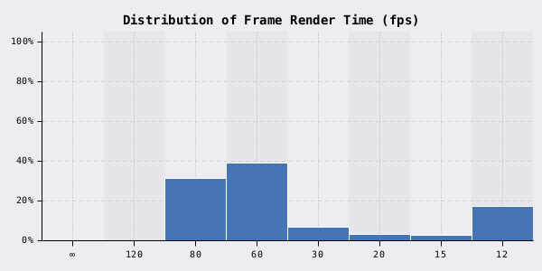
:::


### Relative Frequency Histogram

The share of cars in every horsepower bin.

Source: [Vega-Lite - Relative Frequency Histogram](https://vega.github.io/vega-lite/examples/histogram_rel_freq.html). Data: Car specifications and fuel economy, vega-datasets 3.3.1 `cars.json` (https://cdn.jsdelivr.net/npm/vega-datasets@3.3.1/data/cars.json); original: StatLib Datasets Archive; licence: notspecified (vega-datasets `datapackage.json`).


::: {.sourceClojure}
```clojure
(plot/render-image
 {:data (filter :horsepower cars) :mapping {:x :horsepower}
  :charts [(chart/histogram {:bins (vec (range 40 241 20)) :y :pmf})]
  :scales {:y {:formatter #(format "%.1f%%" (* 100.0 (double %)))}}
  :labels {:x "Horsepower" :y "Relative Frequency"}}
 {:width 500 :height 300})
```
:::


::: {.clay-image}

:::


### Density Plot

A kernel density estimate of the IMDB ratings, bandwidth 0.3 (right: the Vega example's normal values).

Source: Vega-Lite - Density Plot ([1](https://vega.github.io/vega-lite/examples/area_density.html), [2](https://vega.github.io/vega/examples/probability-density/)). Data: Movie box office, budgets and ratings, vega-datasets 3.3.1 `movies.json` (https://cdn.jsdelivr.net/npm/vega-datasets@3.3.1/data/movies.json); licence: none listed - see vega-datasets (cite Vega as the source).


::: {.sourceClojure}
```clojure
(plot/render-image
 (plot/arrange
  [{:data imdb :mapping {:x :imdb-rating}
    :charts [(chart/density {:bandwidth 0.3 :fill :color})]
    :labels {:x "IMDB Rating" :y "density"}}
   {:data normal-2d :mapping {:x :u}
    :charts [(chart/density {:fill :color}) (chart/rug)]
    :labels {:x "u" :y "density"}}]
  {:columns 2})
 {:width 900 :height 300})
```
:::


::: {.clay-image}

:::


### Stacked Density Estimates

Penguin body mass densities per species, stacked.

Source: [Vega-Lite - Stacked Density Estimates](https://vega.github.io/vega-lite/examples/area_density_stacked.html). Data: Palmer Archipelago penguin measurements, vega-datasets 3.3.1 `penguins.json` (https://cdn.jsdelivr.net/npm/vega-datasets@3.3.1/data/penguins.json); original: Palmer Station Antarctica LTER, Allison Horst's Penguins Repository; licence: CC0-1.0 (vega-datasets `datapackage.json`).


::: {.sourceClojure}
```clojure
(plot/render-image
 {:data (filter :body-mass-g penguins) :mapping {:x :body-mass-g :color :species}
  :charts [(chart/density {:position :stack})]
  :scales {:x {:domain [2500 6500]}}
  :labels {:title "Distribution of Body Mass of Penguins" :x "Body Mass (g)" :y "density"}}
 {:width 600 :height 350})
```
:::


::: {.clay-image}

:::


### 2D Histogram Scatterplot

Movies counted in bins of IMDB (1) and Rotten Tomatoes (10) ratings, a circle per bin sized by its count.

Source: Vega-Lite - 2D Histogram Scatterplot ([1](https://vega.github.io/vega-lite/examples/circle_binned.html), [2](https://vega.github.io/vega/examples/binned-scatter-plot/)). Data: Movie box office, budgets and ratings, vega-datasets 3.3.1 `movies.json` (https://cdn.jsdelivr.net/npm/vega-datasets@3.3.1/data/movies.json); licence: none listed - see vega-datasets (cite Vega as the source).


::: {.sourceClojure}
```clojure
(let [rated (filter #(and (number? (:imdb-rating %)) (number? (:rotten-tomatoes-rating %))) movies)
      counts (frequencies (map (juxt #(bin-start 1 (:imdb-rating %)) #(bin-start 10 (:rotten-tomatoes-rating %))) rated))]
  (plot/render-image
   {:data (map (fn [[[x y] n]] {:x (+ x 0.5) :y (+ y 5.0) :n n}) counts)
    :mapping {:x :x :y :y :size :n}
    :charts [(chart/scatter {:color [76 120 168]})]
    :scales {:size {:range [2 24] :area true :title "Count of Records"}}
    :labels {:x "IMDB Rating (binned)" :y "Rotten Tomatoes Rating (binned)"}}
   {:width 600 :height 450}))
```
:::


::: {.clay-image}
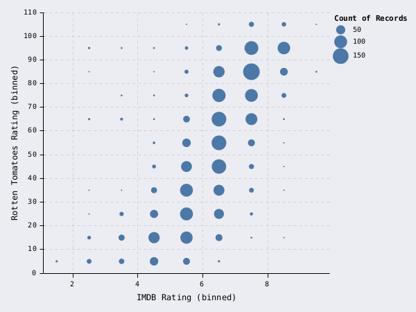
:::


### 2D Histogram Heatmap

The same ratings in finer bins (IMDB 0.2, Rotten Tomatoes 5), each cell coloured by its count.

Source: [Vega-Lite - 2D Histogram Heatmap](https://vega.github.io/vega-lite/examples/rect_binned_heatmap.html). Data: Movie box office, budgets and ratings, vega-datasets 3.3.1 `movies.json` (https://cdn.jsdelivr.net/npm/vega-datasets@3.3.1/data/movies.json); licence: none listed - see vega-datasets (cite Vega as the source).


::: {.sourceClojure}
```clojure
(let [rated (filter #(and (number? (:imdb-rating %)) (number? (:rotten-tomatoes-rating %))) movies)
      counts (frequencies (map (juxt #(bin-start 0.2 (:imdb-rating %)) #(bin-start 5 (:rotten-tomatoes-rating %))) rated))]
  (plot/render-image
   {:data (map (fn [[[x y] n]] {:x (+ x 0.1) :y (+ y 2.5) :n n}) counts)
    :mapping {:x :x :y :y :color :n}
    :charts [(chart/tile)]
    :scales {:color {:title "Count of Records"}}
    :labels {:x "IMDB Rating (binned)" :y "Rotten Tomatoes Rating (binned)"}}
   {:width 700 :height 450}))
```
:::


::: {.clay-image}
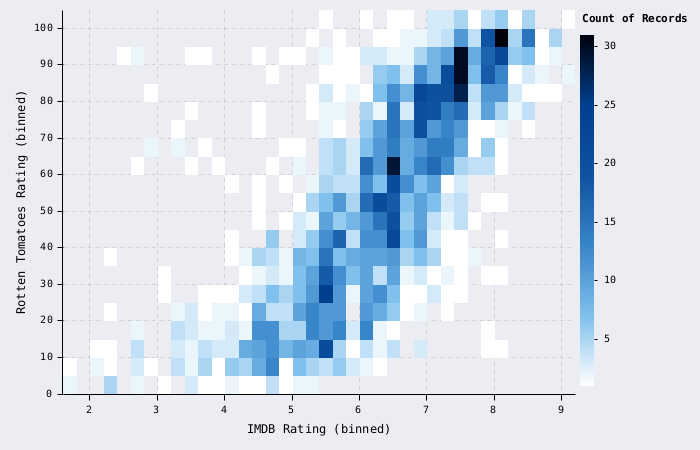
:::


### Cumulative Frequency Distribution

Movies with an IMDB rating up to each value - counts per rating, summed in rating order (Vega-Lite's `window`).

Source: [Vega-Lite - Cumulative Frequency Distribution](https://vega.github.io/vega-lite/examples/area_cumulative_freq.html). Data: Movie box office, budgets and ratings, vega-datasets 3.3.1 `movies.json` (https://cdn.jsdelivr.net/npm/vega-datasets@3.3.1/data/movies.json); licence: none listed - see vega-datasets (cite Vega as the source).


::: {.sourceClojure}
```clojure
(let [counts (sort (frequencies (map :imdb-rating imdb)))]
  (plot/render-image
   {:data (map (fn [[rating] total] {:rating rating :total total}) counts (reductions + (map second counts)))
    :mapping {:x :rating :y :total}
    :charts [(chart/line {:fill :color})]
    :labels {:x "IMDB Rating" :y "Cumulative Count"}}
   {:width 600 :height 300}))
```
:::


::: {.clay-image}
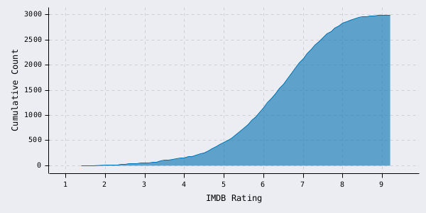
:::


### Layered Histogram and Cumulative Histogram

Cumulative counts per rating bin (histogram `:y :cumulative`), the bin counts over them in translucent yellow.

Source: [Vega-Lite - Layered Histogram and Cumulative Histogram](https://vega.github.io/vega-lite/examples/layer_cumulative_histogram.html). Data: Movie box office, budgets and ratings, vega-datasets 3.3.1 `movies.json` (https://cdn.jsdelivr.net/npm/vega-datasets@3.3.1/data/movies.json); licence: none listed - see vega-datasets (cite Vega as the source).


::: {.sourceClojure}
```clojure
(plot/render-image
 {:data imdb :mapping {:x :imdb-rating}
  :charts [(chart/histogram {:bins (vec (range 1 11)) :y :cumulative :stroke-color :white})
           (chart/histogram {:bins (vec (range 1 11)) :y :count :color [255 255 0 128] :stroke-color :white})]
  :labels {:x "IMDB Rating" :y "Cumulative Count"}}
 {:width 600 :height 350})
```
:::


::: {.clay-image}

:::


### Wilkinson Dot Plot

A stack of dots per value (Vega's dot plot - Wilkinson dot density bins of its sample - right).

Source: Vega-Lite - Wilkinson Dot Plot ([1](https://vega.github.io/vega-lite/examples/circle_wilkinson_dotplot.html), [2](https://vega.github.io/vega/examples/dot-plot/)).


::: {.sourceClojure}
```clojure
(plot/render-image
 (plot/arrange
  [{:data (map (fn [v] {:v v}) [1 1 1 1 1 1 1 1 1 1 2 2 2 3 3 4 4 4 4 4 4])
    :mapping {:x :v} :charts [(chart/dotplot {:binwidth 1})] :labels {:x "data"}}
   {:data (map (fn [v] {:v v}) [6.3 2.1 9.1 15.8 5.2 10.9 8.3 11.0 3.2 7.6 6.3 8.6 6.6 9.5 4.8 12.0 3.3 11.0 4.7 10.4
                                7.4 2.1 7.7 17.9 6.1 8.2 8.4 11.9 10.8 13.8 14.3 15.2 10.0 11.9 6.5 7.5 10.6 7.4 8.4 5.7
                                4.9 3.2 8.1 11.0 4.9 13.2 9.7 12.8])
    :mapping {:x :v} :charts [(chart/dotplot {:binwidth 0.65})] :labels {:x "Density Dot Plot"}}]
  {:columns 2})
 {:width 900 :height 220})
```
:::


::: {.clay-image}

:::


### Isotype Dot Plot

Livestock of Great Britain and the United States, one icon per unit (the icons are cljplot2's own SVG paths).

Source: [Vega-Lite - Isotype Dot Plot](https://vega.github.io/vega-lite/examples/isotype_bar_chart.html).


::: {.sourceClojure}
```clojure
(def livestock
  "Units of livestock per country (one row per icon, `:col` its position)."
  (for [[country counts] [["Great Britain" {"cattle" 3 "pigs" 2 "sheep" 10}]
                          ["United States" {"cattle" 9 "pigs" 6 "sheep" 7}]]
        animal ["cattle" "pigs" "sheep"]
        col (range 1 (inc (counts animal)))]
    {:country country :animal animal :col col}))
```
:::


::: {.sourceClojure}
```clojure
(def animal-icons
  {"cattle" {:path "M2 4 L14 4 L16 2 L19 3 L18 6 L16 6 L16 11 L14 11 L14 8 L5 8 L5 11 L3 11 L3 7 L1 6 Z"}
   "pigs" {:path "M3 5 C3 2 13 2 15 4 L18 4 L18 7 L16 7 C16 9 14 10 12 10 L12 12 L10 12 L10 10 L7 10 L7 12 L5 12 L5 10 C3 9 3 7 3 5 Z"}
   "sheep" {:path "M4 5 C2 5 2 2 5 2 C6 0 9 0 10 2 C12 0 15 1 15 3 L18 3 L18 6 L15 6 C14 8 12 8 11 8 L11 11 L9 11 L9 8 L7 8 L7 11 L5 11 L5 8 C3 8 2 6 4 5 Z"}})
```
:::


::: {.sourceClojure}
```clojure
(plot/render-image
 {:data livestock :mapping {:x :col :y :animal :shape :animal :color :animal :facet :country}
  :charts [(chart/scatter {:size 26})]
  :scales {:shape {:domain ["cattle" "pigs" "sheep"] :range (mapv animal-icons ["cattle" "pigs" "sheep"])}
           :color {:domain ["cattle" "pigs" "sheep"] :range [[118 43 131] [192 144 87] [91 160 87]]}
           :x {:axis false} :y {:domain ["cattle" "pigs" "sheep"] :reverse true}}
  :facets {:columns 1}
  :labels {:x nil :y nil}}
 {:width 700 :height 400})
```
:::


::: {.clay-image}

:::


### Isotype Dot Plot with Emoji

The same counts as emoji (monochrome, from the bundled Noto Emoji font), ranked within each country and animal.

Source: [Vega-Lite - Isotype Dot Plot with Emoji](https://vega.github.io/vega-lite/examples/isotype_bar_chart_emoji.html).


::: {.sourceClojure}
```clojure
(plot/render-image
 {:data livestock :mapping {:x :col :y :animal :shape :animal :facet :country}
  :charts [(chart/scatter {:size 24 :color :black})]
  :scales {:shape {:domain ["cattle" "pigs" "sheep"]
                   :range [{:text "\uD83D\uDC04"} {:text "\uD83D\uDC16"} {:text "\uD83D\uDC11"}]}
           :x {:axis false} :y {:domain ["cattle" "pigs" "sheep"] :reverse true}}
  :facets {:columns 1}
  :labels {:x nil :y nil}}
 {:width 700 :height 400})
```
:::


::: {.clay-image}
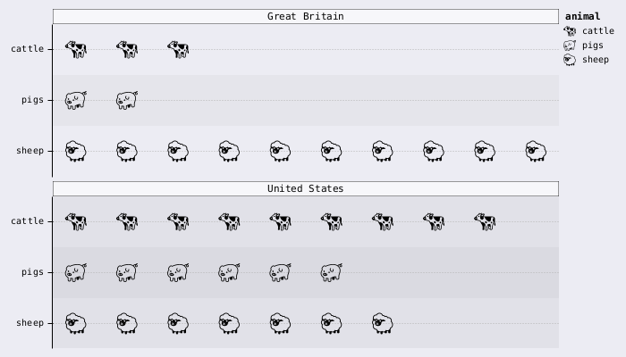
:::


### Relative Bar Chart (Calculate Percentage of Total)

Each activity's share of the day (Vega-Lite's `joinaggregate` for the total).

Source: [Vega-Lite - Relative Bar Chart (Calculate Percentage of Total)](https://vega.github.io/vega-lite/examples/bar_percent_of_total.html).


::: {.sourceClojure}
```clojure
(let [activities [["Sleeping" 8] ["Eating" 2] ["TV" 4] ["Work" 8] ["Exercise" 2]]
      total (reduce + (map second activities))]
  (plot/render-image
   {:data (map (fn [[activity time]] {:activity activity :share (/ (double time) total)}) activities)
    :mapping {:y :activity :x :share}
    :charts [(chart/bar)]
    :scales {:x {:formatter #(str (m/round (* 100.0 (double %))) "%")} :y {:domain (vec (sort (map first activities))) :reverse true}}
    :labels {:x "% of total Time" :y "Activity"}}
   {:width 500 :height 250}))
```
:::


::: {.clay-image}

:::


## Scatter & Strip Plots


### Scatterplot

Miles per gallon against horsepower, hollow points.

Source: Vega-Lite - Scatterplot ([1](https://vega.github.io/vega-lite/examples/point_2d.html), [2](https://vega.github.io/vega/examples/scatter-plot/)). Data: Car specifications and fuel economy, vega-datasets 3.3.1 `cars.json` (https://cdn.jsdelivr.net/npm/vega-datasets@3.3.1/data/cars.json); original: StatLib Datasets Archive; licence: notspecified (vega-datasets `datapackage.json`).


::: {.sourceClojure}
```clojure
(plot/render-image
 {:data cars :mapping {:x :horsepower :y :miles-per-gallon}
  :charts [(chart/scatter {:shape \o :size 8 :color [76 120 168]})]
  :labels {:x "Horsepower" :y "Miles_per_Gallon"}}
 {:width 500 :height 400})
```
:::


::: {.clay-image}

:::


### 1D Strip Plot

Daily precipitation as ticks along one axis (a rug - Vega-Lite's `tick` mark).

Source: [Vega-Lite - 1D Strip Plot](https://vega.github.io/vega-lite/examples/tick_dot.html). Data: Seattle daily weather from 2012–2015, vega-datasets 3.3.1 `seattle-weather.csv` (https://cdn.jsdelivr.net/npm/vega-datasets@3.3.1/data/seattle-weather.csv); original: NOAA National Climatic Data Center; licence: other-pd (vega-datasets `datapackage.json`).


::: {.sourceClojure}
```clojure
(plot/render-image
 {:data seattle :mapping {:x :precipitation}
  :charts [(chart/rug {:place :center :thickness 20 :color [76 120 168]})]
  :labels {:x "precipitation"}}
 {:width 600 :height 120})
```
:::


::: {.clay-image}

:::


### Strip Plot

Horsepower per number of cylinders, a tick per car (a rug per level).

Source: [Vega-Lite - Strip Plot](https://vega.github.io/vega-lite/examples/tick_strip.html). Data: Car specifications and fuel economy, vega-datasets 3.3.1 `cars.json` (https://cdn.jsdelivr.net/npm/vega-datasets@3.3.1/data/cars.json); original: StatLib Datasets Archive; licence: notspecified (vega-datasets `datapackage.json`).


::: {.sourceClojure}
```clojure
(plot/render-image
 {:data cars :mapping {:x :horsepower :y :cylinders}
  :charts [(chart/rug {:thickness 20 :color [76 120 168]})]
  :scales {:y {:type :categorical :reverse true}}
  :labels {:x "Horsepower" :y "Cylinders"}}
 {:width 600 :height 300})
```
:::


::: {.clay-image}

:::


### Colored Scatterplot

Penguins by flipper length and body mass, species in colour and shape.

Source: [Vega-Lite - Colored Scatterplot](https://vega.github.io/vega-lite/examples/point_color_with_shape.html). Data: Palmer Archipelago penguin measurements, vega-datasets 3.3.1 `penguins.json` (https://cdn.jsdelivr.net/npm/vega-datasets@3.3.1/data/penguins.json); original: Palmer Station Antarctica LTER, Allison Horst's Penguins Repository; licence: CC0-1.0 (vega-datasets `datapackage.json`).


::: {.sourceClojure}
```clojure
(plot/render-image
 {:data penguins :mapping {:x :flipper-length-mm :y :body-mass-g :color :species :shape :species}
  :charts [(chart/scatter {:size 8})]
  :scales {:shape {:range [\o \s \+]}}
  :labels {:x "Flipper Length (mm)" :y "Body Mass (g)"}}
 {:width 600 :height 400})
```
:::


::: {.clay-image}

:::


### Bubble Plot

The scatterplot with point sizes by acceleration.

Source: [Vega-Lite - Bubble Plot](https://vega.github.io/vega-lite/examples/point_bubble.html). Data: Car specifications and fuel economy, vega-datasets 3.3.1 `cars.json` (https://cdn.jsdelivr.net/npm/vega-datasets@3.3.1/data/cars.json); original: StatLib Datasets Archive; licence: notspecified (vega-datasets `datapackage.json`).


::: {.sourceClojure}
```clojure
(plot/render-image
 {:data cars :mapping {:x :horsepower :y :miles-per-gallon :size :acceleration}
  :charts [(chart/scatter {:shape \o :color [76 120 168]})]
  :scales {:size {:range [3 14] :title "Acceleration"}}
  :labels {:x "Horsepower" :y "Miles_per_Gallon"}}
 {:width 600 :height 400})
```
:::


::: {.clay-image}
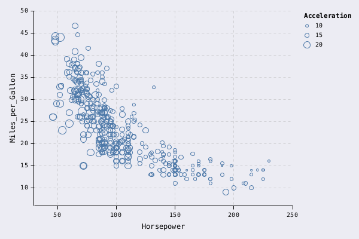
:::


### Scatterplot with Null Values in Grey

Rotten Tomatoes against IMDB ratings; a movie missing one rating can't be a point - it is a grey tick in the
margin of the rating it has (a recipe: `:margins` rugs in the theme's NA colour, the user's suggestion).

Source: Vega-Lite - Scatterplot with Null Values in Grey ([1](https://vega.github.io/vega-lite/examples/point_invalid_color.html), [2](https://vega.github.io/vega/examples/scatter-plot-null-values/)). Data: Movie box office, budgets and ratings, vega-datasets 3.3.1 `movies.json` (https://cdn.jsdelivr.net/npm/vega-datasets@3.3.1/data/movies.json); licence: none listed - see vega-datasets (cite Vega as the source).


::: {.sourceClojure}
```clojure
(let [rated? #(number? (%1 %2))
      na-color [170 170 170]]
  (plot/render-image
   {:data movies :mapping {:x :imdb-rating :y :rotten-tomatoes-rating}
    :charts [(chart/scatter {:shape \o :size 6 :color [76 120 168]})]
    :margins {:top {:charts [(chart/rug {:data (filter #(and (rated? :imdb-rating %) (not (rated? :rotten-tomatoes-rating %))) movies)
                                         :color na-color})]
                    :size 30}
              :right {:charts [(chart/rug {:data (filter #(and (rated? :rotten-tomatoes-rating %) (not (rated? :imdb-rating %))) movies)
                                           :mapping {:x :rotten-tomatoes-rating} :color na-color})]
                      :size 30}}
    :labels {:x "IMDB Rating" :y "Rotten Tomatoes Rating"}}
   {:width 600 :height 450}))
```
:::


::: {.clay-image}
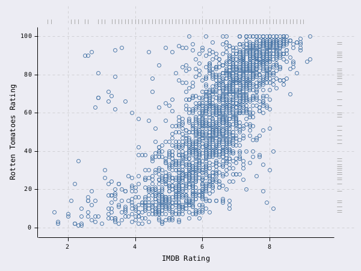
:::


### Scatterplot with Filled Circles

The scatterplot with filled points.

Source: [Vega-Lite - Scatterplot with Filled Circles](https://vega.github.io/vega-lite/examples/circle.html). Data: Car specifications and fuel economy, vega-datasets 3.3.1 `cars.json` (https://cdn.jsdelivr.net/npm/vega-datasets@3.3.1/data/cars.json); original: StatLib Datasets Archive; licence: notspecified (vega-datasets `datapackage.json`).


::: {.sourceClojure}
```clojure
(plot/render-image
 {:data cars :mapping {:x :horsepower :y :miles-per-gallon}
  :charts [(chart/scatter {:size 7 :color [76 120 168 200]})]
  :labels {:x "Horsepower" :y "Miles_per_Gallon"}}
 {:width 500 :height 400})
```
:::


::: {.clay-image}

:::


### Bubble Plot (Gapminder)

Life expectancy against income (log axis), circles sized by population.

Source: [Vega-Lite - Bubble Plot (Gapminder)](https://vega.github.io/vega-lite/examples/circle_bubble_health_income.html). Data: Gapminder income, life expectancy and population, vega-datasets 3.3.1 `gapminder-health-income.csv` (https://cdn.jsdelivr.net/npm/vega-datasets@3.3.1/data/gapminder-health-income.csv); original: Gapminder Foundation, Gapminder GDP Per Capita Data; licence: CC-BY-4.0 (vega-datasets `datapackage.json`).


::: {.sourceClojure}
```clojure
(plot/render-image
 {:data (nu/dataset :gapminder-health-income) :mapping {:x :income :y :health :size :population}
  :charts [(chart/scatter {:color [0 0 0 160]})]
  :scales {:x {:kind :log :minor-ticks 9} :size {:range [2 40] :area true :title "population"}}
  :theme {:panel {:grid {:minor {:color [180 180 180] :width 0.5 :dash :none}}}}
  :labels {:x "income" :y "health"}}
 {:width 700 :height 450})
```
:::


::: {.clay-image}

:::


### Bubble Plot (Natural Disasters)

Annual deaths from each type of natural disaster, 1900-2017 - circle areas by deaths. The circles stay inside their
rows (largest 40 px); the original's (up to about 80 px across) spill over the neighbouring rows.

Source: [Vega-Lite - Bubble Plot (Natural Disasters)](https://vega.github.io/vega-lite/examples/circle_natural_disasters.html). Data: Deaths from natural disasters by type and year, vega-datasets 3.3.1 `disasters.csv` (https://cdn.jsdelivr.net/npm/vega-datasets@3.3.1/data/disasters.csv); original: EM-DAT: The Emergency Events Database, Hannah Ritchie, Pablo Rosado and Max Roser (2022) - Natural Disasters; licence: notspecified, CC-BY-4.0 (vega-datasets `datapackage.json`).


::: {.sourceClojure}
```clojure
(plot/render-image
 {:data (remove #(= "All natural disasters" (:entity %)) (nu/dataset :disasters))
  :mapping {:x :year :y :entity :size :deaths :color :entity}
  :charts [(chart/scatter {:stroke-color :black :stroke-width 1})]
  :scales {:size {:range [0 40] :area true :title "Annual Global Deaths"} :color {:legend false} :y {:reverse true}}
  :labels {:x "Year" :y nil}}
 {:width 900 :height 500})
```
:::


::: {.clay-image}
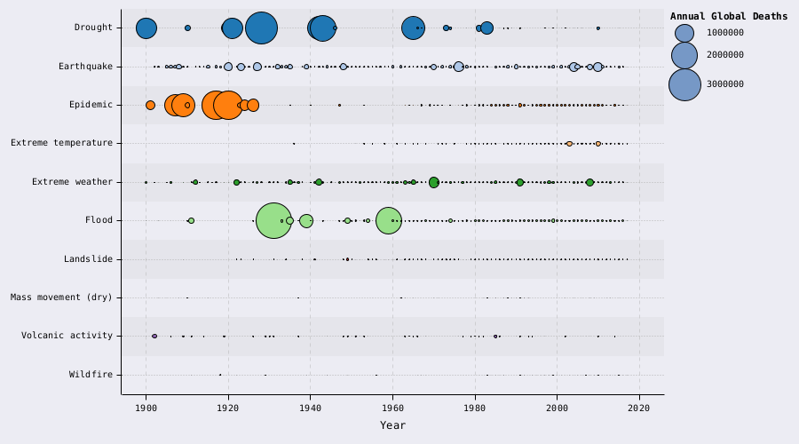
:::


### Scatter Plot with Text Marks

Each car written as the initial of its origin.

Source: [Vega-Lite - Scatter Plot with Text Marks](https://vega.github.io/vega-lite/examples/text_scatterplot_colored.html). Data: Car specifications and fuel economy, vega-datasets 3.3.1 `cars.json` (https://cdn.jsdelivr.net/npm/vega-datasets@3.3.1/data/cars.json); original: StatLib Datasets Archive; licence: notspecified (vega-datasets `datapackage.json`).


::: {.sourceClojure}
```clojure
(plot/render-image
 {:data cars :mapping {:x :horsepower :y :miles-per-gallon}
  :charts [(chart/text {:data (map #(assoc % :initial (subs (:origin %) 0 1)) cars)
                        :mapping {:x :horsepower :y :miles-per-gallon :label :initial :color :origin} :size 13})]
  :labels {:x "Horsepower" :y "Miles_per_Gallon"}}
 {:width 600 :height 400})
```
:::


::: {.clay-image}

:::


### Image-based Scatter Plot

Images at points (the original draws three application icons; here three images drawn with clojure2d).

Source: [Vega-Lite - Image-based Scatter Plot](https://vega.github.io/vega-lite/examples/scatter_image.html).


::: {.sourceClojure}
```clojure
(defn- badge
  "A 48 x 48 image: a disc in `color` with the letter `letter`."
  [color letter]
  (let [cv (c2d/canvas 48 48)]
    (c2d/with-canvas [g cv]
      (c2d/set-color g color)
      (c2d/ellipse g 24 24 44 44)
      (c2d/set-color g :white)
      (c2d/set-font-attributes g 26)
      (c2d/text g letter 24 33 :center))
    (c2d/get-image cv)))
```
:::


::: {.printedClojure}
```clojure
#'galleries.vega/badge

```
:::


::: {.sourceClojure}
```clojure
(plot/render-image
 {:data [{:x 0.5 :y 0.5 :img "f"} {:x 1.5 :y 1.5 :img "g"} {:x 2.5 :y 2.5 :img "z"}]
  :mapping {:x :x :y :y :shape :img}
  :charts [(chart/scatter {:size 40})]
  :scales {:shape {:domain ["f" "g" "z"]
                   :range [{:image (badge [230 100 30] "F")} {:image (badge [90 90 90] "G")} {:image (badge [30 70 160] "Z")}]
                   :legend false}
           :x {:domain [0 3]} :y {:domain [0 3]}}
  :labels {:x "x" :y "y"}}
 {:width 400 :height 400})
```
:::


::: {.clay-image}

:::


### Strip plot with custom axis tick labels

Mean IMDB rating per genre on a scale labelled Poor - Neutral - Great.

Source: [Vega-Lite - Strip plot with custom axis tick labels](https://vega.github.io/vega-lite/examples/circle_custom_tick_labels.html). Data: Movie box office, budgets and ratings, vega-datasets 3.3.1 `movies.json` (https://cdn.jsdelivr.net/npm/vega-datasets@3.3.1/data/movies.json); licence: none listed - see vega-datasets (cite Vega as the source).


::: {.sourceClojure}
```clojure
(let [means (update-vals (group-by :major-genre (filter :major-genre imdb)) #(stats/mean (map :imdb-rating %)))]
  (plot/render-image
   {:data (map (fn [[genre mean]] {:genre genre :mean mean}) means)
    :mapping {:x :mean :y :genre}
    :charts [(chart/scatter {:size 10 :color [76 120 168]})]
    :scales {:x {:domain [0 10] :ticks [0 5 10] :formatter #(get {0 "Poor" 5 "Neutral" 10 "Great"} (m/round (double %)))}
             :y {:domain (vec (sort-by means (keys means))) :reverse true}}
    :labels {:x nil :y nil}}
   {:width 500 :height 350}))
```
:::


::: {.clay-image}
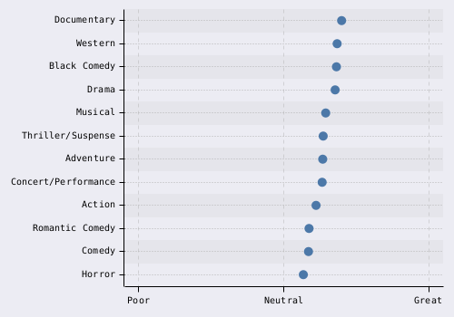
:::


### Dot Plot with Jittering

Horsepower per number of cylinders, points spread across each row by a seeded random offset.

Source: [Vega-Lite - Dot Plot with Jittering](https://vega.github.io/vega-lite/examples/point_offset_random.html). Data: Car specifications and fuel economy, vega-datasets 3.3.1 `cars.json` (https://cdn.jsdelivr.net/npm/vega-datasets@3.3.1/data/cars.json); original: StatLib Datasets Archive; licence: notspecified (vega-datasets `datapackage.json`).


::: {.sourceClojure}
```clojure
(plot/render-image
 {:data cars :mapping {:x :horsepower :y :cylinders}
  :charts [(chart/stripplot {:shape \o :size 6 :color [76 120 168] :jitter 0.8 :rng (r/rng :mersenne 1)})]
  :scales {:y {:type :categorical :reverse true}}
  :labels {:x "Horsepower" :y "Cylinders"}}
 {:width 600 :height 350})
```
:::


::: {.clay-image}
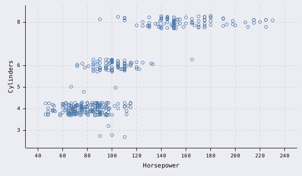
:::


## Line Charts


### Line Chart

Google's stock price.

Source: [Vega-Lite - Line Chart](https://vega.github.io/vega-lite/examples/line.html). Data: Monthly stock prices for five companies, vega-datasets 3.3.1 `stocks.csv` (https://cdn.jsdelivr.net/npm/vega-datasets@3.3.1/data/stocks.csv); licence: none listed - see vega-datasets (cite Vega as the source).


::: {.sourceClojure}
```clojure
(plot/render-image
 {:data goog :mapping {:x :date :y :price} :charts [(chart/line)] :labels {:x "date" :y "price"}}
 {:width 600 :height 300})
```
:::


::: {.clay-image}

:::


### Line Chart with Point Markers

Mean price per year and company, lines with points.

Source: [Vega-Lite - Line Chart with Point Markers](https://vega.github.io/vega-lite/examples/line_overlay.html). Data: Monthly stock prices for five companies, vega-datasets 3.3.1 `stocks.csv` (https://cdn.jsdelivr.net/npm/vega-datasets@3.3.1/data/stocks.csv); licence: none listed - see vega-datasets (cite Vega as the source).


::: {.sourceClojure}
```clojure
(plot/render-image
 {:data yearly-stocks :mapping {:x :date :y :price :color :symbol}
  :charts [(chart/line) (chart/scatter {:size 7})]
  :labels {:x "date (year)" :y "Mean of price"}}
 {:width 600 :height 350})
```
:::


::: {.clay-image}
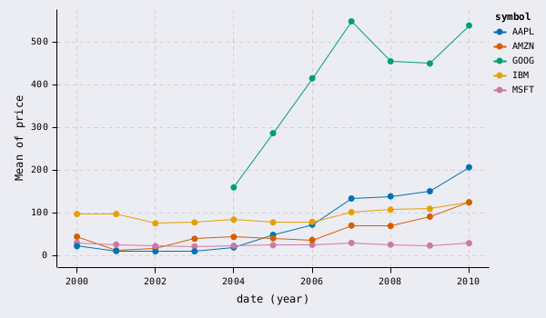
:::


### Line Chart with Stroked Point Markers

The same with hollow markers: white points under coloured outlines.

Source: [Vega-Lite - Line Chart with Stroked Point Markers](https://vega.github.io/vega-lite/examples/line_overlay_stroked.html). Data: Monthly stock prices for five companies, vega-datasets 3.3.1 `stocks.csv` (https://cdn.jsdelivr.net/npm/vega-datasets@3.3.1/data/stocks.csv); licence: none listed - see vega-datasets (cite Vega as the source).


::: {.sourceClojure}
```clojure
(plot/render-image
 {:data yearly-stocks :mapping {:x :date :y :price :color :symbol}
  :charts [(chart/line)
           (chart/scatter {:mapping {:color nil} :size 8 :color :white})
           (chart/scatter {:shape \o :size 8 :stroke-width 1.5})]
  :labels {:x "date (year)" :y "Mean of price"}}
 {:width 600 :height 350})
```
:::


::: {.clay-image}

:::


### Multi Series Line Chart

The prices of five companies (Vega's line chart example - the same concept).

Source: Vega-Lite - Multi Series Line Chart ([1](https://vega.github.io/vega-lite/examples/line_color.html), [2](https://vega.github.io/vega/examples/line-chart/)). Data: Monthly stock prices for five companies, vega-datasets 3.3.1 `stocks.csv` (https://cdn.jsdelivr.net/npm/vega-datasets@3.3.1/data/stocks.csv); licence: none listed - see vega-datasets (cite Vega as the source).


::: {.sourceClojure}
```clojure
(plot/render-image
 {:data stocks :mapping {:x :date :y :price :color :symbol} :charts [(chart/line)] :labels {:x "date" :y "price"}}
 {:width 600 :height 350})
```
:::


::: {.clay-image}

:::


### Repeat and Layer to Show Different Movie Measures

Mean US and worldwide gross per IMDB rating bin - the two measures folded into rows (Vega-Lite's `repeat`).

Source: [Vega-Lite - Repeat and Layer to Show Different Movie Measures](https://vega.github.io/vega-lite/examples/repeat_layer.html). Data: Movie box office, budgets and ratings, vega-datasets 3.3.1 `movies.json` (https://cdn.jsdelivr.net/npm/vega-datasets@3.3.1/data/movies.json); licence: none listed - see vega-datasets (cite Vega as the source).


::: {.sourceClojure}
```clojure
(plot/render-image
 {:data (for [[[measure lo] rows] (group-by (juxt :measure :bin)
                                           (for [movie imdb
                                                 [measure k] [["US Gross" :us-gross] ["Worldwide Gross" :worldwide-gross]]
                                                 :when (number? (k movie))]
                                             {:measure measure :bin (bin-start 1 (:imdb-rating movie)) :gross (k movie)}))]
          {:measure measure :x (+ lo 0.5) :gross (stats/mean (map :gross rows))})
  :mapping {:x :x :y :gross :color :measure}
  :charts [(chart/line)]
  :scales {:y {:formatter #(str (m/round (/ (double %) 1.0e6)) "M")}}
  :labels {:x "IMDB Rating (binned)" :y "Mean of US and Worldwide Gross"}}
 {:width 600 :height 350})
```
:::


::: {.clay-image}

:::


### Multi Series Line Chart with Halo Stroke

Each company's line drawn over a wide white line, so crossings stay readable (a recipe: two line charts per series,
in series order).

Source: [Vega-Lite - Multi Series Line Chart with Halo Stroke](https://vega.github.io/vega-lite/examples/line_color_halo.html). Data: Monthly stock prices for five companies, vega-datasets 3.3.1 `stocks.csv` (https://cdn.jsdelivr.net/npm/vega-datasets@3.3.1/data/stocks.csv); licence: none listed - see vega-datasets (cite Vega as the source).


::: {.sourceClojure}
```clojure
(let [symbols ["AAPL" "AMZN" "GOOG" "IBM" "MSFT"]]
  (plot/render-image
   {:data stocks :mapping {:x :date :y :price :color :symbol}
    :charts (vec (for [symbol symbols
                       :let [rows (filterv #(= symbol (:symbol %)) stocks)]
                       chart [(chart/line {:data rows :mapping {:color nil} :color :white :width 5})
                              (chart/line {:data rows :width 2})]]
                   chart))
    :scales {:color {:domain symbols}}
    :labels {:x "date" :y "price"}}
   {:width 600 :height 350}))
```
:::


::: {.clay-image}

:::


### Slope Graph

Median barley yield per site, 1931 to 1932.

Source: [Vega-Lite - Slope Graph](https://vega.github.io/vega-lite/examples/line_slope.html). Data: Minnesota barley yields by variety and trial site, vega-datasets 3.3.1 `barley.json` (https://cdn.jsdelivr.net/npm/vega-datasets@3.3.1/data/barley.json); original: The Design of Experiments Reference, Wiebe, G. A., Reinbach-Welch, L., Cowan, P. R. (1940). Yields of Barley Varieties in the United States and Canada, 1932-36. United States: U.S. Department of Agriculture.; licence: notspecified (vega-datasets `datapackage.json`).


::: {.sourceClojure}
```clojure
(plot/render-image
 {:data (for [[[site year] rows] (group-by (juxt :site :year) barley)]
          {:site site :year (str year) :yield (stats/median (map :yield rows))})
  :mapping {:x :year :y :yield :color :site}
  :charts [(chart/line)]
  :scales {:x {:domain ["1931" "1932"]}}
  :labels {:x "year" :y "Median of yield"}}
 {:width 400 :height 400})
```
:::


::: {.clay-image}
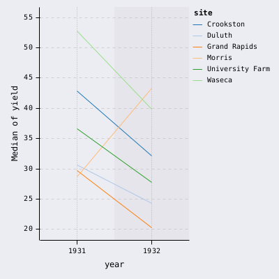
:::


### Step Chart

Google's price as steps (each value held until the next).

Source: [Vega-Lite - Step Chart](https://vega.github.io/vega-lite/examples/line_step.html). Data: Monthly stock prices for five companies, vega-datasets 3.3.1 `stocks.csv` (https://cdn.jsdelivr.net/npm/vega-datasets@3.3.1/data/stocks.csv); licence: none listed - see vega-datasets (cite Vega as the source).


::: {.sourceClojure}
```clojure
(plot/render-image
 {:data goog :mapping {:x :date :y :price} :charts [(chart/line {:interpolator :step-after})] :labels {:x "date" :y "price"}}
 {:width 600 :height 300})
```
:::


::: {.clay-image}

:::


### Line Chart with Monotone Interpolation

Google's price as a monotone curve through the points.

Source: [Vega-Lite - Line Chart with Monotone Interpolation](https://vega.github.io/vega-lite/examples/line_monotone.html). Data: Monthly stock prices for five companies, vega-datasets 3.3.1 `stocks.csv` (https://cdn.jsdelivr.net/npm/vega-datasets@3.3.1/data/stocks.csv); licence: none listed - see vega-datasets (cite Vega as the source).


::: {.sourceClojure}
```clojure
(plot/render-image
 {:data goog :mapping {:x :date :y :price} :charts [(chart/line {:interpolator :monotone})] :labels {:x "date" :y "price"}}
 {:width 600 :height 300})
```
:::


::: {.clay-image}

:::


### Line Chart with Conditional Axis Properties

Google's price in 2006-2007 (the original styles January ticks differently and writes the year under them; here the
plain axis, as the user asked).

Source: [Vega-Lite - Line Chart with Conditional Axis Properties](https://vega.github.io/vega-lite/examples/line_conditional_axis.html). Data: Monthly stock prices for five companies, vega-datasets 3.3.1 `stocks.csv` (https://cdn.jsdelivr.net/npm/vega-datasets@3.3.1/data/stocks.csv); licence: none listed - see vega-datasets (cite Vega as the source).


::: {.sourceClojure}
```clojure
(plot/render-image
 {:data (filter #(<= 2006 (.getYear ^LocalDate (:date %)) 2007) goog)
  :mapping {:x :date :y :price}
  :charts [(chart/line)]
  :labels {:x "date" :y "price"}}
 {:width 600 :height 300})
```
:::


::: {.clay-image}

:::


### Connected Scatterplot (Lines with Custom Paths)

Miles driven per capita against gas price, joined in year order.

Source: Vega-Lite - Connected Scatterplot (Lines with Custom Paths) ([1](https://vega.github.io/vega-lite/examples/connected_scatterplot.html), [2](https://vega.github.io/vega/examples/connected-scatter-plot/)). Data: U.S. driving distances and gasoline prices, vega-datasets 3.3.1 `driving.json` (https://cdn.jsdelivr.net/npm/vega-datasets@3.3.1/data/driving.json); original: New York Times (citing U.S. Energy Information Administration, Federal Highway Administration, and Brookings Institution); licence: none listed - see vega-datasets (cite Vega as the source).


::: {.sourceClojure}
```clojure
(plot/render-image
 {:data (sort-by :year (nu/dataset :driving)) :mapping {:x :miles :y :gas}
  :charts [(chart/line {:sort false}) (chart/scatter {:shape \o :size 7 :color [76 120 168]})]
  :labels {:x "miles" :y "gas"}}
 {:width 600 :height 400})
```
:::


::: {.clay-image}

:::


### Bump Chart

Build results in build order, a categorical y axis.

Source: [Vega-Lite - Bump Chart](https://vega.github.io/vega-lite/examples/line_bump.html).


::: {.sourceClojure}
```clojure
(plot/render-image
 {:data (map (fn [build result] {:build build :result result}) (range 1 17)
             ["PASSED" "PASSED" "FAILED" "FAILED" "SKIPPED" "PASSED" "PASSED" "FAILED" "PASSED" "PASSED" "SKIPPED" "PASSED"
              "PASSED" "FAILED" "PASSED" "SKIPPED"])
  :mapping {:x :build :y :result}
  :charts [(chart/line) (chart/scatter {:size 7})]
  :scales {:y {:domain ["FAILED" "PASSED" "SKIPPED"] :reverse true}}
  :labels {:x "build" :y "result"}}
 {:width 600 :height 250})
```
:::


::: {.clay-image}
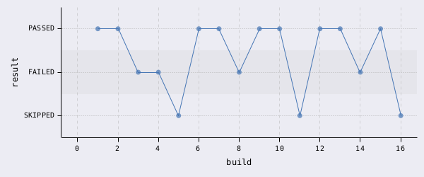
:::


### Line Chart with Varying Size (using the trail mark)

Prices as trails - the width grows with the price.

Source: [Vega-Lite - Line Chart with Varying Size (using the trail mark)](https://vega.github.io/vega-lite/examples/trail_color.html). Data: Monthly stock prices for five companies, vega-datasets 3.3.1 `stocks.csv` (https://cdn.jsdelivr.net/npm/vega-datasets@3.3.1/data/stocks.csv); licence: none listed - see vega-datasets (cite Vega as the source).


::: {.sourceClojure}
```clojure
(plot/render-image
 {:data stocks :mapping {:x :date :y :price :color :symbol :size :price}
  :charts [(chart/line {:trail true})]
  :scales {:size {:range [1 10]}}
  :labels {:x "date" :y "price"}}
 {:width 700 :height 400})
```
:::


::: {.clay-image}

:::


### A comet chart showing changes between between two states

Barley yields from 1931 (thin) to 1932 (wide) per variety and site, coloured by the direction of the change (the
original colours by the change's size; a trail has one colour per group).

Source: [Vega-Lite - A comet chart showing changes between two states](https://vega.github.io/vega-lite/examples/trail_comet.html). Data: Minnesota barley yields by variety and trial site, vega-datasets 3.3.1 `barley.json` (https://cdn.jsdelivr.net/npm/vega-datasets@3.3.1/data/barley.json); original: The Design of Experiments Reference, Wiebe, G. A., Reinbach-Welch, L., Cowan, P. R. (1940). Yields of Barley Varieties in the United States and Canada, 1932-36. United States: U.S. Department of Agriculture.; licence: notspecified (vega-datasets `datapackage.json`).


::: {.sourceClojure}
```clojure
(let [change (into {} (for [[k rows] (group-by (juxt :site :variety) barley)
                            :let [by-year (into {} (map (juxt :year :yield) rows))]]
                        [k (if (> (double (by-year 1932)) (double (by-year 1931))) "increase" "decrease")]))]
  (plot/render-image
   {:data (map #(assoc % :change (change [(:site %) (:variety %)])) (sort-by :year barley))
    :mapping {:x :year :y :variety :size :yield :color :change :group :variety :facet :site}
    :charts [(chart/line {:trail true :sort false})]
    :scales {:size {:range [0 12] :ticks [20 60] :title "Barley Yield (bushels/acre)"}
             :x {:domain [1930.6 1932.4] :nice false :ticks [1931 1932] :formatter #(str (m/round (double %)))}
             :color {:domain ["decrease" "increase"] :range [[202 0 32] [5 113 176]] :title "Yield Delta"}
             :y {:domain (vec (sort (distinct (map :variety barley)))) :reverse true}}
    :facets {:columns 6}
    :labels {:title "Barley Yield comparison between 1932 and 1931" :x nil :y "Variety"}}
   {:width 1000 :height 450}))
```
:::


::: {.clay-image}

:::


### Line Chart with Markers and Invalid Values

A missing value breaks the line (its points are dropped).

Source: [Vega-Lite - Line Chart with Markers and Invalid Values](https://vega.github.io/vega-lite/examples/line_skip_invalid_mid_overlay.html).


::: {.sourceClojure}
```clojure
(let [rows (map (fn [x y] {:x x :y y}) (range 1 8) [10 30 nil 15 nil 40 20])]
  (plot/render-image
   {:data rows :mapping {:x :x :y :y}
    :charts [(chart/line) (chart/scatter {:data (filter :y rows) :size 7})]
    :labels {:x "x" :y "y"}}
   {:width 500 :height 300}))
```
:::


::: {.clay-image}

:::


### Carbon Dioxide in the Atmosphere

Monthly CO2 at Mauna Loa: a line per decade over the years into it, each labelled by its first and last year.

Source: [Vega-Lite - Carbon Dioxide in the Atmosphere](https://vega.github.io/vega-lite/examples/layer_line_co2_concentration.html). Data: Monthly atmospheric CO2 at Mauna Loa, vega-datasets 3.3.1 `co2-concentration.csv` (https://cdn.jsdelivr.net/npm/vega-datasets@3.3.1/data/co2-concentration.csv); original: Scripps CO2 Program, In-situ CO2 Data; licence: CC-BY-4.0 (vega-datasets `datapackage.json`).


::: {.sourceClojure}
```clojure
(let [rows (for [{:keys [date co2]} (nu/dataset :co2-concentration)
                 :let [d (local-date date) year (.getYear d)]]
             {:co2 co2 :year (str year) :decade (str (* 10 (quot year 10)) "s")
              :t (+ (mod year 10) (/ (.getMonthValue d) 12.0))})
      decades (vals (group-by :decade rows))]
  (plot/render-image
   {:data rows :mapping {:x :t :y :co2 :color :decade}
    :charts [(chart/line)
             (chart/text {:data (map #(apply min-key :t %) decades) :mapping {:x :t :y :co2 :label :year :color :decade}
                          :size 9 :anchor [:center :top] :offset [0 -4]})
             (chart/text {:data (map #(apply max-key :t %) decades) :mapping {:x :t :y :co2 :label :year :color :decade}
                          :size 9 :anchor [:center :bottom] :offset [0 4]})]
    :scales {:color {:range (mapv (c/gradient :viridis/magma) (map #(* 0.8 (/ (double %) (dec (count decades)))) (range (count decades)))) :legend false}
             :x {:ticks (vec (range 11))}}
    :labels {:x "Year into Decade" :y "CO2 concentration in ppm"}}
   {:width 800 :height 500}))
```
:::


::: {.clay-image}

:::


### Line Charts Showing Ranks Over Time

World Cup 2018 group F: each team's rank after every matchday (points, then goal difference - Vega-Lite's `window`
rank), rank 1 on top.

Source: [Vega-Lite - Line Charts Showing Ranks Over Time](https://vega.github.io/vega-lite/examples/window_rank.html).


::: {.sourceClojure}
```clojure
(let [results [["Germany" 1 0 -1] ["Mexico" 1 3 1] ["South Korea" 1 0 -1] ["Sweden" 1 3 1]
               ["Germany" 2 3 0] ["Mexico" 2 6 2] ["South Korea" 2 0 -2] ["Sweden" 2 3 0]
               ["Germany" 3 3 -2] ["Mexico" 3 6 -1] ["South Korea" 3 3 0] ["Sweden" 3 6 3]]
      ranked (for [[day rows] (group-by second results)
                   [rank [team]] (map-indexed vector (sort-by (fn [[_ _ point diff]] [(- point) (- diff)]) rows))]
               {:team team :matchday (str day) :rank (inc rank)})]
  (plot/render-image
   {:data ranked :mapping {:x :matchday :y :rank :color :team}
    :charts [(chart/line {:width 2})]
    :scales {:y {:domain [4.3 0.7] :ticks [1 2 3 4] :nice false}
             :x {:domain ["1" "2" "3"]}
             :color {:domain ["Germany" "Mexico" "South Korea" "Sweden"]
                     :range [[0 0 0] [18 113 83] [201 26 60] [12 113 171]]}}
    :labels {:title "World Cup 2018: Group F Rankings" :x "matchday" :y "rank"}}
   {:width 500 :height 300}))
```
:::


::: {.clay-image}
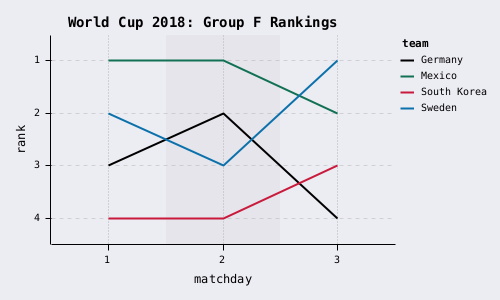
:::


### Drawing Sine and Cosine Curves with the Sequence Generator

sin and cos over a generated sequence, folded into long rows (Vega-Lite's `sequence` and `fold`).

Source: [Vega-Lite - Drawing Sine and Cosine Curves with the Sequence Generator](https://vega.github.io/vega-lite/examples/sequence_line_fold.html).


::: {.sourceClojure}
```clojure
(plot/render-image
 {:data (for [i (range 128) :let [x (* 0.1 i)] [k f] [["sin(x)" m/sin] ["cos(x)" m/cos]]]
          {:x x :key k :value (f x)})
  :mapping {:x :x :y :value :color :key}
  :charts [(chart/line)]
  :scales {:color {:title nil}}
  :labels {:x "x" :y "value"}}
 {:width 600 :height 300})
```
:::


::: {.clay-image}

:::


### Line chart with varying stroke dash

The five companies told apart by dash patterns.

Source: [Vega-Lite - Line chart with varying stroke dash](https://vega.github.io/vega-lite/examples/line_strokedash.html). Data: Monthly stock prices for five companies, vega-datasets 3.3.1 `stocks.csv` (https://cdn.jsdelivr.net/npm/vega-datasets@3.3.1/data/stocks.csv); licence: none listed - see vega-datasets (cite Vega as the source).


::: {.sourceClojure}
```clojure
(plot/render-image
 {:data stocks :mapping {:x :date :y :price :dash :symbol} :charts [(chart/line)] :labels {:x "date" :y "price"}}
 {:width 600 :height 350})
```
:::


::: {.clay-image}

:::


### Line chart with a dashed part

Observed values solid, predicted ones dashed (the two parts share point E).

Source: [Vega-Lite - Line chart with a dashed part](https://vega.github.io/vega-lite/examples/line_dashed_part.html).


::: {.sourceClojure}
```clojure
(plot/render-image
 {:data [{:a "A" :b 28 :predicted "false"} {:a "B" :b 55 :predicted "false"} {:a "D" :b 91 :predicted "false"}
         {:a "E" :b 81 :predicted "false"} {:a "E" :b 81 :predicted "true"} {:a "G" :b 19 :predicted "true"}
         {:a "H" :b 87 :predicted "true"}]
  :mapping {:x :a :y :b :dash :predicted}
  :charts [(chart/line {:color [76 120 168]})]
  :scales {:x {:domain ["A" "B" "D" "E" "G" "H"]}}
  :labels {:x "a" :y "b"}}
 {:width 500 :height 300})
```
:::


::: {.clay-image}

:::


## Area Charts & Streamgraphs


### Area Chart

Unemployed people summed over all industries per month, 2000-2010 (the area from 0: an explicit y domain).

Source: Vega-Lite - Area Chart ([1](https://vega.github.io/vega-lite/examples/area.html), [2](https://vega.github.io/vega/examples/area-chart/)). Data: U.S. unemployment by industry over time, vega-datasets 3.3.1 `unemployment-across-industries.json` (https://cdn.jsdelivr.net/npm/vega-datasets@3.3.1/data/unemployment-across-industries.json); original: U.S. Census Bureau Current Population Survey, BLS LAUS Data Tools, Bureau of Labor Statistics Table A-31; licence: other-pd (vega-datasets `datapackage.json`).


::: {.sourceClojure}
```clojure
(def unemployment
  "Unemployed per industry and month, `:date` a `LocalDate`."
  (mapv #(update % :date local-date) (nu/dataset :unemployment-across-industries)))
```
:::


::: {.sourceClojure}
```clojure
(let [totals (for [[date rows] (group-by :date unemployment)] {:date date :count (reduce + (map :count rows))})]
  (plot/render-image
   {:data totals :mapping {:x :date :y :count}
    :charts [(chart/line {:fill :color})]
    :scales {:y {:domain [0 (reduce max (map :count totals))]}}
    :labels {:x "date (year-month)" :y "count"}}
   {:width 600 :height 300}))
```
:::


::: {.clay-image}

:::


### Area Chart with Gradient

Google's price over an area fading from white at the bottom to dark green (`:fill-gradient` along y).

Source: [Vega-Lite - Area Chart with Gradient](https://vega.github.io/vega-lite/examples/area_gradient.html). Data: Monthly stock prices for five companies, vega-datasets 3.3.1 `stocks.csv` (https://cdn.jsdelivr.net/npm/vega-datasets@3.3.1/data/stocks.csv); licence: none listed - see vega-datasets (cite Vega as the source).


::: {.sourceClojure}
```clojure
(def goog-from-0 {:y {:domain [0 (reduce max (map :price goog))]}})
```
:::


::: {.sourceClojure}
```clojure
(plot/render-image
 {:data goog :mapping {:x :date :y :price}
  :charts [(chart/line {:fill-gradient [:white [0 100 0]] :fill-gradient-axis :y :color [0 100 0]})]
  :scales goog-from-0
  :labels {:x "date" :y "price"}}
 {:width 600 :height 300})
```
:::


::: {.clay-image}
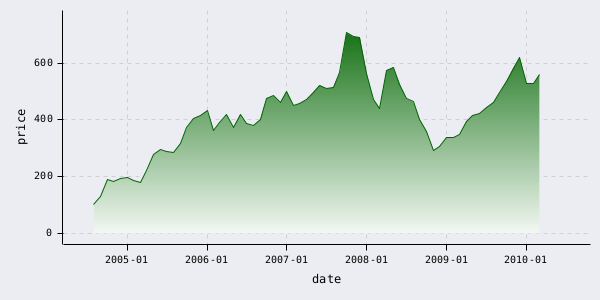
:::


### Area Chart with Overlaying Lines and Point Markers

The area of Google's price with its line and a point per month.

Source: [Vega-Lite - Area Chart with Overlaying Lines and Point Markers](https://vega.github.io/vega-lite/examples/area_overlay.html). Data: Monthly stock prices for five companies, vega-datasets 3.3.1 `stocks.csv` (https://cdn.jsdelivr.net/npm/vega-datasets@3.3.1/data/stocks.csv); licence: none listed - see vega-datasets (cite Vega as the source).


::: {.sourceClojure}
```clojure
(plot/render-image
 {:data goog :mapping {:x :date :y :price}
  :charts [(chart/line {:fill [76 120 168 120] :color [76 120 168]}) (chart/scatter {:size 5 :color [76 120 168]})]
  :scales goog-from-0
  :labels {:x "date" :y "price"}}
 {:width 600 :height 300})
```
:::


::: {.clay-image}

:::


### Stacked Area Chart

Unemployed people per industry, stacked (20 colours, as the original's `category20b`).

Source: Vega-Lite - Stacked Area Chart ([1](https://vega.github.io/vega-lite/examples/stacked_area.html), [2](https://vega.github.io/vega/examples/stacked-area-chart/)). Data: U.S. unemployment by industry over time, vega-datasets 3.3.1 `unemployment-across-industries.json` (https://cdn.jsdelivr.net/npm/vega-datasets@3.3.1/data/unemployment-across-industries.json); original: U.S. Census Bureau Current Population Survey, BLS LAUS Data Tools, Bureau of Labor Statistics Table A-31; licence: other-pd (vega-datasets `datapackage.json`).


::: {.sourceClojure}
```clojure
(def industry-colors {:range (c/palette :category20b) :title "series"})
```
:::


::: {.sourceClojure}
```clojure
(plot/render-image
 {:data unemployment :mapping {:x :date :y :count :color :series}
  :charts [(chart/line {:fill :color :position :stack :width 0})]
  :scales {:color industry-colors}
  :labels {:x "date (year-month)" :y "Sum of count"}}
 {:width 800 :height 400})
```
:::


::: {.clay-image}
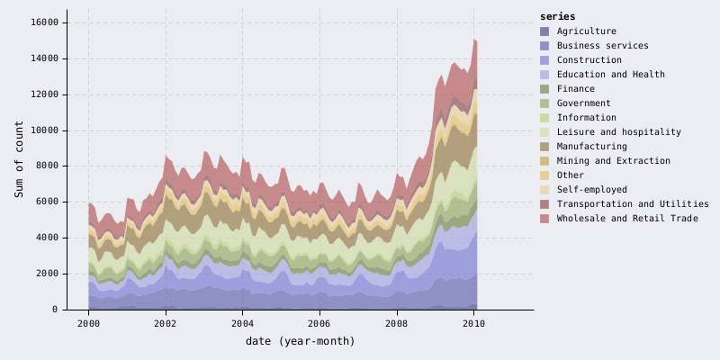
:::


### Horizontal Stacked Area Chart

The share of clay and sand in a soil profile, depth growing downward (`:flip true`, the depth axis reversed).

Source: [Vega-Lite - Horizontal Stacked Area Chart](https://vega.github.io/vega-lite/examples/stacked_area_horizontal.html).


::: {.sourceClojure}
```clojure
(plot/render-image
 {:data (for [[depth clay] [[0 30] [1 20] [2 25] [4 40] [7 70] [10 60]]
              [kind proportion] [["Clay" clay] ["Sand" (- 100 clay)]]]
          {:depth depth :proportion proportion :type kind})
  :mapping {:x :depth :y :proportion :color :type}
  :flip true
  :charts [(chart/line {:fill :color :position :stack :width 0 :alpha 1.0})]
  :scales {:x {:reverse true :nice false} :color {:range [[166 118 29] [230 200 122]] :title "Soil type"}}
  :labels {:x "Depth (m)" :y "Proportion (%)"}}
 {:width 500 :height 400})
```
:::


::: {.clay-image}
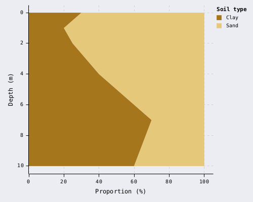
:::


### Normalized Stacked Area Chart

Each industry's share of the unemployed per month (no y axis, as the original).

Source: [Vega-Lite - Normalized Stacked Area Chart](https://vega.github.io/vega-lite/examples/stacked_area_normalize.html). Data: U.S. unemployment by industry over time, vega-datasets 3.3.1 `unemployment-across-industries.json` (https://cdn.jsdelivr.net/npm/vega-datasets@3.3.1/data/unemployment-across-industries.json); original: U.S. Census Bureau Current Population Survey, BLS LAUS Data Tools, Bureau of Labor Statistics Table A-31; licence: other-pd (vega-datasets `datapackage.json`).


::: {.sourceClojure}
```clojure
(plot/render-image
 {:data unemployment :mapping {:x :date :y :count :color :series}
  :charts [(chart/line {:fill :color :position :normalize :width 0})]
  :scales {:color industry-colors :y {:axis false}}
  :labels {:x "date (year-month)" :y nil}}
 {:width 800 :height 400})
```
:::


::: {.clay-image}
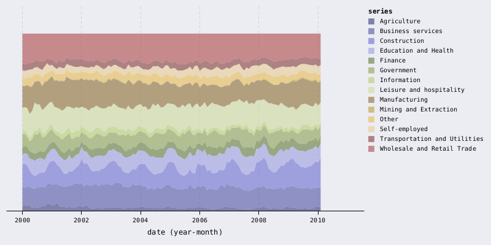
:::


### Streamgraph

The stacked industries centred on a middle line (`:position :silhouette`).

Source: [Vega-Lite - Streamgraph](https://vega.github.io/vega-lite/examples/stacked_area_stream.html). Data: U.S. unemployment by industry over time, vega-datasets 3.3.1 `unemployment-across-industries.json` (https://cdn.jsdelivr.net/npm/vega-datasets@3.3.1/data/unemployment-across-industries.json); original: U.S. Census Bureau Current Population Survey, BLS LAUS Data Tools, Bureau of Labor Statistics Table A-31; licence: other-pd (vega-datasets `datapackage.json`).


::: {.sourceClojure}
```clojure
(plot/render-image
 {:data unemployment :mapping {:x :date :y :count :color :series}
  :charts [(chart/line {:fill :color :position :silhouette :width 0})]
  :scales {:color industry-colors :y {:axis false}}
  :labels {:x "date (year-month)" :y nil}}
 {:width 800 :height 400})
```
:::


::: {.clay-image}

:::


### Horizon Graph

Values folded into two bands of height 50, the upper band darker over the lower, translucent (`plot/horizon`
`:alpha`); the bands follow one monotone curve through the values (`:interpolator :monotone`, as the Vega example);
the original layers the value and the value - 50 as translucent areas clipped at 50.

Source: Vega-Lite - Horizon Graph ([1](https://vega.github.io/vega-lite/examples/area_horizon.html), [2](https://vega.github.io/vega/examples/horizon-graph/)).


::: {.sourceClojure}
```clojure
(plot/render-image
 (plot/horizon (map (fn [x y] {:x x :y y}) (range 1 21)
                    [28 55 43 91 81 53 19 87 52 48 24 49 87 66 17 27 68 16 49 15])
               {:bands 2 :band-height 50 :interpolator :monotone :alpha 0.6})
 {:width 500 :height 120})
```
:::


::: {.clay-image}

:::


## Table-based Plots


### Table Heatmap

Mean horsepower per origin and number of cylinders.

Source: [Vega-Lite - Table Heatmap](https://vega.github.io/vega-lite/examples/rect_heatmap.html). Data: Car specifications and fuel economy, vega-datasets 3.3.1 `cars.json` (https://cdn.jsdelivr.net/npm/vega-datasets@3.3.1/data/cars.json); original: StatLib Datasets Archive; licence: notspecified (vega-datasets `datapackage.json`).


::: {.sourceClojure}
```clojure
(plot/render-image
 {:data (for [[[origin cylinders] rows] (group-by (juxt :origin :cylinders) (filter :horsepower cars))]
          {:origin origin :cylinders (str cylinders) :horsepower (stats/mean (map :horsepower rows))})
  :mapping {:x :cylinders :y :origin :color :horsepower}
  :charts [(chart/tile)]
  :scales {:x {:domain ["3" "4" "5" "6" "8"]} :y {:domain ["Europe" "Japan" "USA"] :reverse true}
           :color {:title "Mean of Horsepower"}}
  :labels {:x "Cylinders" :y "Origin"}}
 {:width 500 :height 250})
```
:::


::: {.clay-image}

:::


### Annual Weather Heatmap

The highest daily maximum temperature per day of the month and month (Seattle 2012-2015); below, the Vega example's
hourly normals - a cell per day of the year and hour of the day.

Source: Vega-Lite - Annual Weather Heatmap ([1](https://vega.github.io/vega-lite/examples/rect_heatmap_weather.html), [2](https://vega.github.io/vega/examples/heatmap/)). Data: Seattle daily weather from 2012–2015, vega-datasets 3.3.1 `seattle-weather.csv` (https://cdn.jsdelivr.net/npm/vega-datasets@3.3.1/data/seattle-weather.csv); original: NOAA National Climatic Data Center; licence: other-pd (vega-datasets `datapackage.json`).


::: {.sourceClojure}
```clojure
(plot/render-image
 {:data (for [[[day month] rows] (group-by (juxt #(.getDayOfMonth (local-date (:date %))) :month) seattle-months)]
          {:day (str day) :month month :temp (reduce max (map :temp-max rows))})
  :mapping {:x :day :y :month :color :temp}
  :charts [(chart/tile)]
  :scales {:x {:domain (mapv str (range 1 32))} :y {:domain month-names :reverse true} :color {:title nil}}
  :labels {:title "Daily Max Temperatures (C) in Seattle, WA" :x "Day" :y "Month"}}
 {:width 900 :height 380})
```
:::


::: {.clay-image}
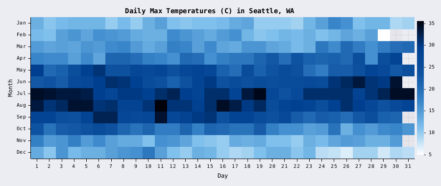
:::


Data: Seattle hourly climate normals for 1981–2010, vega-datasets 3.3.1 `seattle-weather-hourly-normals.csv` (https://cdn.jsdelivr.net/npm/vega-datasets@3.3.1/data/seattle-weather-hourly-normals.csv); original: NOAA National Climatic Data Center (NCDC); licence: other-pd (vega-datasets `datapackage.json`).


::: {.sourceClojure}
```clojure
(plot/render-image
 {:data (for [{:keys [date temperature]} (nu/dataset :seattle-weather-hourly-normals)
              :let [t (java.time.LocalDateTime/parse date) day (.toLocalDate t)]]
          {:x0 day :x1 (.plusDays day 1) :hour (str (.getHour t)) :temperature temperature})
  :charts [(chart/rect {:mapping {:x0 :x0 :x1 :x1 :y0 :hour :y1 :hour :color :temperature}})]
  :scales {:y {:domain (mapv str (concat (range 6 24) (range 6))) :reverse true}
           :x {:formatter #(.format (DateTimeFormatter/ofPattern "MMM" Locale/ENGLISH) ^TemporalAccessor %)}
           :color {:title "Temperature (°C)"}}
  :labels {:title "Seattle Annual Temperatures" :x nil :y "Hour"}}
 {:width 900 :height 400})
```
:::


::: {.clay-image}

:::


### Table Bubble Plot (Github Punch Card)

GitHub contributions summed per weekday and hour, a circle per cell sized by the sum.

Source: [Vega-Lite - Table Bubble Plot (Github Punch Card)](https://vega.github.io/vega-lite/examples/circle_github_punchcard.html). Data: Simulated hourly GitHub commit counts, vega-datasets 3.3.1 `github.csv` (https://cdn.jsdelivr.net/npm/vega-datasets@3.3.1/data/github.csv); original: Generated using `/scripts/github.py`.; licence: BSD-3-Clause (vega-datasets `datapackage.json`).


::: {.sourceClojure}
```clojure
(def weekdays ["Mon" "Tue" "Wed" "Thu" "Fri" "Sat" "Sun"])
```
:::


::: {.sourceClojure}
```clojure
(plot/render-image
 {:data (for [[[day hour] rows] (group-by (juxt #(weekdays (dec (.getValue (.getDayOfWeek (local-date (:time %))))))
                                                #(subs (:time %) 11 13))
                                          (nu/dataset :github))]
          {:day day :hour hour :count (reduce + (map :count rows))})
  :mapping {:x :hour :y :day :size :count}
  :charts [(chart/scatter {:color [76 120 168]})]
  :scales {:x {:domain (mapv #(format "%02d" %) (range 24))} :y {:domain weekdays :reverse true}
           :size {:range [0 18] :area true :title "Sum of count"}}
  :labels {:x "time (hours)" :y "time (day)"}}
 {:width 800 :height 300})
```
:::


::: {.clay-image}

:::


### Layering text over heatmap

Cars per origin and cylinders, each cell labelled with its count in black or white by the colour under it
(tile `:value-label`).

Source: [Vega-Lite - Layering text over heatmap](https://vega.github.io/vega-lite/examples/layer_text_heatmap.html). Data: Car specifications and fuel economy, vega-datasets 3.3.1 `cars.json` (https://cdn.jsdelivr.net/npm/vega-datasets@3.3.1/data/cars.json); original: StatLib Datasets Archive; licence: notspecified (vega-datasets `datapackage.json`).


::: {.sourceClojure}
```clojure
(plot/render-image
 {:data (for [[[origin cylinders] rows] (group-by (juxt :origin :cylinders) cars)]
          {:origin origin :cylinders (str cylinders) :n (count rows)})
  :mapping {:x :cylinders :y :origin :color :n}
  :charts [(chart/tile {:value-label #(str (m/round (double (:value %))))})]
  :scales {:x {:domain ["3" "4" "5" "6" "8"]} :y {:domain ["Europe" "Japan" "USA"] :reverse true}
           :color {:title "Count of Records"}}
  :labels {:x "Cylinders" :y "Origin"}}
 {:width 500 :height 250})
```
:::


::: {.clay-image}

:::


### Lasagna Plot (Dense Time-Series Heatmap)

Monthly prices of four companies as a row of cells each (rects a month wide).

Source: [Vega-Lite - Lasagna Plot (Dense Time-Series Heatmap)](https://vega.github.io/vega-lite/examples/rect_lasagna.html). Data: Monthly stock prices for five companies, vega-datasets 3.3.1 `stocks.csv` (https://cdn.jsdelivr.net/npm/vega-datasets@3.3.1/data/stocks.csv); licence: none listed - see vega-datasets (cite Vega as the source).


::: {.sourceClojure}
```clojure
(plot/render-image
 {:data (for [{:keys [symbol ^LocalDate date price]} stocks :when (not= "GOOG" symbol)]
          {:symbol symbol :x0 date :x1 (.plusMonths date 1) :price price})
  :charts [(chart/rect {:mapping {:x0 :x0 :x1 :x1 :y0 :symbol :y1 :symbol :color :price}})]
  :scales {:y {:domain ["AAPL" "AMZN" "IBM" "MSFT"] :reverse true} :color {:title "Price"}}
  :labels {:x "Time" :y nil}}
 {:width 800 :height 250})
```
:::


::: {.clay-image}
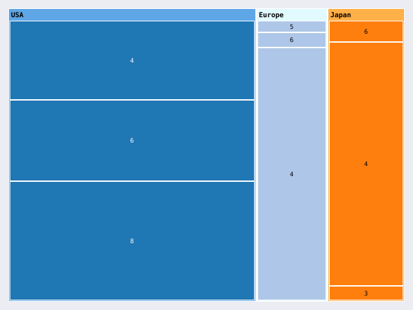
:::


### Mosaic Chart with Labels

Cars per origin (column widths) and cylinders within each origin (heights) - a treemap of `:layout :slice-dice`
(the original builds the same with `stack` and `window` transforms). The treemap orders the parts by size, the
original by name.

Source: [Vega-Lite - Mosaic Chart with Labels](https://vega.github.io/vega-lite/examples/rect_mosaic_labelled_with_offset.html). Data: Car specifications and fuel economy, vega-datasets 3.3.1 `cars.json` (https://cdn.jsdelivr.net/npm/vega-datasets@3.3.1/data/cars.json); original: StatLib Datasets Archive; licence: notspecified (vega-datasets `datapackage.json`).


::: {.sourceClojure}
```clojure
(plot/render-image
 {:data (for [[[origin cylinders] rows] (group-by (juxt :origin :cylinders) cars)]
          {:origin origin :cylinders (str cylinders) :n (count rows)})
  :mapping {:value :n :hierarchy [:origin :cylinders]}
  :charts [(chart/treemap {:layout :slice-dice :padding 2})]}
 {:width 600 :height 450})
```
:::


::: {.clay-image}

:::


### Wind Vector Map

Wind over western Europe on a 0.25° grid: an arrow per cell pointing where the wind blows, as long as its speed,
coloured by its direction (longitude and latitude as plain axes - no map projection).

Source: Vega-Lite - Wind Vector Map ([1](https://vega.github.io/vega-lite/examples/point_angle_windvector.html), [2](https://vega.github.io/vega/examples/wind-vectors/)). Data: Simulated wind vectors over northwestern Europe, vega-datasets 3.3.1 `windvectors.csv` (https://cdn.jsdelivr.net/npm/vega-datasets@3.3.1/data/windvectors.csv); licence: none listed - see vega-datasets (cite Vega as the source).


::: {.sourceClojure}
```clojure
(plot/render-image
 {:data (for [{:keys [longitude latitude dir speed]} (nu/dataset :windvectors)
              :let [heading (m/radians (+ 180.0 (double dir))) len (* 0.05 (double speed))]]
          {:x longitude :y latitude :xend (+ (double longitude) (* len (m/sin heading)))
           :yend (+ (double latitude) (* len (m/cos heading))) :dir dir})
  :mapping {:x :x :y :y :xend :xend :yend :yend :color :dir}
  :charts [(chart/segment {:width 1.2 :arrow {:end true :size 2.5} :padding {:x [0.0 0.0] :y [0.0 0.0]}})]
  :scales {:x {:nice false} :y {:nice false}
           :color {:domain [0 360] :range (mapv (c/gradient :pals/kovesi.cyclic_mrybm_35_75_c68) (m/slice-range 0 1 13))
                   :legend false}}
  :aspect :iso
  :labels {:x "longitude" :y "latitude"}}
 {:width 900 :height 700})
```
:::


::: {.clay-image}
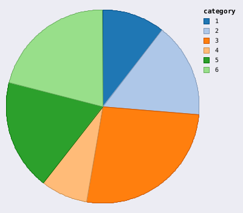
:::


## Circular Plots


### Pie Chart

Six values as slices of one stacked bar around the circle.

Source: Vega-Lite - Pie Chart ([1](https://vega.github.io/vega-lite/examples/arc_pie.html), [2](https://vega.github.io/vega/examples/pie-chart/)).


::: {.sourceClojure}
```clojure
(def pie-values (map (fn [category value] {:category (str category) :value value}) (range 1 7) [4 6 10 3 7 8]))
```
:::


::: {.sourceClojure}
```clojure
(plot/render-image
 {:data pie-values :mapping {:x :value :color :category}
  :coord {:kind :polar}
  :charts [(chart/bar {:position :stack :width 1.0})]
  :scales {:x {:axis false}}
  :labels {:x nil :y nil}}
 {:width 400 :height 350})
```
:::


::: {.clay-image}

:::


### Pie Chart with percentage_tooltip

The slices labelled with their share of the whole (the original shows it in a tooltip).

Source: [Vega-Lite - Pie Chart with percentage_tooltip](https://vega.github.io/vega-lite/examples/arc_pie_normalize_tooltip.html).


::: {.sourceClojure}
```clojure
(plot/render-image
 {:data pie-values :mapping {:x :value :color :category}
  :coord {:kind :polar}
  :charts [(chart/bar {:position :normalize :width 1.0 :value-label #(format "%.1f%%" (* 100.0 (double (:share %))))
                       :label-position :center})]
  :scales {:x {:axis false}}
  :labels {:x nil :y nil}}
 {:width 400 :height 350})
```
:::


::: {.clay-image}

:::


### Donut Chart

The pie with a hole (`:inner` of the polar coord).

Source: Vega-Lite - Donut Chart ([1](https://vega.github.io/vega-lite/examples/arc_donut.html), [2](https://vega.github.io/vega/examples/donut-chart/)).


::: {.sourceClojure}
```clojure
(plot/render-image
 {:data pie-values :mapping {:x :value :color :category}
  :coord {:kind :polar :inner 0.5}
  :charts [(chart/bar {:position :stack :width 1.0})]
  :scales {:x {:axis false}}
  :labels {:x nil :y nil}}
 {:width 400 :height 350})
```
:::


::: {.clay-image}

:::


### Pie Chart with Labels

Each slice named outside its arc, no legend.

Source: Vega-Lite - Pie Chart with Labels ([1](https://vega.github.io/vega-lite/examples/layer_arc_label.html), [2](https://vega.github.io/vega/examples/donut-chart-labelled/)).


::: {.sourceClojure}
```clojure
(plot/render-image
 {:data (map #(update % :category {"1" "a" "2" "b" "3" "c" "4" "d" "5" "e" "6" "f"}) pie-values)
  :mapping {:x :value :color :category}
  :coord {:kind :polar}
  :legend false
  :charts [(chart/bar {:position :stack :width 1.0 :value-label #(get-in % [:group :color]) :label-position :outer})]
  :scales {:x {:axis false}}
  :labels {:x nil :y nil}}
 {:width 400 :height 350})
```
:::


::: {.clay-image}

:::


### Radial Plot

Slices with angles by value and radii by its square root, smallest to largest (the original stacks them in the
order of its colour domain - the values sorted), each labelled outside its arc (rects in polar coordinates).

Source: Vega-Lite - Radial Plot ([1](https://vega.github.io/vega-lite/examples/arc_radial.html), [2](https://vega.github.io/vega/examples/radial-plot/)).


::: {.sourceClojure}
```clojure
(let [values (sort [12 23 47 6 52 19])
      ends (reductions + 0 values)
      rows (map (fn [v lo hi] {:label (str v) :x0 lo :x1 hi :xm (* 0.5 (+ lo hi)) :r (m/sqrt v)}) values ends (rest ends))]
  (plot/render-image
   {:data rows
    :coord {:kind :polar :inner 0.15}
    :legend false
    :charts [(chart/rect {:mapping {:x0 :x0 :x1 :x1 :y0 (constantly 0.0) :y1 :r :color :label} :stroke-color :white
                          :stroke-width 1})
             (chart/text {:mapping {:x :xm :y #(+ 0.5 (double (:r %))) :label :label}})]
    :scales {:x {:axis false :domain [0 (last ends)] :nice false} :y {:axis false :domain [0 8]}
             :color {:domain (map :label rows)}}
    :theme {:panel {:grid {:x :none :y :none}}}
    :labels {:x nil :y nil}}
   {:width 450 :height 450}))
```
:::


::: {.clay-image}

:::


### Pyramid Pie Chart

A pie that looks like a pyramid: the slices start at 135° (the two pyramid sides first, then the sky); the legend
in its usual place, ordered as the slices (the original places it inside the picture).

Source: [Vega-Lite - Pyramid Pie Chart](https://vega.github.io/vega-lite/examples/arc_pie_pyramid.html).


::: {.sourceClojure}
```clojure
(plot/render-image
 {:data [{:category "Shady side of a pyramid" :value 10} {:category "Sunny side of a pyramid" :value 15}
         {:category "Sky" :value 75}]
  :mapping {:x :value :color :category}
  :coord {:kind :polar :start 135}
  :charts [(chart/bar {:position :stack :width 1.0 :stroke-color :none})]
  :scales {:x {:axis false}
           :color {:domain ["Shady side of a pyramid" "Sunny side of a pyramid" "Sky"]
                   :range [[103 64 40] [222 172 88] [65 109 157]] :title nil}}
  :theme {:panel {:grid {:x :none :y :none}}}
  :labels {:x nil :y nil}}
 {:width 550 :height 350})
```
:::


::: {.clay-image}

:::


## Advanced Calculations


### Calculate Difference from Average

Movies rated more than 2.5 above the mean IMDB rating, the mean as a red rule (Vega-Lite's `joinaggregate`).

Source: [Vega-Lite - Calculate Difference from Average](https://vega.github.io/vega-lite/examples/joinaggregate_mean_difference.html). Data: Movie box office, budgets and ratings, vega-datasets 3.3.1 `movies.json` (https://cdn.jsdelivr.net/npm/vega-datasets@3.3.1/data/movies.json); licence: none listed - see vega-datasets (cite Vega as the source).


::: {.sourceClojure}
```clojure
(let [mean-rating (stats/mean (map :imdb-rating imdb))
      best (filter #(> (- (double (:imdb-rating %)) mean-rating) 2.5) imdb)]
  (plot/render-image
   {:data best :mapping {:x :imdb-rating :y :title}
    :charts [(chart/bar) (chart/rule {:x mean-rating :color :red})]
    :scales {:y {:domain (vec (sort (distinct (map :title best)))) :reverse true}}
    :labels {:x "IMDB Rating" :y "Title"}}
   {:width 600 :height 450}))
```
:::


::: {.clay-image}
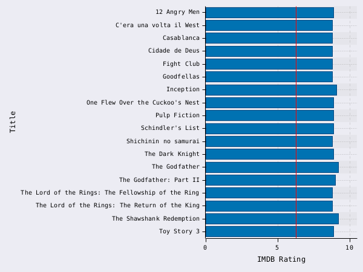
:::


### Calculate Difference from Annual Average

Movies rated more than 2.5 above the mean of their release year, the year's mean as a red tick on each bar (a rug
per title).

Source: [Vega-Lite - Calculate Difference from Annual Average](https://vega.github.io/vega-lite/examples/joinaggregate_mean_difference_by_year.html). Data: Movie box office, budgets and ratings, vega-datasets 3.3.1 `movies.json` (https://cdn.jsdelivr.net/npm/vega-datasets@3.3.1/data/movies.json); licence: none listed - see vega-datasets (cite Vega as the source).


::: {.sourceClojure}
```clojure
(let [year #(.getYear (local-date (:release-date %)))
      year-means (update-vals (group-by year imdb) #(stats/mean (map :imdb-rating %)))
      best (for [movie imdb
                 :let [year-mean (year-means (year movie))]
                 :when (> (- (double (:imdb-rating movie)) (double year-mean)) 2.5)]
             (assoc movie :year-mean year-mean))]
  (plot/render-image
   {:data best :mapping {:x :imdb-rating :y :title}
    :charts [(chart/bar) (chart/rug {:mapping {:x :year-mean} :color :red :line-width 2})]
    :scales {:y {:domain (vec (sort (distinct (map :title best)))) :reverse true}}
    :labels {:x "IMDB Rating" :y "Title"}}
   {:width 600 :height 600}))
```
:::


::: {.clay-image}

:::


### Calculate Residuals

Each movie's IMDB rating minus the mean rating, over its release date, coloured on a diverging scale centred on 0
(`:midpoint`).

Source: [Vega-Lite - Calculate Residuals](https://vega.github.io/vega-lite/examples/joinaggregate_residual_graph.html). Data: Movie box office, budgets and ratings, vega-datasets 3.3.1 `movies.json` (https://cdn.jsdelivr.net/npm/vega-datasets@3.3.1/data/movies.json); licence: none listed - see vega-datasets (cite Vega as the source).


::: {.sourceClojure}
```clojure
(let [dated (filter #(<= (.getYear (local-date (:release-date %))) 2019) imdb)
      mean-rating (stats/mean (map :imdb-rating dated))]
  (plot/render-image
   {:data (map #(assoc % :date (local-date (:release-date %)) :delta (- (double (:imdb-rating %)) mean-rating)) dated)
    :mapping {:x :date :y :delta :color :delta}
    :charts [(chart/scatter {:shape \o :size 6})]
    :scales {:color {:range [[202 0 32] [247 247 247] [5 113 176]] :midpoint 0 :title "Rating Delta"}}
    :labels {:x "Release Date" :y "Rating Delta"}}
   {:width 700 :height 400}))
```
:::


::: {.clay-image}

:::


### Waterfall Chart of Monthly Profit and Loss

Each month's change as a floating bar from the running total before it to the one after it, joined by rules;
the totals written past the bars, the changes inside them (Vega-Lite's `window` sums as Clojure `reductions`).

Source: [Vega-Lite - Waterfall Chart of Monthly Profit and Loss](https://vega.github.io/vega-lite/examples/waterfall_chart.html).


::: {.sourceClojure}
```clojure
(def waterfall
  "Running totals of the monthly amounts: `:previous` and `:sum` - the total before and after the row, `:kind`
  `total` (Begin, End), `increase` or `decrease`."
  (let [amounts [["Begin" 4000] ["Jan" 1707] ["Feb" -1425] ["Mar" -1030] ["Apr" 1812] ["May" -1067] ["Jun" -1481]
                 ["Jul" 1228] ["Aug" 1176] ["Sep" 1146] ["Oct" 1205] ["Nov" -1388] ["Dec" 1492]]
        sums (reductions + (map second amounts))
        rows (map (fn [[label amount] sum next-label]
                    {:label label :amount amount :previous (- sum amount) :sum sum :next next-label
                     :kind (cond (= "Begin" label) "total" (neg? amount) "decrease" :else "increase")})
                  amounts sums (concat (map first (rest amounts)) ["End"]))]
    (vec (concat rows [{:label "End" :amount (last sums) :previous 0 :sum (last sums) :next "End" :kind "total"}]))))
```
:::


::: {.sourceClojure}
```clojure
(def waterfall-centres
  "The waterfall rows with the bar centre `:center` and the change as text (`+` for increases)."
  (map #(assoc % :center (* 0.5 (+ (long (:sum %)) (long (:previous %))))
               :text (str (when (= "increase" (:kind %)) "+") (:amount %)))
       waterfall))
```
:::


::: {.sourceClojure}
```clojure
(plot/render-image
 {:data waterfall
  :charts [(chart/rect {:mapping {:x0 :label :x1 :label :y0 :previous :y1 :sum :color :kind} :band-width 0.8})
           (chart/segment {:data (butlast waterfall) :mapping {:x :label :y :sum :xend :next :yend :sum}
                           :color [64 64 64] :width 2})
           (chart/text {:data (filter #(>= (long (:amount %)) 0) waterfall) :mapping {:x :label :y :sum :label :sum}
                        :anchor [:center :bottom] :offset [0 4]})
           (chart/text {:data (filter #(neg? (long (:amount %))) waterfall) :mapping {:x :label :y :sum :label :sum}
                        :anchor [:center :top] :offset [0 -4]})
           (chart/text {:data (filter #(= "total" (:kind %)) waterfall-centres)
                        :mapping {:x :label :y :center :label :text} :font-style :bold :color [114 90 48]})
           (chart/text {:data (remove #(= "total" (:kind %)) waterfall-centres)
                        :mapping {:x :label :y :center :label :text} :font-style :bold :color :white})]
  :scales {:x {:domain (mapv :label waterfall)}
           :color {:domain ["total" "decrease" "increase"] :range [[247 224 182] [247 138 100] [147 196 170]]
                   :legend false}}
  :labels {:x "Months" :y "Amount"}}
 {:width 950 :height 450})
```
:::


::: {.clay-image}

:::


### Filtering Top-K Items

The five best students by score (Vega-Lite's `window` rank, then `filter`).

Source: Vega-Lite - Filtering Top-K Items ([1](https://vega.github.io/vega-lite/examples/window_top_k.html), [2](https://vega.github.io/vega/examples/top-k-plot/)).


::: {.sourceClojure}
```clojure
(let [scores [["A" 100] ["B" 56] ["C" 88] ["D" 65] ["E" 45] ["F" 23] ["G" 66] ["H" 67] ["I" 13] ["J" 12] ["K" 50]
              ["L" 78] ["M" 66] ["N" 30] ["O" 97] ["P" 75] ["Q" 24] ["R" 42] ["S" 76] ["T" 78] ["U" 21] ["V" 46]]
      top (take 5 (sort-by (comp - second) scores))]
  (plot/render-image
   {:data (map (fn [[student score]] {:student student :score score}) top)
    :mapping {:x :score :y :student}
    :charts [(chart/bar)]
    :scales {:y {:domain (mapv first top) :reverse true}}
    :labels {:x "score" :y "student"}}
   {:width 500 :height 250}))
```
:::


::: {.clay-image}

:::


### Top-K Plot with "Others"

The nine directors with the highest mean worldwide gross, the rest averaged into "All Others".

Source: Vega-Lite - Top-K Plot with "Others" ([1](https://vega.github.io/vega-lite/examples/window_top_k_others.html), [2](https://vega.github.io/vega/examples/top-k-plot-with-others/)). Data: Movie box office, budgets and ratings, vega-datasets 3.3.1 `movies.json` (https://cdn.jsdelivr.net/npm/vega-datasets@3.3.1/data/movies.json); licence: none listed - see vega-datasets (cite Vega as the source).


::: {.sourceClojure}
```clojure
(let [means (->> (filter #(and (:director %) (number? (:worldwide-gross %))) movies)
                 (group-by :director)
                 (map (fn [[director rows]] [director (stats/mean (map :worldwide-gross rows))]))
                 (sort-by (comp - second)))
      ranked (concat (take 9 means) [["All Others" (stats/mean (map second (drop 9 means)))]])]
  (plot/render-image
   {:data (map (fn [[director gross]] {:director director :gross gross}) ranked)
    :mapping {:x :gross :y :director}
    :charts [(chart/bar)]
    :scales {:y {:domain (vec (map first (sort-by (comp - second) ranked))) :reverse true}
             :x {:formatter #(str (m/round (/ (double %) 1.0e6)) "M")}}
    :labels {:title "Top Directors by Average Worldwide Gross" :x nil :y nil}}
   {:width 600 :height 350}))
```
:::


::: {.clay-image}
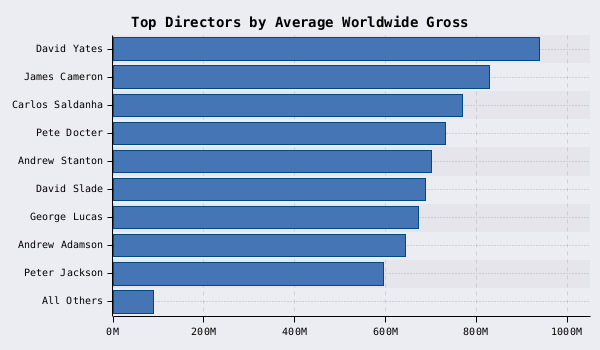
:::


### Using the lookup transform to combine data

Mean age per group: people's ages joined into the group list by name (Vega-Lite's `lookup`).

Source: [Vega-Lite - Using the lookup transform to combine data](https://vega.github.io/vega-lite/examples/lookup.html). Data: Synthetic group memberships for lookup examples, vega-datasets 3.3.1 `lookup_groups.csv` (https://cdn.jsdelivr.net/npm/vega-datasets@3.3.1/data/lookup_groups.csv); original: Generated Data; licence: BSD-3-Clause (vega-datasets `datapackage.json`).


::: {.sourceClojure}
```clojure
(let [people (into {} (map (juxt :name identity) (nu/dataset :lookup-people)))]
  (plot/render-image
   {:data (map #(merge % (select-keys (people (:person %)) [:age :height])) (nu/dataset :lookup-groups))
    :mapping {:x (comp str :group) :y :age}
    :charts [(chart/bar {:stat :mean})]
    :labels {:x "group" :y "Mean of age"}}
   {:width 400 :height 300}))
```
:::


::: {.clay-image}

:::


### Parallel Coordinate Plot

Four penguin measurements, each axis scaled from its minimum to its maximum, a translucent line per penguin
(`chart/parallel`); below, the Vega example's seven car measurements.

Source: Vega-Lite - Parallel Coordinate Plot ([1](https://vega.github.io/vega-lite/examples/parallel_coordinate.html), [2](https://vega.github.io/vega/examples/parallel-coordinates/)). Data: Palmer Archipelago penguin measurements, vega-datasets 3.3.1 `penguins.json` (https://cdn.jsdelivr.net/npm/vega-datasets@3.3.1/data/penguins.json); original: Palmer Station Antarctica LTER, Allison Horst's Penguins Repository; licence: CC0-1.0 (vega-datasets `datapackage.json`).


::: {.sourceClojure}
```clojure
(plot/render-image
 {:data (filter :beak-length-mm penguins) :mapping {:color :species}
  :charts [(chart/parallel {:variables [["Beak Length (mm)" :beak-length-mm] ["Beak Depth (mm)" :beak-depth-mm]
                                        ["Flipper Length (mm)" :flipper-length-mm] ["Body Mass (g)" :body-mass-g]]
                            :alpha 0.3})]
  :labels {:x nil :y nil}}
 {:width 700 :height 400})
```
:::


::: {.clay-image}

:::


Data: Car specifications and fuel economy, vega-datasets 3.3.1 `cars.json` (https://cdn.jsdelivr.net/npm/vega-datasets@3.3.1/data/cars.json); original: StatLib Datasets Archive; licence: notspecified (vega-datasets `datapackage.json`).


::: {.sourceClojure}
```clojure
(plot/render-image
 {:data (map #(update % :year (fn [y] (.getYear (local-date y)))) cars)
  :charts [(chart/parallel {:variables [["Cylinders" :cylinders] ["Displacement" :displacement]
                                        ["Weight_in_lbs" :weight-in-lbs] ["Horsepower" :horsepower]
                                        ["Acceleration" :acceleration] ["Miles_per_Gallon" :miles-per-gallon]
                                        ["Year" :year]]
                            :color [70 130 180] :alpha 0.3})]
  :labels {:x nil :y nil}}
 {:width 900 :height 400})
```
:::


::: {.clay-image}

:::


### Bar Chart Showing Argmax Value

The production budget of each genre's highest-grossing movie (US gross).

Source: [Vega-Lite - Bar Chart Showing Argmax Value](https://vega.github.io/vega-lite/examples/bar_argmax.html). Data: Movie box office, budgets and ratings, vega-datasets 3.3.1 `movies.json` (https://cdn.jsdelivr.net/npm/vega-datasets@3.3.1/data/movies.json); licence: none listed - see vega-datasets (cite Vega as the source).


::: {.sourceClojure}
```clojure
(let [top (for [[genre rows] (group-by :major-genre (filter #(and (:major-genre %) (number? (:us-gross %))) movies))]
            (assoc (apply max-key :us-gross rows) :genre genre))]
  (plot/render-image
   {:data top :mapping {:x :production-budget :y :genre}
    :charts [(chart/bar)]
    :scales {:y {:domain (vec (sort (map :genre top))) :reverse true}
             :x {:formatter #(str (m/round (/ (double %) 1.0e6)) "M")}}
    :labels {:x "Production Budget of the movie with the highest US Gross" :y "Major Genre"}}
   {:width 600 :height 400}))
```
:::


::: {.clay-image}

:::


### Layering Averages over Raw Values

Google's monthly prices as translucent points per year, the yearly mean as a line.

Source: [Vega-Lite - Layering Averages over Raw Values](https://vega.github.io/vega-lite/examples/layer_line_mean_point_raw.html). Data: Monthly stock prices for five companies, vega-datasets 3.3.1 `stocks.csv` (https://cdn.jsdelivr.net/npm/vega-datasets@3.3.1/data/stocks.csv); licence: none listed - see vega-datasets (cite Vega as the source).


::: {.sourceClojure}
```clojure
(plot/render-image
 {:data (filter #(= "GOOG" (:symbol %)) yearly-stocks) :mapping {:x :date :y :price}
  :charts [(chart/scatter {:data (map #(assoc % :date (LocalDate/of (.getYear ^LocalDate (:date %)) 1 1)) goog)
                           :shape \o :size 6 :color [76 120 168 80]})
           (chart/line)]
  :labels {:x "date (year)" :y "price"}}
 {:width 500 :height 350})
```
:::


::: {.clay-image}

:::


### Layering Rolling Averages over Raw Values

Seattle's daily maximum temperature, its 31-day centred mean in red (fastmath's `moving-average-filter`). The
filter pads the series with zeros, so the first and last 15 days - without a full window - are left out.

Source: [Vega-Lite - Layering Rolling Averages over Raw Values](https://vega.github.io/vega-lite/examples/layer_line_rolling_mean_point_raw.html). Data: Seattle daily weather from 2012–2015, vega-datasets 3.3.1 `seattle-weather.csv` (https://cdn.jsdelivr.net/npm/vega-datasets@3.3.1/data/seattle-weather.csv); original: NOAA National Climatic Data Center; licence: other-pd (vega-datasets `datapackage.json`).


::: {.sourceClojure}
```clojure
(let [days (sort-by :date (map #(update % :date local-date) seattle))
      rolling ((sig/moving-average-filter 31) (map :temp-max days))]
  (plot/render-image
   {:data days :mapping {:x :date :y :temp-max}
    :charts [(chart/scatter {:shape \o :size 5 :color [76 120 168 80]})
             (chart/line {:data (->> (map #(assoc %1 :rolling %2) days rolling) (drop 15) (drop-last 15))
                          :mapping {:y :rolling} :color :red :width 3})]
    :labels {:x "Date" :y "Max Temperature and Rolling Mean"}}
   {:width 800 :height 350}))
```
:::


::: {.clay-image}

:::


### Line Chart to Show Benchmarking Results

Frames per second (1000 / frame time) of two systems over 210 trials, on a log axis.

Source: [Vega-Lite - Line Chart to Show Benchmarking Results](https://vega.github.io/vega-lite/examples/layer_line_window.html).


::: {.sourceClojure}
```clojure
(def falcon-ms
  [16.82 19.76 16.08 19.58 16.42 16.2 16.02 15.94 16.28 16.12 16.16 16.12 16.14 16.1 16.2 16.26 19.36 19.7 15.94
   19.14 16.2 16.12 19.52 19.7 16.2 20.98 16.3 16.42 16.82 16.5 16.56 16.18 16.08 16.24 16.04 16.3 19.4 15.7 16.24
   15.92 16.26 16.22 16.52 16.46 16.36 15.72 16.06 15.96 16.48 16.6 16.24 16.94 16.22 15.96 15.9 16.48 16.32 15.76
   16 16.18 16.22 15.8 16.14 16.3 16.36 16.26 15.96 15.94 16.54 16.14 16.26 16.2 15.9 16.08 16.08 15.7 15.66 16.14
   23.1 16.6 16.42 16.02 15.62 16.36 15.72 15.92 15.56 16.34 22.82 15.66 15.56 16 16 15.82 16.4 16.46 16.06 16.24
   15.8 16.16 16.36 19.7 16.1 16.14 15.82 16.44 16.14 16.02 15.86 16.06 16.02 15.92 15.82 16.58 15.88 16.58 15.7
   19.38 19.24 16 15.98 15.96 16.2 15.98 16.34 16.32 16.26 15.92 15.54 16.14 16.46 16.34 15.82 19.72 15.76 16.5
   15.72 16.08 16.44 16.2 15.96 16 16.1 19.32 16.1 16.18 15.96 22.64 15.9 16.28 16.1 15.92 16.08 16.26 15.9 15.82
   15.7 15.98 16.38 16.04 19.42 15.94 16.16 15.96 16.26 15.78 15.88 15.98 16.06 16.12 23.02 15.62 15.92 16.06 14.78
   16.26 19.52 16.32 16.6 16.22 19.74 19.46 15.94 15.84 16.1 16.46 16.18 16.1 15.94 16.06 15.86 15.82 16.04 16.18
   15.82 17.3 15.94 15.74 15.72 15.68 15.62 15.6 16.04 15.5 15.6 19.44 15.96 16.24 16.04 16.24])
```
:::


::: {.sourceClojure}
```clojure
(def square-ms
  [24.2 17.9 15.8 58.4 151 2523.1 245.3 136 72.3 55.7 42.4 37.7 30.1 30.1 21.8 20.6 21.8 17.6 18.2 21 941.7 177.4
   2821.8 359.2 318 217.1 126 69 57.8 45.3 35.6 29.1 23.8 44.2 17.7 17.7 15.7 27.8 22.8 3853.6 91.6 181.4 476.3
   265.9 254.6 2583.2 124.8 73.2 56.4 48.7 41.6 21.1 20.3 21.3 18.3 17.1 19.5 828.2 162.2 217.9 205.5 197.6 2249.8
   103.1 71.7 57.6 41.4 34.5 22 20.5 21.7 18.3 17.3 19.4 666.8 214.9 212.3 125.8 67.7 56.1 45.8 38.3 33 35.4 22.7
   19.4 19.9 24.1 19.3 21.3 3508.7 204.1 125.4 65.3 60.8 44.1 36.3 30.5 28.6 16.5 18.6 23.7 22.3 17.6 19.2 448.8
   124.4 66.6 53.5 51 45.2 28.4 29.2 26.7 25.9 18.1 17.6 20.1 25.2 3332 67.5 53.6 56.6 39.9 27.6 29.6 33.5 17.2
   18.8 25.2 16.7 16.9 240.2 52.4 42.1 33.9 28 28.6 17.3 20 21 22.8 16.7 19.2 175.4 43.5 34.7 29.7 34.9 25.8 17.3
   22.6 17.6 17.2 19.2 111.8 35.4 27.6 25.4 21.9 18.6 18.1 21.2 17.9 17 80.6 29.8 30.1 16 26.8 17.5 22.3 16.8 22.4
   77.4 31 29.7 28.7 26 16.9 15.8 19 52.6 25.2 16.7 17.9 21 19.8 18.8 46.5 17.5 16.8 18.3 18.3 14.9 41 18.3 17.3 17
   17.5 32.3 22.6 16.6 17.9 25.6 17.5 20.3 25.2 18.6 17.7])
```
:::


::: {.sourceClojure}
```clojure
(plot/render-image
 {:data (for [[system times] [["Falcon" falcon-ms] ["Square Crossfilter (3M)" square-ms]]
              [i ms] (map-indexed vector times)]
          {:system system :trial (inc i) :fps (/ 1000.0 (double ms))})
  :mapping {:x :trial :y :fps :color :system}
  :charts [(chart/line {:width 1})]
  :scales {:y {:kind :log} :x {:nice false} :color {:title "System"}}
  :theme {:panel {:grid {:x :none :y :none}}}
  :labels {:x "Trial" :y "Frames Per Second (fps)"}}
 {:width 700 :height 350})
```
:::


::: {.clay-image}

:::


### Quantile-Quantile Plot (QQ Plot)

The quantiles of a sample (1% steps) against those of the uniform (left) and normal (right) distributions.

Source: Vega-Lite - Quantile-Quantile Plot (QQ Plot) ([1](https://vega.github.io/vega-lite/examples/point_quantile_quantile.html), [2](https://vega.github.io/vega/examples/quantile-quantile-plot/)). Data: Simulated points from a bivariate normal distribution, vega-datasets 3.3.1 `normal-2d.json` (https://cdn.jsdelivr.net/npm/vega-datasets@3.3.1/data/normal-2d.json); original: Generated Data; licence: BSD-3-Clause (vega-datasets `datapackage.json`).


::: {.sourceClojure}
```clojure
(let [ps (map #(+ 0.005 (* 0.01 (double %))) (range 100))
      vs (stats/quantiles (map :u normal-2d) ps)
      normal (r/distribution :normal)
      rows (map (fn [p v] {:p p :v v :norm (r/icdf normal p)}) ps vs)]
  (plot/render-image
   (plot/arrange
    [{:data rows :mapping {:x :p :y :v} :charts [(chart/scatter {:shape \o :size 6})] :labels {:x "unif" :y "v"}}
     {:data rows :mapping {:x :norm :y :v} :charts [(chart/scatter {:shape \o :size 6})] :labels {:x "norm" :y "v"}}]
    {:columns 2})
   {:width 800 :height 350}))
```
:::


::: {.clay-image}

:::


### Linear Regression

IMDB against Rotten Tomatoes ratings with a least-squares line and its R² (the squared correlation).

Source: Vega-Lite - Linear Regression ([1](https://vega.github.io/vega-lite/examples/layer_point_line_regression.html), [2](https://vega.github.io/vega/examples/regression/)). Data: Movie box office, budgets and ratings, vega-datasets 3.3.1 `movies.json` (https://cdn.jsdelivr.net/npm/vega-datasets@3.3.1/data/movies.json); licence: none listed - see vega-datasets (cite Vega as the source).


::: {.sourceClojure}
```clojure
(let [rated (filter #(and (number? (:imdb-rating %)) (number? (:rotten-tomatoes-rating %))) movies)
      r2 (m/sq (stats/pearson-correlation (map :rotten-tomatoes-rating rated) (map :imdb-rating rated)))]
  (plot/render-image
   {:data rated :mapping {:x :rotten-tomatoes-rating :y :imdb-rating}
    :charts [(chart/scatter {:size 5 :color [76 120 168]})
             (chart/smooth {:method :lm :band :none :color [178 34 34] :width 2})
             (chart/text {:x 100 :y 1.5 :text (format "R²: %.2f" r2) :anchor [:right :bottom] :color [178 34 34]})]
    :labels {:x "Rotten Tomatoes Rating" :y "IMDB Rating"}}
   {:width 600 :height 450}))
```
:::


::: {.clay-image}
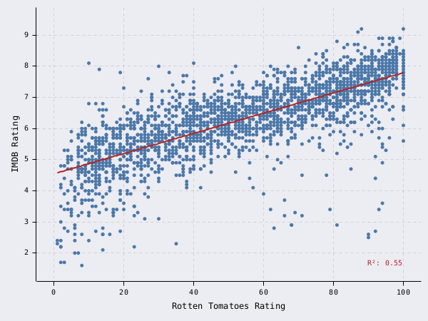
:::


### Loess Regression

The same ratings with a loess curve (bandwidth 0.3, as Vega-Lite's default).

Source: Vega-Lite - Loess Regression ([1](https://vega.github.io/vega-lite/examples/layer_point_line_loess.html), [2](https://vega.github.io/vega/examples/loess-regression/)). Data: Movie box office, budgets and ratings, vega-datasets 3.3.1 `movies.json` (https://cdn.jsdelivr.net/npm/vega-datasets@3.3.1/data/movies.json); licence: none listed - see vega-datasets (cite Vega as the source).


::: {.sourceClojure}
```clojure
(plot/render-image
 {:data (filter #(and (number? (:imdb-rating %)) (number? (:rotten-tomatoes-rating %))) movies)
  :mapping {:x :rotten-tomatoes-rating :y :imdb-rating}
  :charts [(chart/scatter {:size 5 :color [76 120 168]})
           (chart/smooth {:band :none :method-params {:bandwidth 0.3} :color [178 34 34] :width 2})]
  :labels {:x "Rotten Tomatoes Rating" :y "IMDB Rating"}}
 {:width 600 :height 450})
```
:::


::: {.clay-image}

:::


### Using window transform to impute missing values by averaging the previous and next values.

A missing value replaced by the mean of its neighbours (Vega-Lite's `window` `lag` / `lead`).

Source: [Vega-Lite - Using window transform to impute missing values by averaging the previous and next values.](https://vega.github.io/vega-lite/examples/window_impute_null.html).


::: {.sourceClojure}
```clojure
(let [bs [28 55 nil 65 43 nil 55 43]
      imputed (map (fn [prev b next] (or b (* 0.5 (+ (double prev) (double next))))) (cons nil bs) bs (concat (rest bs) [nil]))]
  (plot/render-image
   {:data (map (fn [day b] {:date (LocalDate/of 2000 1 (int day)) :b b}) (range 1 9) imputed)
    :mapping {:x :date :y :b}
    :charts [(chart/line) (chart/scatter {:size 7})]
    :scales {:x {:formatter #(.format (DateTimeFormatter/ofPattern "dd MMM" Locale/ENGLISH) ^TemporalAccessor %)}}
    :labels {:x "a" :y "b"}}
   {:width 500 :height 300}))
```
:::


::: {.clay-image}

:::


## Error Bars & Error Bands


### Error Bars Showing Confidence Interval

Mean barley yield per variety with its 95% confidence interval (`chart/extent` `:method :ci` - Student's t; the
original bootstraps it).

Source: Vega-Lite - Error Bars Showing Confidence Interval ([1](https://vega.github.io/vega-lite/examples/layer_point_errorbar_ci.html), [2](https://vega.github.io/vega/examples/error-bars/)). Data: Minnesota barley yields by variety and trial site, vega-datasets 3.3.1 `barley.json` (https://cdn.jsdelivr.net/npm/vega-datasets@3.3.1/data/barley.json); original: The Design of Experiments Reference, Wiebe, G. A., Reinbach-Welch, L., Cowan, P. R. (1940). Yields of Barley Varieties in the United States and Canada, 1932-36. United States: U.S. Department of Agriculture.; licence: notspecified (vega-datasets `datapackage.json`).


::: {.sourceClojure}
```clojure
(def barley-varieties (vec (sort (distinct (map :variety barley)))))
```
:::


::: {.sourceClojure}
```clojure
(plot/render-image
 {:data barley :mapping {:x :yield :y :variety}
  :charts [(chart/extent {:method :ci :color :black :shape \O :size 6})]
  :scales {:y {:domain barley-varieties :reverse true}}
  :labels {:x "Barley Yield" :y "variety"}}
 {:width 500 :height 350})
```
:::


::: {.clay-image}
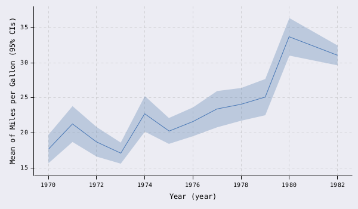
:::


### Error Bars Showing Standard Deviation

The means with one standard deviation either side.

Source: [Vega-Lite - Error Bars Showing Standard Deviation](https://vega.github.io/vega-lite/examples/layer_point_errorbar_stdev.html). Data: Minnesota barley yields by variety and trial site, vega-datasets 3.3.1 `barley.json` (https://cdn.jsdelivr.net/npm/vega-datasets@3.3.1/data/barley.json); original: The Design of Experiments Reference, Wiebe, G. A., Reinbach-Welch, L., Cowan, P. R. (1940). Yields of Barley Varieties in the United States and Canada, 1932-36. United States: U.S. Department of Agriculture.; licence: notspecified (vega-datasets `datapackage.json`).


::: {.sourceClojure}
```clojure
(plot/render-image
 {:data barley :mapping {:x :yield :y :variety}
  :charts [(chart/extent {:method :stddev :color :black :shape \O :size 6})]
  :scales {:y {:domain barley-varieties :reverse true}}
  :labels {:x "Barley Yield" :y "variety"}}
 {:width 500 :height 350})
```
:::


::: {.clay-image}
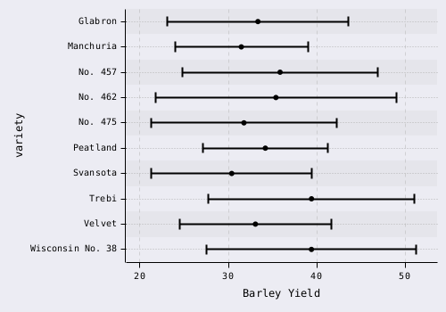
:::


### Line Chart with Confidence Interval Band

Mean miles per gallon per model year with its 95% confidence band (`fastmath.stats/ci` per year, a ribbon).

Source: [Vega-Lite - Line Chart with Confidence Interval Band](https://vega.github.io/vega-lite/examples/layer_line_errorband_ci.html). Data: Car specifications and fuel economy, vega-datasets 3.3.1 `cars.json` (https://cdn.jsdelivr.net/npm/vega-datasets@3.3.1/data/cars.json); original: StatLib Datasets Archive; licence: notspecified (vega-datasets `datapackage.json`).


::: {.sourceClojure}
```clojure
(plot/render-image
 {:data (for [[year rows] (group-by #(local-date (:year %)) (filter :miles-per-gallon cars))
              :let [[lo hi mean] (stats/ci (map :miles-per-gallon rows))]]
          {:year year :lo lo :hi hi :mean mean})
  :mapping {:x :year :y :mean}
  :charts [(chart/ribbon {:mapping {:ymin :lo :ymax :hi} :color [76 120 168 80]}) (chart/line)]
  :labels {:x "Year (year)" :y "Mean of Miles per Gallon (95% CIs)"}}
 {:width 600 :height 350})
```
:::


::: {.clay-image}

:::


### Scatterplot with Mean and Standard Deviation Overlay

Miles per gallon against horsepower; a band of one standard deviation around the mean, the mean as a rule.

Source: [Vega-Lite - Scatterplot with Mean and Standard Deviation Overlay](https://vega.github.io/vega-lite/examples/layer_scatter_errorband_1D_stdev_global_mean.html). Data: Car specifications and fuel economy, vega-datasets 3.3.1 `cars.json` (https://cdn.jsdelivr.net/npm/vega-datasets@3.3.1/data/cars.json); original: StatLib Datasets Archive; licence: notspecified (vega-datasets `datapackage.json`).


::: {.sourceClojure}
```clojure
(let [mpg (keep :miles-per-gallon cars)
      mean (stats/mean mpg)
      sd (stats/stddev mpg)]
  (plot/render-image
   {:data cars :mapping {:x :horsepower :y :miles-per-gallon}
    :charts [(chart/rect {:y [(- mean sd) (+ mean sd)] :fill [76 120 168] :alpha 0.2})
             (chart/scatter {:shape \o :size 6 :color [76 120 168]})
             (chart/rule {:y mean :color :black})]
    :labels {:x "Horsepower" :y "Miles per Gallon"}}
   {:width 600 :height 400}))
```
:::


::: {.clay-image}

:::


## Box Plots


### Box Plot with Min/Max Whiskers

Penguin body mass per species, whiskers to the minimum and maximum (`:stat :identity` over statistics computed
in Clojure).

Source: [Vega-Lite - Box Plot with Min/Max Whiskers](https://vega.github.io/vega-lite/examples/boxplot_minmax_2D_vertical.html). Data: Palmer Archipelago penguin measurements, vega-datasets 3.3.1 `penguins.json` (https://cdn.jsdelivr.net/npm/vega-datasets@3.3.1/data/penguins.json); original: Palmer Station Antarctica LTER, Allison Horst's Penguins Repository; licence: CC0-1.0 (vega-datasets `datapackage.json`).


::: {.sourceClojure}
```clojure
(plot/render-image
 {:data (for [[species rows] (group-by :species (filter :body-mass-g penguins))
              :let [mass (map :body-mass-g rows)
                    [q1 median q3] (stats/quantiles mass [0.25 0.5 0.75])]]
          {:species species :lower (reduce min mass) :q1 q1 :median median :q3 q3 :upper (reduce max mass)})
  :mapping {:x :species :lower :lower :q1 :q1 :median :median :q3 :q3 :upper :upper :color :species}
  :charts [(chart/box {:stat :identity})]
  :legend false
  :labels {:x "Species" :y "Body Mass (g)"}}
 {:width 450 :height 400})
```
:::


::: {.clay-image}
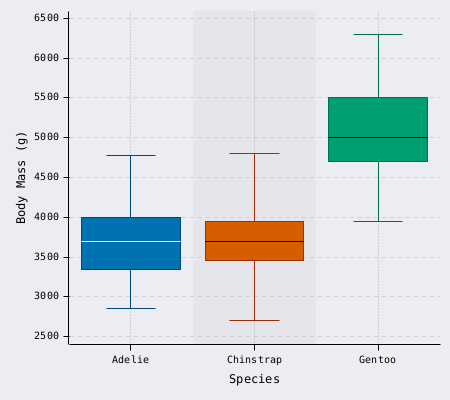
:::


### Tukey Box Plot (1.5 IQR)

The same with Tukey's whiskers (1.5 IQR) and outliers.

Source: Vega-Lite - Tukey Box Plot (1.5 IQR) ([1](https://vega.github.io/vega-lite/examples/boxplot_2D_vertical.html), [2](https://vega.github.io/vega/examples/box-plot/)). Data: Palmer Archipelago penguin measurements, vega-datasets 3.3.1 `penguins.json` (https://cdn.jsdelivr.net/npm/vega-datasets@3.3.1/data/penguins.json); original: Palmer Station Antarctica LTER, Allison Horst's Penguins Repository; licence: CC0-1.0 (vega-datasets `datapackage.json`).


::: {.sourceClojure}
```clojure
(plot/render-image
 {:data (filter :body-mass-g penguins) :mapping {:x :species :y :body-mass-g :color :species}
  :charts [(chart/box)]
  :legend false
  :labels {:x "Species" :y "Body Mass (g)"}}
 {:width 450 :height 400})
```
:::


::: {.clay-image}

:::


### Box Plot with Pre-Calculated Summaries

Boxes from given statistics and outliers (`:stat :identity`).

Source: [Vega-Lite - Box Plot with Pre-Calculated Summaries](https://vega.github.io/vega-lite/examples/boxplot_preaggregated.html).


::: {.sourceClojure}
```clojure
(plot/render-image
 {:data [{:species "Adelie" :lower 2850 :q1 3350 :median 3700 :q3 4000 :upper 4775 :outliers []}
         {:species "Chinstrap" :lower 2700 :q1 3487.5 :median 3700 :q3 3950 :upper 4800 :outliers [2700 4800]}
         {:species "Gentoo" :lower 3950 :q1 4700 :median 5000 :q3 5500 :upper 6300 :outliers []}]
  :mapping {:y :species :lower :lower :q1 :q1 :median :median :q3 :q3 :upper :upper :outliers :outliers :color :species}
  :charts [(chart/box {:stat :identity})]
  :scales {:y {:domain ["Adelie" "Chinstrap" "Gentoo"] :reverse true}}
  :legend false
  :labels {:title "Body Mass of Penguin Species (g)" :x nil :y nil}}
 {:width 500 :height 250})
```
:::


::: {.clay-image}
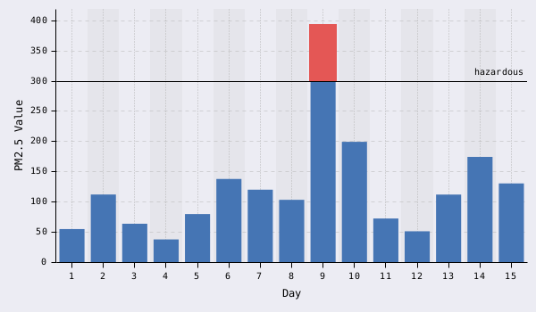
:::


## Labeling & Annotation


### Simple Bar Chart with Labels and Emojis

Fruit counts, bars coloured by count (rects - bars take only categorical colours), each labelled inside its end;
the emoji names are text in the bundled Noto Emoji font (the y axis labels can't take a font of their own).

Source: [Vega-Lite - Simple Bar Chart with Labels and Emojis](https://vega.github.io/vega-lite/examples/layer_bar_fruit.html).


::: {.sourceClojure}
```clojure
(let [fruit (map (fn [[name n]] {:name name :count n})
                 [["🍊" 21] ["🍇" 13] ["🍏" 8] ["🍌" 5] ["🍐" 3] ["🍋" 2] ["🍎" 1] ["🍉" 1]])]
  (plot/render-image
   {:data fruit
    :charts [(chart/rect {:mapping {:x0 (constantly 0) :x1 :count :y0 :name :y1 :name :color :count} :band-width 0.9})
             (chart/text {:mapping {:x :count :y :name :label :count} :data (filter #(> (long (:count %)) 10) fruit)
                          :anchor [:right :middle] :offset [-4 0] :color :white})
             (chart/text {:mapping {:x :count :y :name :label :count} :data (remove #(> (long (:count %)) 10) fruit)
                          :anchor [:right :middle] :offset [-4 0] :color :black})
             (chart/text {:mapping {:x (constantly -1.2) :y :name :label :name} :font "Noto Emoji" :size 16})]
    :scales {:y {:domain (mapv :name fruit) :reverse true :axis false} :x {:domain [-2.4 22]}
             :color {:range [[222 238 238] [44 120 150]] :title "Number of fruit"}}
    :labels {:x nil :y nil}}
   {:width 500 :height 350}))
```
:::


::: {.clay-image}
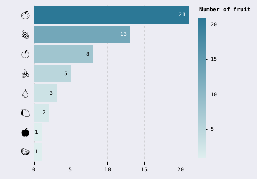
:::


### Bar Chart Highlighting Values beyond a Threshold

Daily PM2.5 values, the part of a bar above the hazardous level 300 in red, the level as a labelled rule.

Source: [Vega-Lite - Bar Chart Highlighting Values beyond a Threshold](https://vega.github.io/vega-lite/examples/layer_bar_annotations.html).


::: {.sourceClojure}
```clojure
(let [days (map (fn [day value] {:day (str day) :value value}) (range 1 16)
                [54.8 112.1 63.6 37.6 79.7 137.9 120.1 103.3 394.8 199.5 72.3 51.1 112.0 174.5 130.5])]
  (plot/render-image
   {:data days :mapping {:x :day :y :value}
    :charts [(chart/bar {:stroke-color :none :alpha 1.0})
             (chart/rect {:data (filter #(>= (double (:value %)) 300.0) days)
                          :mapping {:x0 :day :x1 :day :y0 (constantly 300) :y1 :value} :fill [228 87 85] :band-width 0.9})
             (chart/rule {:y 300 :color :black})
             (chart/text {:x [:panel 1.0] :y 300 :text "hazardous" :anchor [:right :bottom] :offset [-2 2]})]
    :scales {:x {:domain (mapv :day days)}}
    :labels {:x "Day" :y "PM2.5 Value"}}
   {:width 600 :height 350}))
```
:::


::: {.clay-image}

:::


### Mean overlay over precipitation chart

Mean precipitation per month, the mean of all days as a red rule.

Source: [Vega-Lite - Mean overlay over precipitation chart](https://vega.github.io/vega-lite/examples/layer_precipitation_mean.html). Data: Seattle daily weather from 2012–2015, vega-datasets 3.3.1 `seattle-weather.csv` (https://cdn.jsdelivr.net/npm/vega-datasets@3.3.1/data/seattle-weather.csv); original: NOAA National Climatic Data Center; licence: other-pd (vega-datasets `datapackage.json`).


::: {.sourceClojure}
```clojure
(plot/render-image
 {:data seattle-months :mapping {:x :month :y :precipitation}
  :charts [(chart/bar {:stat :mean})
           (chart/rule {:y (stats/mean (map :precipitation seattle)) :color :red :width 3})]
  :scales {:x {:domain month-names}}
  :labels {:x "date (month)" :y "Mean of precipitation"}}
 {:width 600 :height 350})
```
:::


::: {.clay-image}

:::


### Histogram with a Global Mean Overlay

IMDB ratings binned, the mean rating as a red rule.

Source: [Vega-Lite - Histogram with a Global Mean Overlay](https://vega.github.io/vega-lite/examples/layer_histogram_global_mean.html). Data: Movie box office, budgets and ratings, vega-datasets 3.3.1 `movies.json` (https://cdn.jsdelivr.net/npm/vega-datasets@3.3.1/data/movies.json); licence: none listed - see vega-datasets (cite Vega as the source).


::: {.sourceClojure}
```clojure
(plot/render-image
 {:data imdb :mapping {:x :imdb-rating}
  :charts [(chart/histogram {:bins (vec (range 1 11)) :y :count})
           (chart/rule {:x (stats/mean (map :imdb-rating imdb)) :color :red :width 5})]
  :labels {:x "IMDB Rating (binned)" :y "Count of Records"}}
 {:width 500 :height 350})
```
:::


::: {.clay-image}

:::


### Line Chart with Highlighted Rectangles

Falkensee's population, 1875-2014, with the Nazi and GDR periods as coloured rectangles behind the line.

Source: Vega-Lite - Line Chart with Highlighted Rectangles ([1](https://vega.github.io/vega-lite/examples/layer_falkensee.html), [2](https://vega.github.io/vega/examples/falkensee-population/)).


::: {.sourceClojure}
```clojure
(plot/render-image
 {:data (map (fn [[year population]] {:year year :population population})
             [[1875 1309] [1890 1558] [1910 4512] [1925 8180] [1933 15915] [1939 24824] [1946 28275] [1950 29189]
              [1964 29881] [1971 26007] [1981 24029] [1985 23340] [1989 22307] [1990 22087] [1991 22139] [1992 22105]
              [1993 22242] [1994 22801] [1995 24273] [1996 25640] [1997 27393] [1998 29505] [1999 32124] [2000 33791]
              [2001 35297] [2002 36179] [2003 36829] [2004 37493] [2005 38376] [2006 39008] [2007 39366] [2008 39821]
              [2009 40179] [2010 40511] [2011 40465] [2012 40905] [2013 41258] [2014 41777]])
  :mapping {:x :year :y :population}
  :charts [(chart/rect {:data [{:start 1933 :end 1945 :event "Nazi Rule"} {:start 1948 :end 1989 :event "GDR (East Germany)"}]
                        :mapping {:x0 :start :x1 :end :y0 (constantly nil) :y1 (constantly nil) :color :event}
                        :alpha 0.6})
           (chart/line {:color [51 51 51]})
           (chart/scatter {:size 5 :color [51 51 51]})]
  :scales {:x {:formatter #(str (m/round (double %)))} :color {:title "event"}}
  :labels {:x "year (year)" :y "population"}}
 {:width 700 :height 350})
```
:::


::: {.clay-image}

:::


### Distributions and Medians of Likert Scale Ratings

Ratings of 17 participants per question: a circle per answer sized by its count, the median as a black tick,
each scale's end labels beside it.

Source: [Vega-Lite - Distributions and Medians of Likert Scale Ratings](https://vega.github.io/vega-lite/examples/layer_likert.html).


::: {.sourceClojure}
```clojure
(def likert
  "Questions: name, the 17 ratings, the median and the scale's end labels."
  [["Identify Errors:" [2 2 2 3 2 1 2 3 2 2 2 1 2 3 4 1 3] 2.0 "Easy" "Hard"]
   ["Fix Errors:" [2 3 2 3 2 3 3 1 3 2 2 3 2 3 5 3 2] 2.0 "Easy" "Hard"]
   ["Easier to Fix:" [3 4 2 2 4 3 4 2 2 1 1 2 1 2 1 2 2] 2.0 "Toolbar" "Gesture"]
   ["Faster to Fix:" [4 5 1 2 4 4 5 4 4 1 1 3 1 2 1 2 2] 2.5 "Toolbar" "Gesture"]
   ["Easier on Phone:" [2 5 2 4 4 4 3 2 1 1 1 1 1 1 1 1 1] 1.5 "Toolbar" "Gesture"]
   ["Easier on Tablet:" [5 5 1 1 5 4 2 5 4 1 1 3 1 1 1 4 3] 3.0 "Toolbar" "Gesture"]
   ["Device Preference:" [5 5 5 5 5 4 4 5 4 5 4 3 5 1 5 5 2] 4.5 "Phone" "Tablet"]])
```
:::


::: {.sourceClojure}
```clojure
(let [questions (mapv first likert)
      ends (for [[question _ median lo hi] likert] {:question question :median median :lo lo :hi hi})]
  (plot/render-image
   {:data (for [[question ratings] likert [rating n] (frequencies ratings)] {:question question :rating rating :n n})
    :mapping {:x :rating :y :question :size :n}
    :charts [(chart/scatter {:color [110 180 253]})
             (chart/rug {:data ends :mapping {:x :median :size nil} :color :black :line-width 2 :thickness 0.4})
             (chart/text {:data ends :mapping {:x (constantly 0.4) :y :question :label :lo :size nil} :anchor [:right :middle]})
             (chart/text {:data ends :mapping {:x (constantly 5.6) :y :question :label :hi :size nil} :anchor [:left :middle]})]
    :scales {:y {:domain questions :reverse true} :x {:domain [-1.2 7.2] :ticks [1 2 3 4 5] :nice false}
             :size {:range [3 16] :area true :title "Number of Ratings"}}
    :labels {:title "Questionnaire Ratings" :x nil :y nil}}
   {:width 800 :height 350}))
```
:::


::: {.clay-image}

:::


### Comparative Likert Scale Ratings

Mean ratings with 95% intervals of two measures in two studies (top), and what each side of 0 means (bottom).

Source: [Vega-Lite - Comparative Likert Scale Ratings](https://vega.github.io/vega-lite/examples/concat_layer_voyager_result.html).


::: {.sourceClojure}
```clojure
(let [results [{:measure "Open Exploration" :mean 1.813 :lo 1.255 :hi 2.37 :study "PoleStar vs Voyager"}
               {:measure "Focused Question Answering" :mean -1.688 :lo -2.325 :hi -1.05 :study "PoleStar vs Voyager"}
               {:measure "Open Exploration" :mean 2.1875 :lo 1.665 :hi 2.71 :study "PoleStar vs Voyager 2"}
               {:measure "Focused Question Answering" :mean -0.0625 :lo -0.474 :hi 0.349 :study "PoleStar vs Voyager 2"}]]
  (plot/render-image
   (plot/arrange
    [{:data results :mapping {:x :lo :y :study}
      :charts [(chart/rule {:x 0 :color [102 102 102]})
               (chart/segment {:mapping {:xend :hi :yend :study} :color :black})
               (chart/scatter {:mapping {:x :mean :color :measure} :size 10 :stroke-color :black})]
      :scales {:x {:domain [-3 3]} :y {:domain ["PoleStar vs Voyager" "PoleStar vs Voyager 2"] :reverse true}
               :color {:domain ["Focused Question Answering" "Open Exploration"] :range [:black :white] :legend false}}
      :labels {:title "Mean of Subject Ratings (95% CIs)" :x nil :y nil}}
     {:data [{:from -0.25 :to -2.9 :y 0} {:from 0.25 :to 2.9 :y 0}]
      :mapping {:x :from :y :y :xend :to :yend :y}
      :charts [(chart/segment {:color :black :arrow {:end true :size 6}})
               (chart/text {:x -0.25 :y 0 :text "PoleStar\nMore Valuable" :anchor [:right :bottom] :offset [0 4]})
               (chart/text {:x 0.25 :y 0 :text "Voyager / Voyager 2\nMore Valuable" :anchor [:left :bottom] :offset [0 4]})]
      :scales {:x {:domain [-3 3] :axis false} :y {:axis false}}
      :theme {:panel {:grid {:x :none :y :none}}}
      :labels {:x nil :y nil}}]
    {:columns 1 :heights [3 1.4]})
   {:width 600 :height 320}))
```
:::


::: {.clay-image}

:::


## Other Layered Plots


### Candlestick Chart

Daily open, high, low and close of a stock in June 2009 - green when it closed above the open.

Source: [Vega-Lite - Candlestick Chart](https://vega.github.io/vega-lite/examples/layer_candlestick.html). Data: VIX daily open, high, low and close values, vega-datasets 3.3.1 `ohlc.json` (https://cdn.jsdelivr.net/npm/vega-datasets@3.3.1/data/ohlc.json); original: Yahoo Finance VIX Data, CBOE - VIX Historical Data; licence: none listed - see vega-datasets (cite Vega as the source).


::: {.sourceClojure}
```clojure
(plot/render-image
 {:data (map #(update % :date local-date) (nu/dataset :ohlc))
  :mapping {:x :date :open :open :high :high :low :low :close :close}
  :charts [(chart/candlestick {:up-color [6 152 45] :down-color [174 19 37]})]
  :scales {:x {:formatter #(.format (DateTimeFormatter/ofPattern "MM/dd") ^TemporalAccessor %)}}
  :labels {:x "Date in 2009" :y "Price"}}
 {:width 600 :height 400})
```
:::


::: {.clay-image}
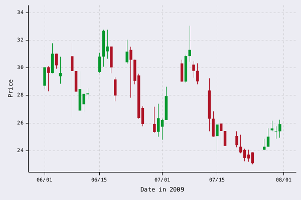
:::


### Ranged Dot Plot

Life expectancy of five countries in 1955 and 2000, joined by a line.

Source: [Vega-Lite - Ranged Dot Plot](https://vega.github.io/vega-lite/examples/layer_ranged_dot.html). Data: Country life expectancy and fertility over time, vega-datasets 3.3.1 `countries.json` (https://cdn.jsdelivr.net/npm/vega-datasets@3.3.1/data/countries.json); original: Gapminder Foundation - Life Expectancy, Gapminder Foundation - Fertility; licence: CC-BY-4.0 (vega-datasets `datapackage.json`).


::: {.sourceClojure}
```clojure
(let [countries #{"China" "India" "United States" "Indonesia" "Brazil"}
      rows (filter #(and (countries (:country %)) (#{1955 2000} (:year %))) (nu/dataset :countries-vega))]
  (plot/render-image
   {:data (map #(update % :year str) rows) :mapping {:x :life-expect :y :country}
    :charts [(chart/line {:mapping {:group :country} :color [219 100 111] :sort false})
             (chart/scatter {:mapping {:color :year} :size 9})]
    :scales {:y {:domain (vec (sort countries)) :reverse true}
             :color {:domain ["1955" "2000"] :range [[230 149 156] [145 26 36]] :title "Year"}}
    :labels {:x "Life Expectancy (years)" :y "Country"}}
   {:width 600 :height 250}))
```
:::


::: {.clay-image}

:::


### Bullet Chart

Five measures against qualitative ranges (grey bands), each with its current and projected value (blue bars) and
target (black tick) - `chart/bullet`; a panel per measure with its own x scale (facets, `:scales {:x :free}`).

Source: [Vega-Lite - Bullet Chart](https://vega.github.io/vega-lite/examples/facet_bullet.html).


::: {.sourceClojure}
```clojure
(def bullets
  [{:title "Revenue" :ranges [150 225 300] :measures [220 270] :markers [250]}
   {:title "Profit" :ranges [20 25 30] :measures [21 23] :markers [26]}
   {:title "Order Size" :ranges [350 500 600] :measures [100 320] :markers [550]}
   {:title "New Customers" :ranges [1400 2000 2500] :measures [1000 1650] :markers [2100]}
   {:title "Satisfaction" :ranges [3.5 4.25 5] :measures [3.2 4.7] :markers [4.4]}])
```
:::


::: {.sourceClojure}
```clojure
(plot/render-image
 {:data bullets :mapping {:facet :title :ranges :ranges :measures :measures :markers :markers}
  :charts [(chart/bullet)]
  :scales {:x {:nice false} :facet {:domain (mapv :title bullets)}}
  :facets {:columns 1 :scales {:x :free}}
  :theme {:panel {:grid {:x :none :y :none}}}
  :labels {:x nil :y nil}}
 {:width 600 :height 450})
```
:::


::: {.clay-image}

:::


### Weekly Weather Plot

Ten days of temperatures: record (light grey) and normal (dark grey) ranges, the observed range (black) for the
past days and the forecast ranges of the low and high (black bars joined by a thin one) for the next days.

Source: Vega-Lite - Weekly Weather Plot ([1](https://vega.github.io/vega-lite/examples/bar_layered_weather.html), [2](https://vega.github.io/vega/examples/weekly-temperature/)). Data: Example temperatures with normals, records and forecasts, vega-datasets 3.3.1 `weekly-weather.json` (https://cdn.jsdelivr.net/npm/vega-datasets@3.3.1/data/weekly-weather.json); licence: none listed - see vega-datasets (cite Vega as the source).


::: {.sourceClojure}
```clojure
(let [weather (nu/dataset :weekly-weather)
      series (fn [s] (filter #(and (= s (:series %)) (:low %)) weather))
      bars (fn [rows lo hi half fill]
             (chart/rect {:data rows :mapping {:x0 #(- (long (:id %)) half) :x1 #(+ (long (:id %)) half) :y0 lo :y1 hi}
                          :fill fill}))
      forecast (map (fn [l h] {:id (:id l) :low-high (:high l) :high-low (:low h)}) (series "forecast-low") (series "forecast-high"))]
  (plot/render-image
   {:data weather
    :charts [(bars (series "record") :low :high 0.3 [204 204 204])
             (bars (series "normal") :low :high 0.3 [153 153 153])
             (bars (series "actual") :low :high 0.18 :black)
             (bars (series "forecast-low") :low :high 0.18 :black)
             (bars forecast :low-high :high-low 0.04 :black)
             (bars (series "forecast-high") :low :high 0.18 :black)
             (chart/text {:data (series "record") :mapping {:x :id :y (constantly 70) :label :day} :anchor [:center :bottom]})]
    :scales {:y {:domain [10 72]} :x {:axis false}}
    :theme {:panel {:grid {:x :none}}}
    :labels {:title "Weekly Weather - Observations and Predictions" :x nil :y "Temperature (F)"}}
   {:width 600 :height 400}))
```
:::


::: {.clay-image}
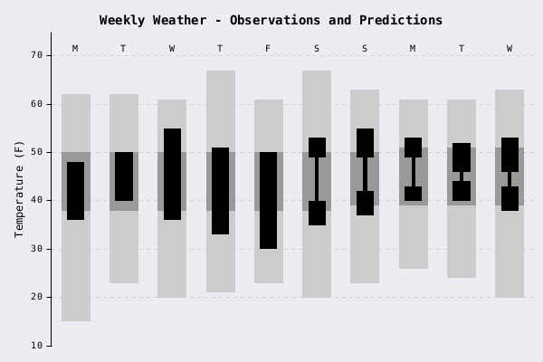
:::


### Wheat and Wages Example

W. Playfair's chart of the price of wheat (bars, shillings per quarter) and weekly wages (area) in England,
1565-1821, with the monarchs' reigns along the top (Cromwell's Commonwealth white), the names above the upper
reigns and below the lower ones.

Source: Vega-Lite - Wheat and Wages Example ([1](https://vega.github.io/vega-lite/examples/wheat_wages.html), [2](https://vega.github.io/vega/examples/wheat-and-wages/)). Data: Playfair's wheat prices and wages from 1565–1820, vega-datasets 3.3.1 `wheat.json` (https://cdn.jsdelivr.net/npm/vega-datasets@3.3.1/data/wheat.json); original: 1822 Playfair Chart; licence: other-pd (vega-datasets `datapackage.json`).


::: {.sourceClojure}
```clojure
(let [wheat (map #(update % :year parse-long) (nu/dataset :wheat))
      monarchs (for [{:keys [index commonwealth start end] :as monarch} (nu/dataset :monarchs)
                     :let [low? (and (not commonwealth) (odd? (long index)))]]
                 (assoc monarch :y0 95 :y1 (if low? 93 97) :low? low? :mid (* 0.5 (+ (long start) (long end)))
                        :fill (if commonwealth "commonwealth" "crown")))
      names (fn [low? y anchor dy]
              (chart/text {:data (filter #(= low? (:low? %)) monarchs) :mapping {:x :mid :y (constantly y) :label :name}
                           :size 9 :font-style :italic :anchor [:center anchor] :offset [0 dy] :background [255 255 255 170]
                           :padding 1}))]
  (plot/render-image
   {:data wheat :mapping {:x :year :y :wages}
    :charts [(chart/rect {:mapping {:x0 :year :x1 #(+ 5 (long (:year %))) :y0 (constantly 0) :y1 :wheat}
                          :fill [170 170 170] :stroke-color [153 153 153] :stroke-width 1})
             (chart/rule {:x [1600 1650 1700 1750 1800] :color [0 0 0 128] :width 0.6})
             (chart/line {:fill [164 206 219 180] :color :black :alpha 0.7 :width 1})
             (chart/line {:color [238 129 130] :width 1.5})
             (chart/rect {:data monarchs :mapping {:x0 :start :x1 :end :y0 :y0 :y1 :y1 :color :fill} :stroke-color :black})
             (names false 97 :bottom 2) (names true 93 :top -2)]
    :scales {:color {:domain ["crown" "commonwealth"] :range [:black :white] :legend false}
             :x {:formatter #(str (m/round (double %)))} :y {:domain [0 100]}}
    :labels {:x nil :y nil}}
   {:width 900 :height 450}))
```
:::


::: {.clay-image}

:::


## Faceting (Trellis Plot / Small Multiples)


### Trellis Bar Chart

The 2000 population per age group, a row of panels per gender.

Source: [Vega-Lite - Trellis Bar Chart](https://vega.github.io/vega-lite/examples/trellis_bar.html). Data: U.S. population by age, sex and census year, vega-datasets 3.3.1 `population.json` (https://cdn.jsdelivr.net/npm/vega-datasets@3.3.1/data/population.json); original: IPUMS USA; licence: notspecified (vega-datasets `datapackage.json`).


::: {.sourceClojure}
```clojure
(plot/render-image
 {:data population-2000 :mapping {:x :age :y :people :color :gender :facet-row :gender}
  :charts [(chart/bar)]
  :scales {:x {:type :categorical} :y {:formatter millions} :color gender-colors}
  :labels {:x "age" :y "population"}}
 {:width 700 :height 450})
```
:::


::: {.clay-image}
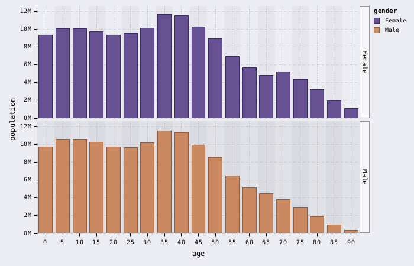
:::


### Trellis Stacked Bar Chart

Barley yields per variety stacked by site, a column of panels per year.

Source: [Vega-Lite - Trellis Stacked Bar Chart](https://vega.github.io/vega-lite/examples/trellis_stacked_bar.html). Data: Minnesota barley yields by variety and trial site, vega-datasets 3.3.1 `barley.json` (https://cdn.jsdelivr.net/npm/vega-datasets@3.3.1/data/barley.json); original: The Design of Experiments Reference, Wiebe, G. A., Reinbach-Welch, L., Cowan, P. R. (1940). Yields of Barley Varieties in the United States and Canada, 1932-36. United States: U.S. Department of Agriculture.; licence: notspecified (vega-datasets `datapackage.json`).


::: {.sourceClojure}
```clojure
(plot/render-image
 {:data barley :mapping {:y :variety :x :yield :color :site :facet-col :year}
  :charts [(chart/bar {:position :stack})]
  :scales {:y {:domain barley-varieties :reverse true}}
  :labels {:x "Sum of yield" :y "variety"}}
 {:width 900 :height 400})
```
:::


::: {.clay-image}
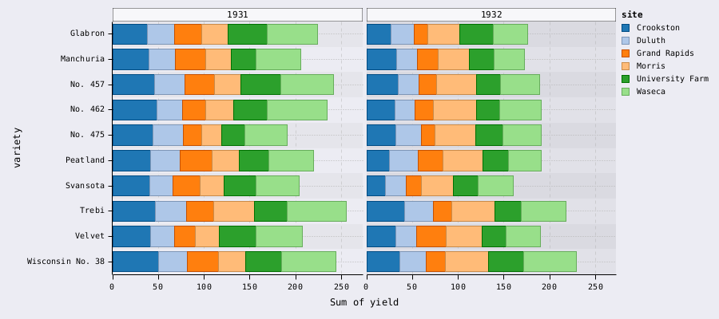
:::


### Trellis Scatter Plot (wrapped)

US DVD sales against worldwide gross, a panel per MPAA rating wrapped in two columns (the movies without a rating
in the NA panel).

Source: [Vega-Lite - Trellis Scatter Plot (wrapped)](https://vega.github.io/vega-lite/examples/trellis_scatter.html). Data: Movie box office, budgets and ratings, vega-datasets 3.3.1 `movies.json` (https://cdn.jsdelivr.net/npm/vega-datasets@3.3.1/data/movies.json); licence: none listed - see vega-datasets (cite Vega as the source).


::: {.sourceClojure}
```clojure
(plot/render-image
 {:data (filter #(and (number? (:worldwide-gross %)) (number? (:us-dvd-sales %))) movies)
  :mapping {:x :worldwide-gross :y :us-dvd-sales :facet :mpaa-rating}
  :charts [(chart/scatter {:shape \o :size 5 :color [76 120 168]})]
  :scales {:x {:formatter billions} :y {:formatter #(str (m/round (/ (double %) 1.0e6)) "M")}}
  :facets {:columns 2}
  :labels {:x "Worldwide Gross" :y "US DVD Sales"}}
 {:width 700 :height 800})
```
:::


::: {.clay-image}

:::


### Trellis Histograms

Horsepower in bins of 10, a row of panels per origin.

Source: [Vega-Lite - Trellis Histograms](https://vega.github.io/vega-lite/examples/trellis_bar_histogram.html). Data: Car specifications and fuel economy, vega-datasets 3.3.1 `cars.json` (https://cdn.jsdelivr.net/npm/vega-datasets@3.3.1/data/cars.json); original: StatLib Datasets Archive; licence: notspecified (vega-datasets `datapackage.json`).


::: {.sourceClojure}
```clojure
(plot/render-image
 {:data (filter :horsepower cars) :mapping {:x :horsepower :facet-row :origin}
  :charts [(chart/histogram {:bins (vec (range 40 241 10)) :y :count})]
  :labels {:x "Horsepower (binned)" :y "Count of Records"}}
 {:width 600 :height 500})
```
:::


::: {.clay-image}
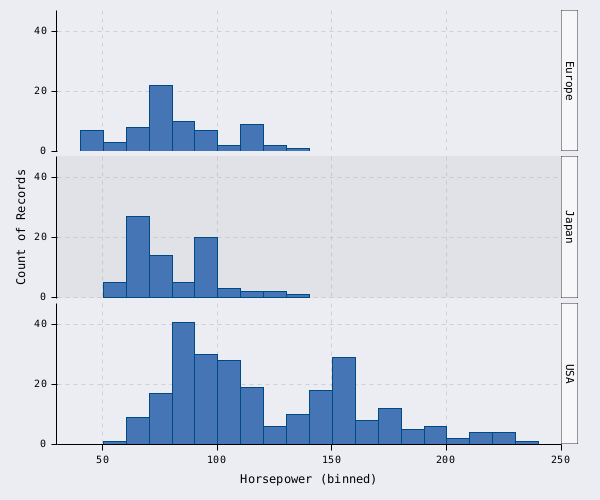
:::


### Trellis Scatter Plot Showing Anscombe's Quartet

Four series with the same summary statistics and different shapes.

Source: [Vega-Lite - Trellis Scatter Plot Showing Anscombe's Quartet](https://vega.github.io/vega-lite/examples/trellis_anscombe.html). Data: Anscombe’s quartet: similar statistics, different patterns, vega-datasets 3.3.1 `anscombe.json` (https://cdn.jsdelivr.net/npm/vega-datasets@3.3.1/data/anscombe.json); original: Anscombe's quartet (Wikipedia), Anscombe, F. J. (1973). Graphs in Statistical Analysis. The American Statistician, 27(1):17-21.; licence: none listed - see vega-datasets (cite Vega as the source).


::: {.sourceClojure}
```clojure
(plot/render-image
 {:data (nu/dataset :anscombe) :mapping {:x :x :y :y :facet-col :series}
  :charts [(chart/scatter {:size 7 :color [76 120 168]})]
  :labels {:x "X" :y "Y"}}
 {:width 900 :height 300})
```
:::


::: {.clay-image}
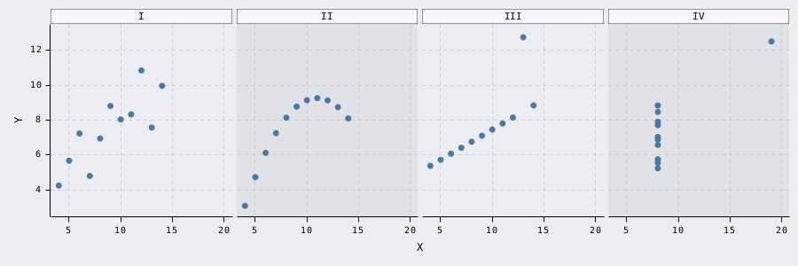
:::


### Becker's Barley Trellis Plot

Median yield per variety, year and site; sites ordered by median yield, varieties by their overall median (largest
on top) - Becker's Morris, where 1931 and 1932 seem swapped.

Source: Vega-Lite - Becker's Barley Trellis Plot ([1](https://vega.github.io/vega-lite/examples/trellis_barley.html), [2](https://vega.github.io/vega/examples/barley-trellis-plot/)). Data: Minnesota barley yields by variety and trial site, vega-datasets 3.3.1 `barley.json` (https://cdn.jsdelivr.net/npm/vega-datasets@3.3.1/data/barley.json); original: The Design of Experiments Reference, Wiebe, G. A., Reinbach-Welch, L., Cowan, P. R. (1940). Yields of Barley Varieties in the United States and Canada, 1932-36. United States: U.S. Department of Agriculture.; licence: notspecified (vega-datasets `datapackage.json`).


::: {.sourceClojure}
```clojure
(let [median-of (fn [k] (update-vals (group-by k barley) #(stats/median (map :yield %))))
      site-medians (median-of :site)
      variety-medians (median-of :variety)]
  (plot/render-image
   {:data (for [[[site variety year] rows] (group-by (juxt :site :variety :year) barley)]
            {:site site :variety variety :year (str year) :yield (stats/median (map :yield rows))})
    :mapping {:x :yield :y :variety :color :year :facet :site}
    :charts [(chart/scatter {:shape \o :size 7 :stroke-width 1.5})]
    :scales {:facet {:domain (vec (sort-by site-medians (keys site-medians)))} :color {:range (c/palette :category10)}
             :y {:domain (vec (sort-by (comp - variety-medians) (keys variety-medians))) :reverse true}}
    :facets {:columns 2}
    :labels {:x "Median of yield" :y "variety"}}
   {:width 700 :height 700}))
```
:::


::: {.clay-image}
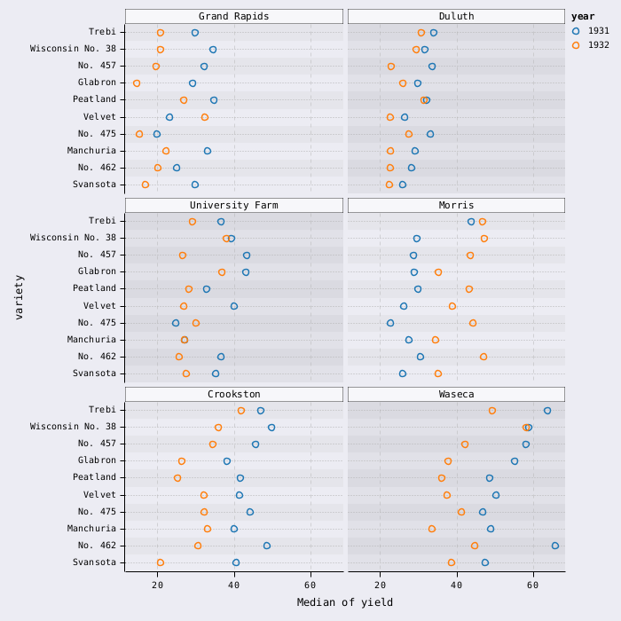
:::


### Trellis Area

The prices of four companies as areas, a row of panels per symbol (no grid, as the original).

Source: [Vega-Lite - Trellis Area](https://vega.github.io/vega-lite/examples/trellis_area.html). Data: Monthly stock prices for five companies, vega-datasets 3.3.1 `stocks.csv` (https://cdn.jsdelivr.net/npm/vega-datasets@3.3.1/data/stocks.csv); licence: none listed - see vega-datasets (cite Vega as the source).


::: {.sourceClojure}
```clojure
(let [rows (remove #(= "GOOG" (:symbol %)) stocks)]
  (plot/render-image
   {:data rows :mapping {:x :date :y :price :color :symbol :facet-row :symbol}
    :charts [(chart/line {:fill :color})]
    :scales {:y {:domain [0 (reduce max (map :price rows))]} :color {:range (c/palette :category10) :legend false}}
    :theme {:panel {:grid {:x :none :y :none}}}
    :labels {:x "Time" :y "Price"}}
   {:width 600 :height 500}))
```
:::


::: {.clay-image}
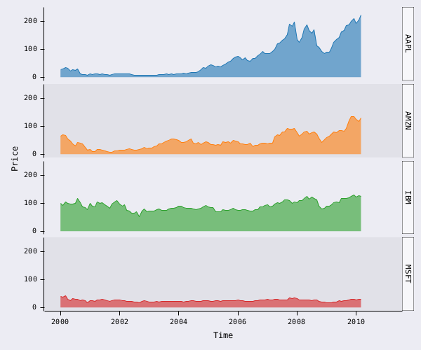
:::


### Trellis Area Plot Showing Annual Temperatures in Seattle

Hourly temperature normals over the year, a thin panel per hour from 6 AM, each labelled inside at its left
(strips off), the y range per panel's data (no zero, no y axis - as the original).

Source: [Vega-Lite - Trellis Area Plot Showing Annual Temperatures in Seattle](https://vega.github.io/vega-lite/examples/trellis_area_seattle.html). Data: Seattle hourly climate normals for 1981–2010, vega-datasets 3.3.1 `seattle-weather-hourly-normals.csv` (https://cdn.jsdelivr.net/npm/vega-datasets@3.3.1/data/seattle-weather-hourly-normals.csv); original: NOAA National Climatic Data Center (NCDC); licence: other-pd (vega-datasets `datapackage.json`).


::: {.sourceClojure}
```clojure
(let [hour-label (fn [h] (case (long h) 0 "Midnight" 12 "Noon" (format "%02d:00 %s" (if (zero? (mod h 12)) 12 (mod h 12)) (if (< h 12) "AM" "PM"))))
      hours (map #(mod (+ 6 %) 24) (range 24))
      rows (for [{:keys [date temperature]} (nu/dataset :seattle-weather-hourly-normals)
                 :let [t (java.time.LocalDateTime/parse date)]]
             {:date (.toLocalDate t) :hour (hour-label (.getHour t)) :temperature temperature})]
  (plot/render-image
   {:data rows :mapping {:x :date :y :temperature :facet-row :hour}
    :charts [(chart/line {:fill [76 120 168 160] :color [76 120 168] :width 0.5})
             (chart/text {:data (for [[hour rs] (group-by :hour rows)
                                      :let [ts (map :temperature rs)]]
                                  {:hour hour :date (reduce #(if (neg? (compare %1 %2)) %1 %2) (map :date rs))
                                   :mid (* 0.5 (+ (double (reduce min ts)) (double (reduce max ts))))})
                          :mapping {:x :date :y :mid :label :hour :facet-row :hour} :anchor [:left :middle] :offset [4 0]
                          :size 9})]
    :scales {:facet-row {:domain (mapv hour-label hours)} :y {:axis false}
             :x {:formatter #(.format (DateTimeFormatter/ofPattern "MMM" Locale/ENGLISH) ^TemporalAccessor %)}}
    :facets {:strips false :scales {:y :free}}
    :theme {:panel {:grid {:x :none :y :none}} :facet {:gap 1}}
    :labels {:title "Seattle Temperature Normals" :x "Month" :y nil}}
   {:width 800 :height 800}))
```
:::


::: {.clay-image}
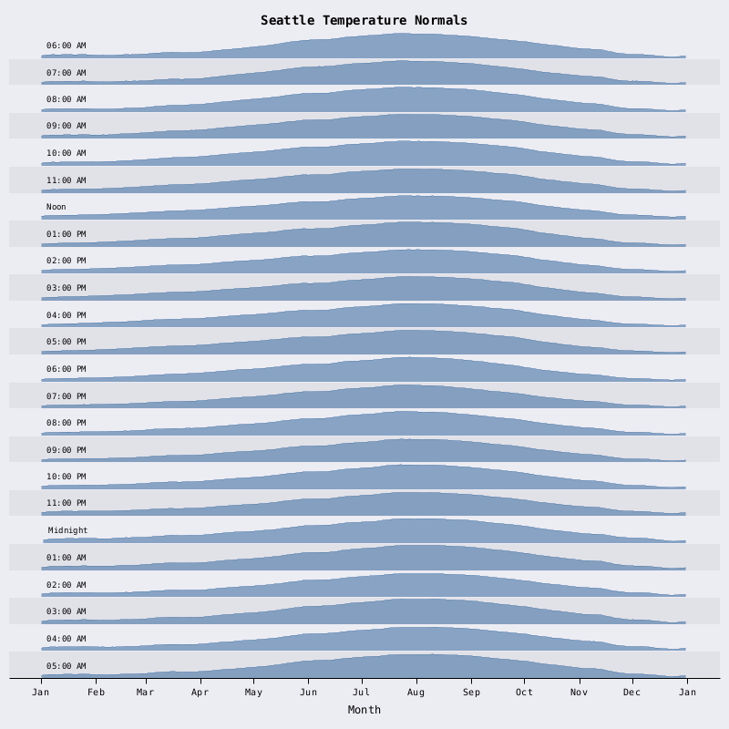
:::


### Faceted Density Plot

Penguin body mass densities from 2500 to 6500 g, a row of panels per species.

Source: [Vega-Lite - Faceted Density Plot](https://vega.github.io/vega-lite/examples/area_density_facet.html). Data: Palmer Archipelago penguin measurements, vega-datasets 3.3.1 `penguins.json` (https://cdn.jsdelivr.net/npm/vega-datasets@3.3.1/data/penguins.json); original: Palmer Station Antarctica LTER, Allison Horst's Penguins Repository; licence: CC0-1.0 (vega-datasets `datapackage.json`).


::: {.sourceClojure}
```clojure
(plot/render-image
 {:data (filter :body-mass-g penguins) :mapping {:x :body-mass-g :facet-row :species}
  :charts [(chart/density {:fill :color})]
  :scales {:x {:domain [2500 6500]}}
  :labels {:title "Distribution of Body Mass of Penguins" :x "Body Mass (g)" :y "density"}}
 {:width 600 :height 450})
```
:::


::: {.clay-image}

:::


### Compact Trellis Grid of Bar Charts

Three settings' values per combination of two factors: a grid of panels (`:facet-row` / `:facet-col`), no y axis,
the legend naming the bars.

Source: [Vega-Lite - Compact Trellis Grid of Bar Charts](https://vega.github.io/vega-lite/examples/facet_grid_bar.html).


::: {.sourceClojure}
```clojure
(plot/render-image
 {:data (for [[a b ps] [["a1" "b1" [0.14 0.60 0.03]] ["a1" "b2" [0.80 0.38 0.55]] ["a1" "b3" [0.11 0.58 0.79]]
                        ["a2" "b1" [0.83 0.87 0.67]] ["a2" "b2" [0.97 0.84 0.90]] ["a2" "b3" [0.74 0.64 0.19]]
                        ["a3" "b1" [0.57 0.35 0.49]] ["a3" "b2" [0.91 0.38 0.91]] ["a3" "b3" [0.99 0.80 0.37]]]
              [c p] (map vector ["x" "y" "z"] ps)]
          {:a a :b b :c c :p p})
  :mapping {:y :c :x :p :color :c :facet-row :a :facet-col :b}
  :charts [(chart/bar)]
  :scales {:y {:axis false :reverse true} :x {:formatter #(str (m/round (* 100.0 (double %))) "%")}
           :color {:title "settings"}}
  :labels {:x nil :y nil}}
 {:width 700 :height 400})
```
:::


::: {.clay-image}

:::


## Repeat & Concatenation


### Vertical Concatenation

Seattle's mean precipitation per month (top); days counted per bin of minimum and maximum temperature (bottom).

Source: [Vega-Lite - Vertical Concatenation](https://vega.github.io/vega-lite/examples/vconcat_weather.html). Data: Seattle and New York daily weather from 2012–2015, vega-datasets 3.3.1 `weather.csv` (https://cdn.jsdelivr.net/npm/vega-datasets@3.3.1/data/weather.csv); original: NOAA Climate Data Online; licence: other-pd (vega-datasets `datapackage.json`).


::: {.sourceClojure}
```clojure
(let [seattle-days (filter #(= "Seattle" (:location %)) (nu/dataset :weather))]
  (plot/render-image
   (plot/arrange
    [{:data (map #(assoc % :month (month-name (:date %))) seattle-days) :mapping {:x :month :y :precipitation}
      :charts [(chart/bar {:stat :mean})]
      :scales {:x {:domain month-names}}
      :labels {:x "date (month)" :y "Mean of precipitation"}}
     {:data (map (fn [[[lo-min lo-max] n]] {:x (+ lo-min 2.5) :y (+ lo-max 2.5) :n n})
                 (frequencies (map (juxt #(bin-start 5 (:temp-min %)) #(bin-start 5 (:temp-max %))) seattle-days)))
      :mapping {:x :x :y :y :size :n}
      :charts [(chart/scatter {:shape \o :color [76 120 168] :stroke-width 1.5})]
      :scales {:size {:range [2 20] :area true :title "Count of Records"}}
      :labels {:x "temp_min (binned)" :y "temp_max (binned)"}}]
    {:columns 1})
   {:width 600 :height 650}))
```
:::


::: {.clay-image}
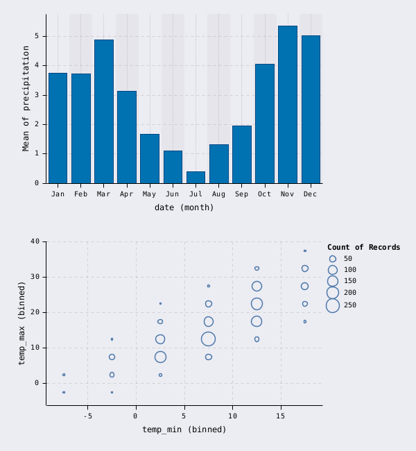
:::


### Horizontally Repeated Charts

Histograms of four car measurements, stacked by origin, in two columns (Vega-Lite's `repeat`).

Source: [Vega-Lite - Horizontally Repeated Charts](https://vega.github.io/vega-lite/examples/repeat_histogram.html). Data: Car specifications and fuel economy, vega-datasets 3.3.1 `cars.json` (https://cdn.jsdelivr.net/npm/vega-datasets@3.3.1/data/cars.json); original: StatLib Datasets Archive; licence: notspecified (vega-datasets `datapackage.json`).


::: {.sourceClojure}
```clojure
(plot/render-image
 (plot/arrange
  (vec (for [[k title bins] [[:horsepower "Horsepower" (range 40 241 20)] [:miles-per-gallon "Miles_per_Gallon" (range 5 51 5)]
                             [:acceleration "Acceleration" (range 8 27 2)] [:displacement "Displacement" (range 50 501 50)]]]
         {:data (filter k cars) :mapping {:x k :color :origin}
          :charts [(chart/histogram {:bins (vec bins) :y :count :position :stack})]
          :scales {:color {:range (c/palette :category10)}}
          :labels {:x (str title " (binned)") :y "Count of Records"}}))
  {:columns 2})
 {:width 900 :height 600})
```
:::


::: {.clay-image}
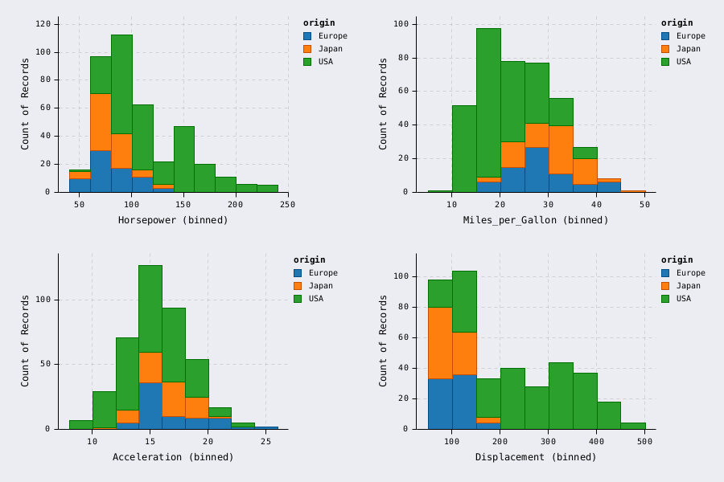
:::


### Interactive Scatterplot Matrix

Horsepower, acceleration and miles per gallon against each other, coloured by origin - the matrix without its
brushing and panning (static). The rows run in the opposite order to the columns, as the original's.

Source: [Vega-Lite - Interactive Scatterplot Matrix](https://vega.github.io/vega-lite/examples/interactive_splom.html). Data: Car specifications and fuel economy, vega-datasets 3.3.1 `cars.json` (https://cdn.jsdelivr.net/npm/vega-datasets@3.3.1/data/cars.json); original: StatLib Datasets Archive; licence: notspecified (vega-datasets `datapackage.json`).


::: {.sourceClojure}
```clojure
(let [columns [[:miles-per-gallon "Miles_per_Gallon"] [:acceleration "Acceleration"] [:horsepower "Horsepower"]]]
  (plot/render-image
   (plot/arrange
    (vec (for [[row-k row-title] (reverse columns) [col-k col-title] columns]
           {:data (filter #(and (row-k %) (col-k %)) cars) :mapping {:x col-k :y row-k :color :origin}
            :charts [(chart/scatter {:shape \o :size 5})]
            :scales {:color {:range (c/palette :category10)}}
            :legend (= [row-k col-k] [:horsepower :horsepower])
            :labels {:x col-title :y row-title}}))
    {:columns 3 :equal-panels true})
   {:width 900 :height 750}))
```
:::


::: {.clay-image}

:::


### Marginal Histograms

Movies counted per IMDB and Rotten Tomatoes rating bin (centre), with each rating's histogram on the top and right
margins.

Source: [Vega-Lite - Marginal Histograms](https://vega.github.io/vega-lite/examples/concat_marginal_histograms.html). Data: Movie box office, budgets and ratings, vega-datasets 3.3.1 `movies.json` (https://cdn.jsdelivr.net/npm/vega-datasets@3.3.1/data/movies.json); licence: none listed - see vega-datasets (cite Vega as the source).


::: {.sourceClojure}
```clojure
(let [rated (filter #(and (number? (:imdb-rating %)) (number? (:rotten-tomatoes-rating %))) movies)
      counts (frequencies (map (juxt #(bin-start 1 (:imdb-rating %)) #(bin-start 10 (:rotten-tomatoes-rating %))) rated))]
  (plot/render-image
   {:data (map (fn [[[x y] n]] {:x (+ x 0.5) :y (+ y 5.0) :n n}) counts)
    :mapping {:x :x :y :y :color :n}
    :charts [(chart/tile)]
    :margins {:top {:charts [(chart/histogram {:data (filter #(number? (:imdb-rating %)) movies) :mapping {:x :imdb-rating}
                                               :bins (vec (range 1 11)) :y :count})]
                    :size 120}
              :right {:charts [(chart/histogram {:data (filter #(number? (:rotten-tomatoes-rating %)) movies)
                                                 :mapping {:x :rotten-tomatoes-rating} :bins (vec (range 0 101 10)) :y :count})]
                      :size 120}}
    :scales {:color {:title "Count of Records"}}
    :labels {:x "IMDB Rating (binned)" :y "Rotten Tomatoes Rating (binned)"}}
   {:width 700 :height 600}))
```
:::


::: {.clay-image}

:::


### Discretizing scales

Nine values as circles with sizes and colours in classes: equal-width bins (quantize), quantiles (quantile) and
given breaks 30 and 70 (threshold) - colours through binned colour scales, the size classes computed in Clojure
(cljplot2 has no binned size scale).

Source: [Vega-Lite - Discretizing scales](https://vega.github.io/vega-lite/examples/concat_bar_scales_discretize.html).


::: {.sourceClojure}
```clojure
(let [values [["A" 28] ["B" 55] ["C" 43] ["D" 91] ["E" 81] ["F" 53] ["G" 19] ["H" 87] ["I" 52]]
      class-of (fn [breaks v] (count (filter #(>= (double v) (double %)) breaks)))
      panel (fn [title breaks color-bins gradient]
              {:data (map (fn [[a b]] {:a a :b b :class (str (class-of breaks b))}) values)
               :mapping {:y :a :x (constantly 0) :color :b :size :class}
               :charts [(chart/scatter)]
               :scales {:y {:domain (mapv first values) :reverse true} :x {:axis false}
                        :color {:kind :binned :bins color-bins :range gradient :title title}
                        :size {:domain (mapv str (range (inc (count breaks)))) :range [4 16] :legend false}}
               :labels {:x nil :y nil}})
      quartiles (stats/quantiles (map second values) [0.25 0.5 0.75])]
  (plot/render-image
   (plot/arrange
    [(panel "Quantize" [22.75 45.5 68.25] [0 22.75 45.5 68.25 91] [[222 235 247] [8 81 156]])
     (panel "Quantile" quartiles {:quantiles 4} :viridis/magma)
     (panel "Threshold" [30 70] [0 30 70 100] :viridis/viridis)]
    {:columns 3})
   {:width 900 :height 350}))
```
:::


::: {.clay-image}

:::


### Nested View Concatenation Aligned with Axis `minExtent`

Histograms of two ratings (top) and two grosses (bottom), up to 20 bins each, the panels aligned across rows.

Source: [Vega-Lite - Nested View Concatenation Aligned with Axis minExtent](https://vega.github.io/vega-lite/examples/nested_concat_align.html). Data: Movie box office, budgets and ratings, vega-datasets 3.3.1 `movies.json` (https://cdn.jsdelivr.net/npm/vega-datasets@3.3.1/data/movies.json); licence: none listed - see vega-datasets (cite Vega as the source).


::: {.sourceClojure}
```clojure
(let [histogram (fn [k title bins formatter]
                  {:data (filter #(number? (k %)) movies) :mapping {:x k}
                   :charts [(chart/histogram {:bins bins :y :count})]
                   :scales (if formatter {:x {:formatter formatter}} {})
                   :labels {:x (str title " (binned)") :y "Count of Records"}})]
  (plot/render-image
   (plot/arrange
    [(plot/arrange [(histogram :rotten-tomatoes-rating "Rotten Tomatoes Rating" (vec (range 0 101 5)) nil)
                    (histogram :imdb-rating "IMDB Rating" (vec (range 1 10.01 0.5)) nil)]
                   {:columns 2 :title "Ratings"})
     (plot/arrange [(histogram :us-gross "US Gross" (vec (range 0 8.01e8 5e7)) #(str (m/round (/ (double %) 1.0e6)) "M"))
                    (histogram :worldwide-gross "Worldwide Gross" (vec (range 0 2.81e9 2e8)) billions)]
                   {:columns 2 :title "Gross"})]
    {:columns 1})
   {:width 900 :height 650}))
```
:::


::: {.clay-image}
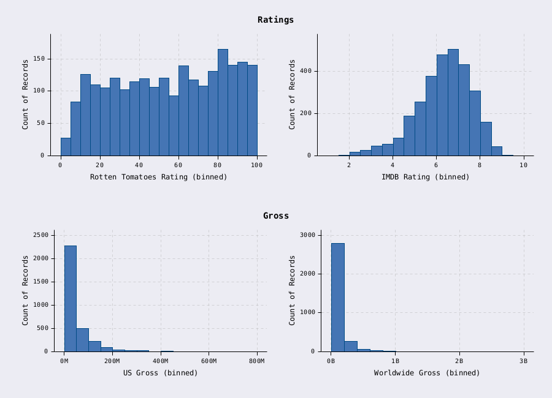
:::


### Population Pyramid

Women (left, the axis running leftward) and men (right) per age group in 2000, the ages written between the halves.

Source: [Vega-Lite - Population Pyramid](https://vega.github.io/vega-lite/examples/concat_population_pyramid.html). Data: U.S. population by age, sex and census year, vega-datasets 3.3.1 `population.json` (https://cdn.jsdelivr.net/npm/vega-datasets@3.3.1/data/population.json); original: IPUMS USA; licence: notspecified (vega-datasets `datapackage.json`).


::: {.sourceClojure}
```clojure
(let [ages (vec (sort > (distinct (map :age population-2000))))
      half (fn [gender reverse?]
             {:data (filter #(= gender (:gender %)) population-2000) :mapping {:y :age :x :people :color :gender}
              :charts [(chart/bar)]
              :scales {:y {:type :categorical :domain ages :reverse true :axis false}
                       :x {:formatter millions :reverse reverse?} :color gender-colors}
              :legend false
              :labels {:title gender :x "population" :y nil}})]
  (plot/render-image
   (plot/arrange
    [(half "Female" true)
     {:data (map (fn [age] {:age age :x 0}) ages) :mapping {:y :age :x :x}
      :charts [(chart/text {:mapping {:x :x :y :age :label :age}})]
      :scales {:y {:type :categorical :domain ages :reverse true :axis false} :x {:axis false}}
      :theme {:panel {:grid {:x :none :y :none}}}
      :labels {:title " " :x " " :y nil}}
     (half "Male" false)]
    {:columns 3 :widths [5 1 5]})
   {:width 900 :height 450}))
```
:::


::: {.clay-image}

:::


## Interactive Charts (static variants)


### Interactive Legend

The streamgraph of unemployment per industry with one series selected - Finance at full colour, the others faded
toward the background (the original selects by clicking the legend and dims the rest with opacity).

Source: Vega-Lite - Interactive Legend ([1](https://vega.github.io/vega-lite/examples/interactive_legend.html), [2](https://vega.github.io/vega/examples/interactive-legend/)). Data: U.S. unemployment by industry over time, vega-datasets 3.3.1 `unemployment-across-industries.json` (https://cdn.jsdelivr.net/npm/vega-datasets@3.3.1/data/unemployment-across-industries.json); original: U.S. Census Bureau Current Population Survey, BLS LAUS Data Tools, Bureau of Labor Statistics Table A-31; licence: other-pd (vega-datasets `datapackage.json`).


::: {.sourceClojure}
```clojure
(let [industries (vec (sort (distinct (map :series unemployment))))
      colors (map (fn [industry color] (if (= "Finance" industry) color (c/lerp color [236 236 243] 0.8)))
                  industries (cycle (c/palette :category20b)))]
  (plot/render-image
   {:data unemployment :mapping {:x :date :y :count :color :series}
    :charts [(chart/line {:fill :color :position :silhouette :width 0 :alpha 1.0})]
    :scales {:color {:domain industries :range (vec colors) :title "series"} :y {:axis false}}
    :labels {:x "date (year-month)" :y nil}}
   {:width 800 :height 400}))
```
:::


::: {.clay-image}
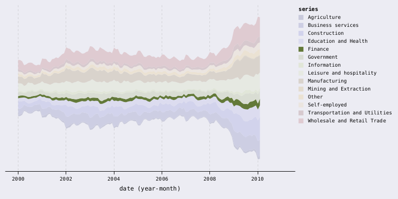
:::


## Bar Charts (Vega)


### Nested bar chart

Mean values per inner category (`b`) nested in outer groups (`a`): a row of panels per group, each as tall as its
number of bars (free y scales, facet `:heights`).

Source: [Vega - Nested bar chart](https://vega.github.io/vega/examples/nested-bar-chart/).


::: {.sourceClojure}
```clojure
(plot/render-image
 {:data (for [[[a b] rows] (group-by (juxt :a :b) [{:a 0 :b "a" :c 6.3} {:a 0 :b "a" :c 4.2} {:a 0 :b "b" :c 6.8}
                                                  {:a 0 :b "c" :c 5.1} {:a 1 :b "b" :c 4.4} {:a 2 :b "b" :c 3.5}
                                                  {:a 2 :b "c" :c 6.2}])]
          {:a (str a) :b b :c (stats/mean (map :c rows))})
  :mapping {:y :b :x :c :color :a :facet-row :a}
  :charts [(chart/bar)]
  :scales {:y {:reverse true}}
  :facets {:scales {:y :free} :heights [3 1 2]}
  :legend false
  :labels {:x "c" :y "b"}}
 {:width 500 :height 300})
```
:::


::: {.clay-image}
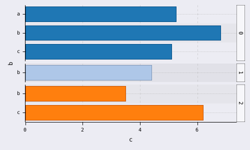
:::


## Line & Area Charts (Vega)


### Job voyager

Each occupation's share of the US labour force, 1850-2000, men (blue) and women (red) stacked (the original's search
box and its labels of the largest jobs are left out).

Source: [Vega - Job voyager](https://vega.github.io/vega/examples/job-voyager/). Data: U.S. occupation counts by sex and census year, vega-datasets 3.3.1 `jobs.json` (https://cdn.jsdelivr.net/npm/vega-datasets@3.3.1/data/jobs.json); original: IPUMS USA; licence: notspecified (vega-datasets `datapackage.json`).


::: {.sourceClojure}
```clojure
(plot/render-image
 {:data (nu/dataset :jobs) :mapping {:x :year :y :perc :color :sex :group :job}
  :charts [(chart/line {:fill :color :position :stack :alpha 0.6 :color :white :width 0.2})]
  :scales {:color {:domain ["men" "women"] :range [[51 51 255] [255 51 51]] :title nil}
           :x {:formatter #(str (m/round (double %)))} :y {:formatter #(str (m/round (* 100.0 (double %))) "%")}}
  :labels {:x "year" :y "share of the labour force"}}
 {:width 900 :height 500})
```
:::


::: {.clay-image}
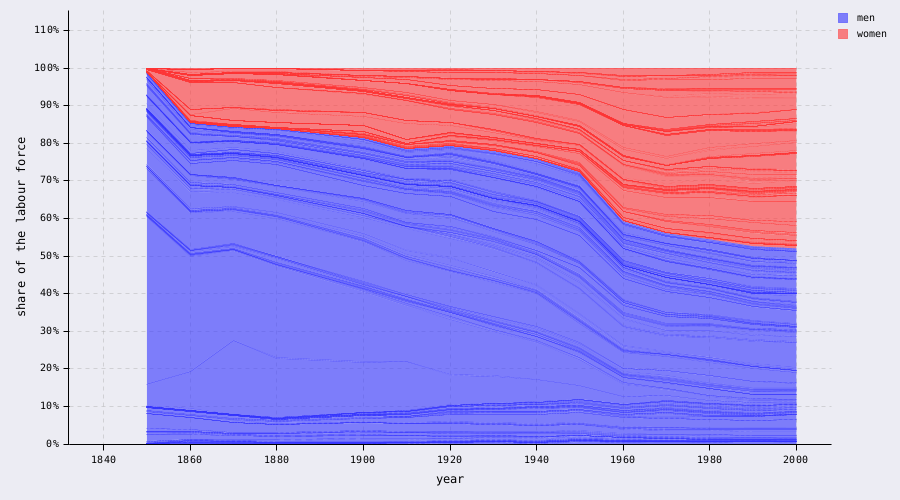
:::


## Circular Charts (Vega)


### Radar chart

Seven values of two categories as filled polygons on spokes (parallel coordinates in polar coordinates, one scale
for all spokes; no value axes, as the original).

Source: [Vega - Radar chart](https://vega.github.io/vega/examples/radar-chart/).


::: {.sourceClojure}
```clojure
(plot/render-image
 {:data [{:category "0" :key-0 19 :key-1 22 :key-2 14 :key-3 38 :key-4 23 :key-5 5 :key-6 27}
         {:category "1" :key-0 13 :key-1 12 :key-2 42 :key-3 13 :key-4 6 :key-5 15 :key-6 8}]
  :mapping {:color :category}
  :coord {:kind :polar}
  :charts [(chart/parallel {:variables [:key-0 :key-1 :key-2 :key-3 :key-4 :key-5 :key-6] :scaling :globalminmax
                            :fill :color :alpha 0.5 :axes false})]
  :scales {:color {:range (c/palette :category10)}}
  :labels {:x nil :y nil}}
 {:width 500 :height 450})
```
:::


::: {.clay-image}

:::


## Distributions (Vega)


### Histogram null values

IMDB ratings in bins of 1, the movies without a rating as a separate grey bar on the left (a second plot sharing the
count axis - cljplot2 has no null bin).

Source: [Vega - Histogram null values](https://vega.github.io/vega/examples/histogram-null-values/). Data: Movie box office, budgets and ratings, vega-datasets 3.3.1 `movies.json` (https://cdn.jsdelivr.net/npm/vega-datasets@3.3.1/data/movies.json); licence: none listed - see vega-datasets (cite Vega as the source).


::: {.sourceClojure}
```clojure
(let [nulls (count (remove #(number? (:imdb-rating %)) movies))
      y {:domain [0 (max nulls 1000)]}]
  (plot/render-image
   (plot/arrange
    [{:data [{:x "null" :n nulls}] :mapping {:x :x :y :n}
      :charts [(chart/bar {:color [170 170 170] :width 0.9})]
      :scales {:y y} :labels {:x " " :y "count"}}
     {:data imdb :mapping {:x :imdb-rating}
      :charts [(chart/histogram {:bins (vec (range 1 11)) :y :count})]
      :scales {:y (assoc y :axis false)} :labels {:x "IMDB Rating" :y nil}}]
    {:columns 2 :widths [2 9]})
   {:width 700 :height 350}))
```
:::


::: {.clay-image}
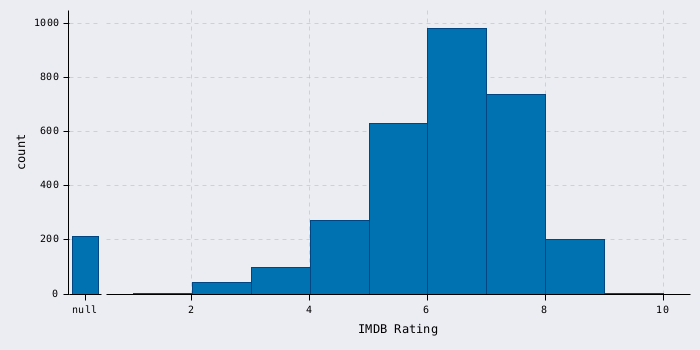
:::


### Violin plot

Penguin body mass per species as violins with the quartile box: trimmed to the data (top) and estimated over 2000 -
6500 g (bottom), at three bandwidths (the original has a checkbox and a slider).

Source: [Vega - Violin plot](https://vega.github.io/vega/examples/violin-plot/). Data: Palmer Archipelago penguin measurements, vega-datasets 3.3.1 `penguins.json` (https://cdn.jsdelivr.net/npm/vega-datasets@3.3.1/data/penguins.json); original: Palmer Station Antarctica LTER, Allison Horst's Penguins Repository; licence: CC0-1.0 (vega-datasets `datapackage.json`).


::: {.sourceClojure}
```clojure
(let [rows (filter :body-mass-g penguins)]
  (plot/render-image
   (plot/arrange
    (vec (for [trimmed? [true false] bandwidth [:nrd0 100 250]]
           {:data rows :mapping {:x :body-mass-g :y :species :color :species}
            :charts [(chart/violin (cond-> {:bandwidth bandwidth :inner :box}
                                     trimmed? (assoc :cut 0)
                                     (not trimmed?) (assoc :cut 10)))]
            :scales {:y {:reverse true} :x {:domain [2000 6500]}}
            :legend false
            :labels {:title (str (if trimmed? "trimmed" "2000 - 6500 g") ", bandwidth " (if (keyword? bandwidth) "auto" bandwidth))
                     :x "Body Mass (g)" :y nil}}))
    {:columns 3})
   {:width 1000 :height 550}))
```
:::


::: {.clay-image}
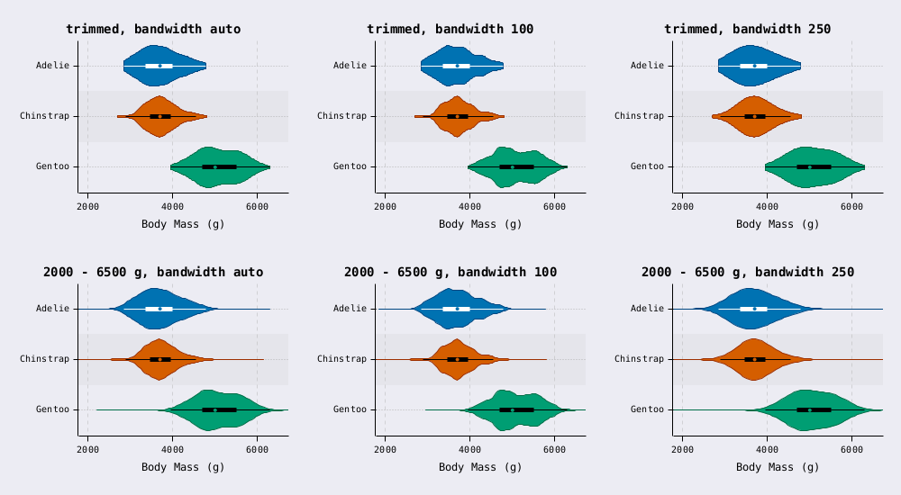
:::


### Contour plot

Cars by horsepower and miles per gallon with three density contours per origin.

Source: [Vega - Contour plot](https://vega.github.io/vega/examples/contour-plot/). Data: Car specifications and fuel economy, vega-datasets 3.3.1 `cars.json` (https://cdn.jsdelivr.net/npm/vega-datasets@3.3.1/data/cars.json); original: StatLib Datasets Archive; licence: notspecified (vega-datasets `datapackage.json`).


::: {.sourceClojure}
```clojure
(plot/render-image
 {:data (filter #(and (:horsepower %) (:miles-per-gallon %)) cars)
  :mapping {:x :horsepower :y :miles-per-gallon :color :origin}
  :charts [(chart/scatter {:size 4}) (chart/contour {:levels 3 :width 1.5})]
  :scales {:color {:range (c/palette :category10)}}
  :labels {:x "Horsepower" :y "Miles_per_Gallon"}}
 {:width 600 :height 450})
```
:::


::: {.clay-image}

:::


### Wheat plot

A sample stacked as dots in bins of 0.075 from -1 (dot plot `:method :histogram`).

Source: [Vega - Wheat plot](https://vega.github.io/vega/examples/wheat-plot/). Data: Simulated points from a bivariate normal distribution, vega-datasets 3.3.1 `normal-2d.json` (https://cdn.jsdelivr.net/npm/vega-datasets@3.3.1/data/normal-2d.json); original: Generated Data; licence: BSD-3-Clause (vega-datasets `datapackage.json`).


::: {.sourceClojure}
```clojure
(plot/render-image
 {:data normal-2d :mapping {:x :u}
  :charts [(chart/dotplot {:method :histogram :binwidth 0.075 :origin -1})]
  :scales {:x {:domain [-1 1]}}
  :labels {:x "u" :y nil}}
 {:width 900 :height 600})
```
:::


::: {.clay-image}
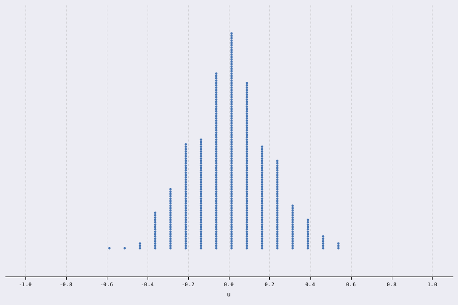
:::


### Quantile dot plot

A bus arrival time as 20 equally likely outcomes - the quantiles of a log-normal distribution (median 11.4 min) as
dots in bins of 1.25 min; the red band marks arrivals within 10 minutes and their probability (the original selects
the time by a click).

Source: [Vega - Quantile dot plot](https://vega.github.io/vega/examples/quantile-dot-plot/).


::: {.sourceClojure}
```clojure
(let [arrival (r/distribution :log-normal {:scale (m/log 11.4) :shape 0.2})
      select 10.0]
  (plot/render-image
   {:data (map (fn [i] {:minutes (r/icdf arrival (/ (+ 0.5 (double i)) 20.0))}) (range 20))
    :mapping {:x :minutes}
    :charts [(chart/rect {:x [0 select] :fill [178 34 34] :alpha 0.2})
             (chart/dotplot {:method :histogram :binwidth 1.25 :origin 0 :color [70 130 180]})
             (chart/text {:x select :y [:panel 0.95] :text (format "%.1f%%" (* 100.0 (r/cdf arrival select)))
                          :anchor [:left :top] :offset [3 0]})]
    :scales {:x {:domain [0 30]}}
    :labels {:x "Minutes until the bus arrives" :y nil}}
   {:width 600 :height 250}))
```
:::


::: {.clay-image}

:::


### Time units

20,000 flights (January - March 2001) per month, day of the month, weekday and hour: the number of flights (left)
and the mean delay (right) - every unit and measure of the original's selectors (its year is a single bar, left
out).

Source: [Vega - Time units](https://vega.github.io/vega/examples/time-units/). Data: U.S. flight delays and routes (20,000 flights), vega-datasets 3.3.1 `flights-20k.json` (https://cdn.jsdelivr.net/npm/vega-datasets@3.3.1/data/flights-20k.json); original: U.S. Bureau of Transportation Statistics; licence: other-open (vega-datasets `datapackage.json`).


::: {.sourceClojure}
```clojure
(let [flights (map #(assoc % :t (java.time.LocalDateTime/parse (:date %))) (nu/dataset :flights-20k))
      units [["month" #(month-names (dec (.getMonthValue ^java.time.LocalDateTime (:t %)))) (subvec month-names 0 3)]
             ["date" #(str (.getDayOfMonth ^java.time.LocalDateTime (:t %))) (mapv str (range 1 32))]
             ["day" #(weekdays (dec (.getValue (.getDayOfWeek ^java.time.LocalDateTime (:t %))))) weekdays]
             ["hours" #(str (.getHour ^java.time.LocalDateTime (:t %))) (mapv str (range 24))]]]
  (plot/render-image
   (plot/arrange
    (vec (for [[unit f domain] units
               [stat title] [[:count "flights"] [:mean "mean delay (min)"]]]
           {:data (map #(assoc % :unit (f %)) flights) :mapping {:x :unit :y :delay}
            :charts [(chart/bar {:stat stat})]
            :scales {:x {:domain domain}}
            :labels {:x unit :y title}}))
    {:columns 2})
   {:width 1000 :height 800}))
```
:::


::: {.clay-image}

:::


## Geographic Maps (Vega)


### Volcano contours

The Maunga Whau volcano's heights on a 10 m grid as filled contours (a gridded `:value`), north up.

Source: [Vega - Volcano contours](https://vega.github.io/vega/examples/volcano-contours/). Data: Mount Eden volcano elevation grid, vega-datasets 3.3.1 `volcano.json` (https://cdn.jsdelivr.net/npm/vega-datasets@3.3.1/data/volcano.json); original: R Datasets; licence: none listed - see vega-datasets (cite Vega as the source).


::: {.sourceClojure}
```clojure
(plot/render-image
 {:data (nu/dataset :volcano-vega) :mapping {:x :col :y :row :value :value}
  :charts [(chart/contour {:fill true :levels 10})]
  :scales {:y {:reverse true :axis false} :x {:axis false} :color {:range :viridis/viridis :title "height (m)"}}
  :aspect :iso
  :labels {:x nil :y nil}}
 {:width 700 :height 500})
```
:::


::: {.clay-image}

:::


## Tree Diagrams (Vega)


### Tree layout

The Flare class hierarchy as a tree, the root on the left and the leaves on the right (a horizontal dendrogram of
the parent links, its height axis reversed), groups named (the original also names the 220 leaves on a 1600 px tall
canvas; its tidy layout places groups by depth, the dendrogram aligns all leaves).

Source: [Vega - Tree layout](https://vega.github.io/vega/examples/tree-layout/). Data: Flare package and class hierarchy, vega-datasets 3.3.1 `flare.json` (https://cdn.jsdelivr.net/npm/vega-datasets@3.3.1/data/flare.json); licence: none listed - see vega-datasets (cite Vega as the source).


::: {.sourceClojure}
```clojure
(def flare (nu/dataset :flare-vega))
```
:::


::: {.sourceClojure}
```clojure
(def flare-tree (tree/from-parents flare {:id :id :parent :parent :name :name}))
```
:::


::: {.sourceClojure}
```clojure
(plot/render-image
 (assoc-in (plot/dendrogram flare-tree {:horizontal true :labels? false :group-labels? true}) [:scales :y :reverse] true)
 {:width 900 :height 800})
```
:::


::: {.clay-image}
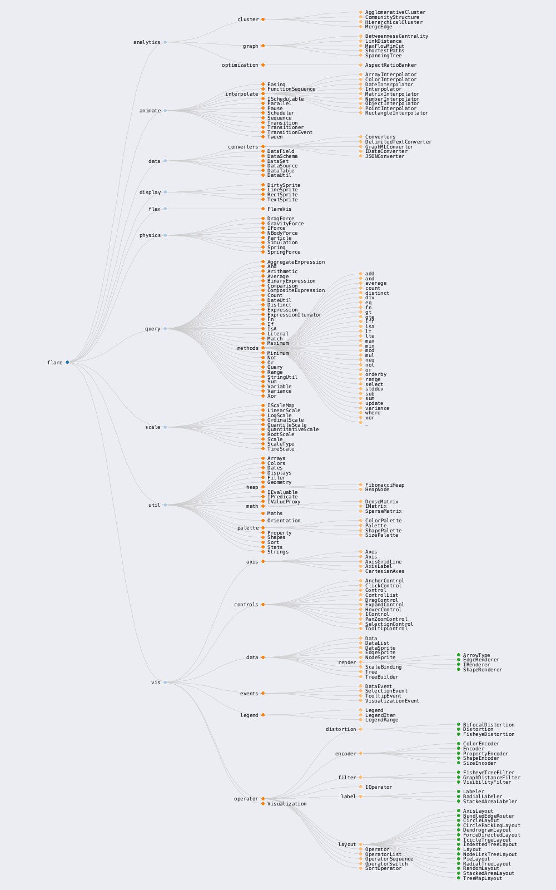
:::


### Radial tree layout

The same tree around a circle, every leaf named.

Source: [Vega - Radial tree layout](https://vega.github.io/vega/examples/radial-tree-layout/). Data: Flare package and class hierarchy, vega-datasets 3.3.1 `flare.json` (https://cdn.jsdelivr.net/npm/vega-datasets@3.3.1/data/flare.json); licence: none listed - see vega-datasets (cite Vega as the source).


::: {.sourceClojure}
```clojure
(plot/render-image
 (plot/dendrogram flare-tree {:circular true})
 {:width 900 :height 900})
```
:::


::: {.clay-image}

:::


### Treemap

The Flare classes as nested rectangles, areas by code size (levels below the root as the hierarchy).

Source: [Vega - Treemap](https://vega.github.io/vega/examples/treemap/). Data: Flare package and class hierarchy, vega-datasets 3.3.1 `flare.json` (https://cdn.jsdelivr.net/npm/vega-datasets@3.3.1/data/flare.json); licence: none listed - see vega-datasets (cite Vega as the source).


::: {.sourceClojure}
```clojure
(def flare-leaves
  "Flare classes (rows with a size) with `:path` - the names from below the root down to the class."
  (let [by-id (into {} (map (juxt :id identity) flare))
        path-of (fn [row] (->> (iterate (comp by-id :parent) row) (take-while some?) (map :name) reverse rest vec))]
    (mapv #(assoc % :path (path-of %)) (filter :size flare))))
```
:::


::: {.sourceClojure}
```clojure
(def flare-levels
  "Hierarchy accessors of `flare-leaves`: one per path level."
  (mapv (fn [i] #(get (:path %) i)) (range (reduce max (map (comp count :path) flare-leaves)))))
```
:::


::: {.sourceClojure}
```clojure
(plot/render-image
 {:data flare-leaves :mapping {:value :size :hierarchy flare-levels}
  :charts [(chart/treemap {:padding 1})]}
 {:width 1000 :height 700})
```
:::


::: {.clay-image}

:::


### Circle packing

The same hierarchy as nested circles.

Source: [Vega - Circle packing](https://vega.github.io/vega/examples/circle-packing/). Data: Flare package and class hierarchy, vega-datasets 3.3.1 `flare.json` (https://cdn.jsdelivr.net/npm/vega-datasets@3.3.1/data/flare.json); licence: none listed - see vega-datasets (cite Vega as the source).


::: {.sourceClojure}
```clojure
(plot/render-image
 {:data flare-leaves :mapping {:value :size :hierarchy flare-levels}
  :charts [(chart/pack {:padding 2})]}
 {:width 800 :height 800})
```
:::


::: {.clay-image}
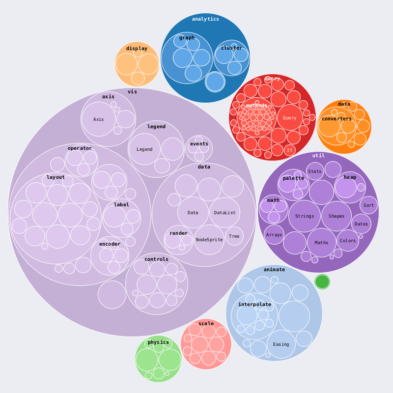
:::


### Sunburst

The same hierarchy as rings around the root (a partition in polar coordinates).

Source: [Vega - Sunburst](https://vega.github.io/vega/examples/sunburst/). Data: Flare package and class hierarchy, vega-datasets 3.3.1 `flare.json` (https://cdn.jsdelivr.net/npm/vega-datasets@3.3.1/data/flare.json); licence: none listed - see vega-datasets (cite Vega as the source).


::: {.sourceClojure}
```clojure
(plot/render-image
 {:data flare-leaves :mapping {:value :size :hierarchy flare-levels}
  :coord {:kind :polar}
  :charts [(chart/partition {:root true :leaf-labels false})]}
 {:width 800 :height 800})
```
:::


::: {.clay-image}

:::


## Network Diagrams (Vega)


### Edge bundling

Dependencies between Flare classes routed along the class tree (hierarchical edge bundling), coloured by the
source's top-level package.

Source: [Vega - Edge bundling](https://vega.github.io/vega/examples/edge-bundling/). Data: Flare class dependency network, vega-datasets 3.3.1 `flare-dependencies.json` (https://cdn.jsdelivr.net/npm/vega-datasets@3.3.1/data/flare-dependencies.json); licence: none listed - see vega-datasets (cite Vega as the source).


::: {.sourceClojure}
```clojure
(plot/render-image
 (plot/bundle (nu/dataset :flare-dependencies-vega) flare-tree {:from :source :to :target :scales {:color {:legend false}}})
 {:width 900 :height 900})
```
:::


::: {.clay-image}
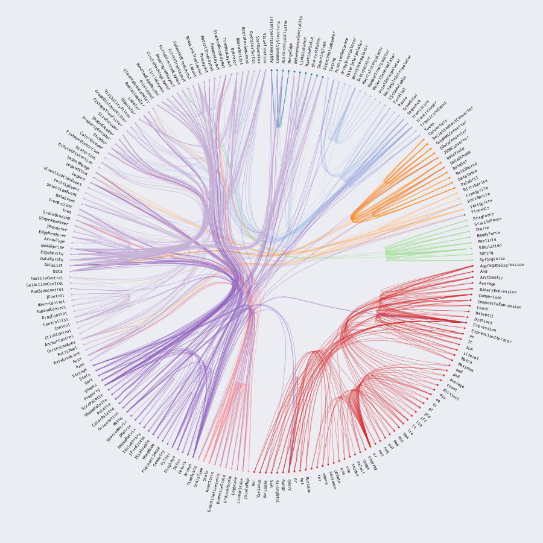
:::


### Force directed layout

Les Misérables characters linked by co-occurrence, laid out by forces (seeded), coloured by group, edge widths by
the number of shared chapters.

Source: [Vega - Force directed layout](https://vega.github.io/vega/examples/force-directed-layout/). Data: Les Misérables character coappearance network, vega-datasets 3.3.1 `miserables.json` (https://cdn.jsdelivr.net/npm/vega-datasets@3.3.1/data/miserables.json); original: D. E. Knuth, The Stanford GraphBase: A Platform for Combinatorial Computing, Addison-Wesley, Reading, MA (1993).; licence: notspecified (vega-datasets `datapackage.json`).


::: {.sourceClojure}
```clojure
(def miserables-nodes (map #(update % :group str) (nu/dataset :miserables-nodes)))
```
:::


::: {.sourceClojure}
```clojure
(def miserables-links (nu/dataset :miserables-links-vega))
```
:::


::: {.sourceClojure}
```clojure
(plot/render-image
 (plot/network miserables-links {:from :source :to :target :nodes miserables-nodes :id :index :rng (r/rng :mersenne 7)
                                 :mapping {:color :group} :edge-mapping {:size :value}
                                 :scales {:size {:range [0.5 4] :legend false} :color {:legend false}}})
 {:width 800 :height 700})
```
:::


::: {.clay-image}
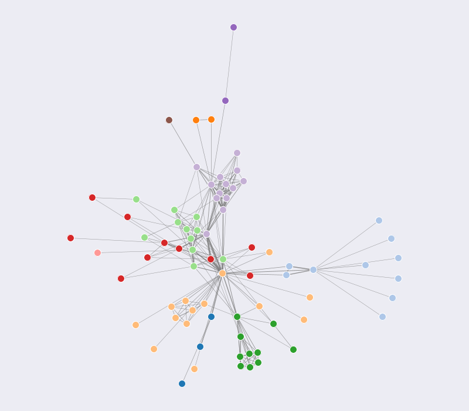
:::


### Reorderable matrix

The co-occurrence matrix of the characters ordered by group: a cell per pair of characters who meet, coloured by
their group when both share it (grey across groups) - the original reorders by dragging.

Source: [Vega - Reorderable matrix](https://vega.github.io/vega/examples/reorderable-matrix/). Data: Les Misérables character coappearance network, vega-datasets 3.3.1 `miserables.json` (https://cdn.jsdelivr.net/npm/vega-datasets@3.3.1/data/miserables.json); original: D. E. Knuth, The Stanford GraphBase: A Platform for Combinatorial Computing, Addison-Wesley, Reading, MA (1993).; licence: notspecified (vega-datasets `datapackage.json`).


::: {.sourceClojure}
```clojure
(let [by-index (into {} (map (juxt :index identity) miserables-nodes))
      order (mapv :name (sort-by (juxt #(parse-long (:group %)) :index) miserables-nodes))]
  (plot/render-image
   {:data (for [{:keys [source target]} miserables-links
                :let [s (by-index source) t (by-index target)]
                [a b] [[s t] [t s]]]
            {:x (:name a) :y (:name b) :group (if (= (:group a) (:group b)) (:group a) "across")})
    :mapping {:x :x :y :y :color :group}
    :charts [(chart/tile {:stroke-color :white :stroke-width 0.5})]
    :scales {:x {:domain order} :y {:domain order :reverse true}
             :color {:domain (conj (vec (sort-by parse-long (distinct (map :group miserables-nodes)))) "across")
                     :range (conj (vec (take 11 (cycle (c/palette :category10)))) [190 190 190]) :legend false}}
    :theme {:text {:tick-label {:size 6}}}
    :labels {:x nil :y nil}}
   {:width 900 :height 900}))
```
:::


::: {.clay-image}
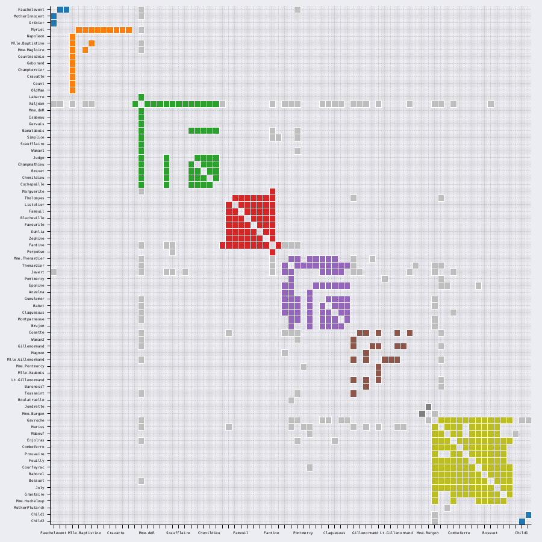
:::


### Arc diagram

The same co-occurrences as arcs above the characters, ordered by group.

Source: [Vega - Arc diagram](https://vega.github.io/vega/examples/arc-diagram/). Data: Les Misérables character coappearance network, vega-datasets 3.3.1 `miserables.json` (https://cdn.jsdelivr.net/npm/vega-datasets@3.3.1/data/miserables.json); original: D. E. Knuth, The Stanford GraphBase: A Platform for Combinatorial Computing, Addison-Wesley, Reading, MA (1993).; licence: notspecified (vega-datasets `datapackage.json`).


::: {.sourceClojure}
```clojure
(plot/render-image
 (plot/arc miserables-links {:from :source :to :target :nodes miserables-nodes :id :index
                             :order (mapv :index (sort-by (juxt #(parse-long (:group %)) :index) miserables-nodes))
                             :mapping {:color :group} :scales {:color {:legend false}}})
 {:width 1000 :height 450})
```
:::


::: {.clay-image}
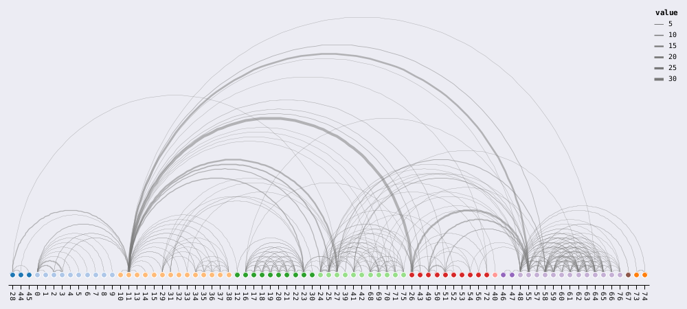
:::


## Other Chart Types (Vega)


### Density heatmaps

Miles per gallon against acceleration as a kernel density raster per origin (each panel its own density).

Source: [Vega - Density heatmaps](https://vega.github.io/vega/examples/density-heatmaps/). Data: Car specifications and fuel economy, vega-datasets 3.3.1 `cars.json` (https://cdn.jsdelivr.net/npm/vega-datasets@3.3.1/data/cars.json); original: StatLib Datasets Archive; licence: notspecified (vega-datasets `datapackage.json`).


::: {.sourceClojure}
```clojure
(plot/render-image
 {:data (filter #(and (:acceleration %) (:miles-per-gallon %)) cars)
  :mapping {:x :acceleration :y :miles-per-gallon :facet-col :origin}
  :charts [(chart/field)]
  :scales {:color {:range :viridis/viridis}}
  :labels {:x "Acceleration" :y "Miles_per_Gallon"}}
 {:width 1000 :height 350})
```
:::


::: {.clay-image}

:::


### Beeswarm plot

Les Misérables characters per group, packed without overlap (a beeswarm; the original simulates forces).

Source: [Vega - Beeswarm plot](https://vega.github.io/vega/examples/beeswarm-plot/). Data: Les Misérables character coappearance network, vega-datasets 3.3.1 `miserables.json` (https://cdn.jsdelivr.net/npm/vega-datasets@3.3.1/data/miserables.json); original: D. E. Knuth, The Stanford GraphBase: A Platform for Combinatorial Computing, Addison-Wesley, Reading, MA (1993).; licence: notspecified (vega-datasets `datapackage.json`).


::: {.sourceClojure}
```clojure
(plot/render-image
 {:data (map #(assoc % :g (parse-long (:group %))) miserables-nodes) :mapping {:x :g :color :group}
  :charts [(chart/beeswarm {:size 18})]
  :scales {:x {:ticks (vec (range 11))} :color {:legend false}}
  :labels {:x "group" :y nil}}
 {:width 800 :height 350})
```
:::


::: {.clay-image}

:::


### Calendar view

Daily change of the S&P 500 close, 2000-2020: a row of panels per year, a cell per trading day (week of the year ×
weekday), diverging around 0.

Source: [Vega - Calendar view](https://vega.github.io/vega/examples/calendar-view/). Data: S&P 500 daily index values and volume, vega-datasets 3.3.1 `sp500-2000.csv` (https://cdn.jsdelivr.net/npm/vega-datasets@3.3.1/data/sp500-2000.csv); original: Yahoo Finance; licence: none listed - see vega-datasets (cite Vega as the source).


::: {.sourceClojure}
```clojure
(let [days (map #(update % :date local-date) (nu/dataset :sp500-2000))
      week-fields (java.time.temporal.WeekFields/of java.time.DayOfWeek/SUNDAY 1)]
  (plot/render-image
   {:data (map (fn [prev {:keys [^LocalDate date close]}]
                 {:year (str (.getYear date)) :week (.get date (.weekOfYear week-fields))
                  :day (weekdays (dec (.getValue (.getDayOfWeek date))))
                  :change (/ (- (double close) (double (:close prev))) (double (:close prev)))})
               days (rest days))
    :mapping {:x :week :y :day :color :change :facet-row :year}
    :charts [(chart/tile)]
    :scales {:y {:domain (subvec weekdays 0 5) :reverse true :axis false} :x {:axis false}
             :color {:range [[197 27 125] [247 247 247] [77 146 33]] :midpoint 0 :domain [-0.06 0.06]
                     :formatter #(format "%.0f%%" (* 100.0 (double %))) :title "change"}}
    :theme {:facet {:gap 2} :text {:strip {:size 8}}}
    :labels {:x nil :y nil}}
   {:width 900 :height 800}))
```
:::


::: {.clay-image}
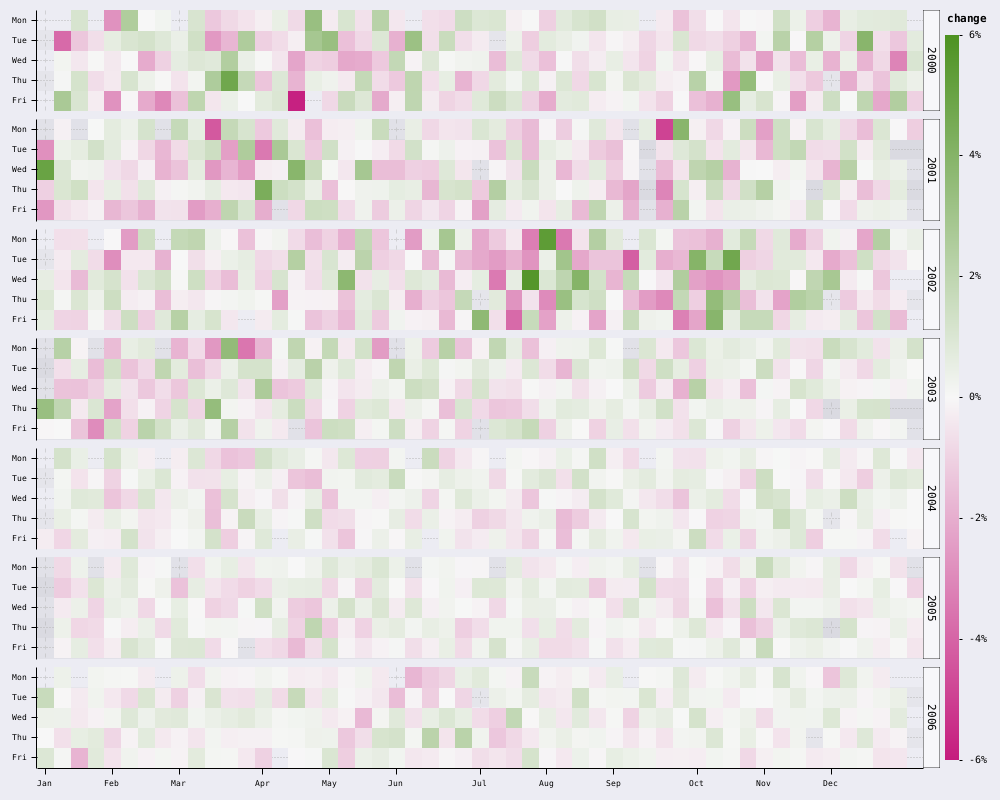
:::


### Packed bubble chart

Sixteen amounts as packed circles (the original packs them by forces).

Source: [Vega - Packed bubble chart](https://vega.github.io/vega/examples/packed-bubble-chart/).


::: {.sourceClojure}
```clojure
(plot/render-image
 {:data (map (fn [k v] {:category (str k) :amount v}) "ABCDEFGHIJKLMNOP"
             [0.28 0.55 0.43 0.91 0.81 0.53 0.19 0.87 0.28 0.55 0.43 0.91 0.81 0.53 0.19 0.87])
  :mapping {:value :amount :hierarchy [:category] :color :category}
  :charts [(chart/pack {:padding 3})]
  :legend false}
 {:width 500 :height 500})
```
:::


::: {.clay-image}
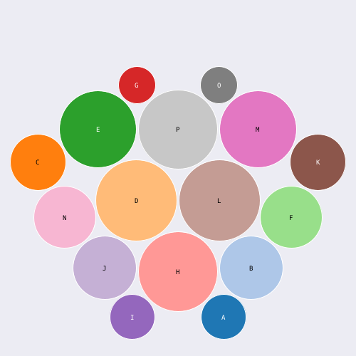
:::


## Custom Designs (Vega)


### Budget forecasts

Each year's budget forecast of the surplus / deficit (% of GDP, grey lines) against the actual balance (black).

Source: [Vega - Budget forecasts](https://vega.github.io/vega/examples/budget-forecasts/). Data: U.S. federal budget balances and forecasts, vega-datasets 3.3.1 `budgets.json` (https://cdn.jsdelivr.net/npm/vega-datasets@3.3.1/data/budgets.json); original: Office of Management and Budget; licence: other-pd (vega-datasets `datapackage.json`).


::: {.sourceClojure}
```clojure
(let [budgets (nu/dataset :budgets)]
  (plot/render-image
   {:data budgets :mapping {:x :forecast-year :y :value :group :budget-year}
    :charts [(chart/rule {:y 0 :color :black})
             (chart/line {:color [170 170 170] :width 1})
             (chart/line {:data (filter #(= (:forecast-year %) (dec (long (:budget-year %)))) budgets) :mapping {:group nil}
                          :color :black :width 3})]
    :scales {:x {:formatter #(str (m/round (double %)))}}
    :labels {:x nil :y "Surplus / deficit (% of GDP)"}}
   {:width 800 :height 400}))
```
:::


::: {.clay-image}
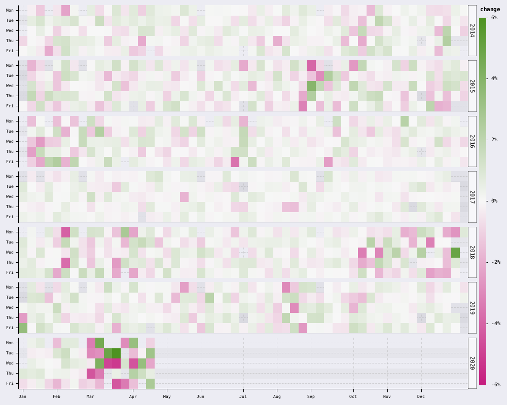
:::


### Annual temperature

Seattle's hourly temperature normals over the year, each hour of the day a row from 6 AM, its area scaled into the
row (ribbons from the row's base).

Source: [Vega - Annual temperature](https://vega.github.io/vega/examples/annual-temperature/). Data: Seattle hourly climate normals for 1981–2010, vega-datasets 3.3.1 `seattle-weather-hourly-normals.csv` (https://cdn.jsdelivr.net/npm/vega-datasets@3.3.1/data/seattle-weather-hourly-normals.csv); original: NOAA National Climatic Data Center (NCDC); licence: other-pd (vega-datasets `datapackage.json`).


::: {.sourceClojure}
```clojure
(let [hours (map #(mod (+ 6 %) 24) (range 24))
      row-of (zipmap hours (range 23 -1 -1))
      rows (for [{:keys [date temperature]} (nu/dataset :seattle-weather-hourly-normals)
                 :let [t (java.time.LocalDateTime/parse date)]]
             {:date (.toLocalDate t) :hour (.getHour t) :temperature temperature})
      [lo hi] ((juxt #(reduce min %) #(reduce max %)) (map :temperature rows))]
  (plot/render-image
   {:data (map (fn [{:keys [hour temperature] :as r}]
                 (let [base (double (row-of hour))]
                   (assoc r :base base :top (+ base (* 0.95 (/ (- (double temperature) lo) (- hi lo)))))))
               rows)
    :mapping {:x :date :group :hour}
    :charts [(chart/ribbon {:mapping {:ymin :base :ymax :top} :color [70 130 180] :stroke-color [40 80 120] :stroke-width 0.5})]
    :scales {:y {:ticks (mapv #(+ 0.5 (double (row-of %))) hours)
                 :formatter (let [label (into {} (map (fn [h] [(+ 0.5 (double (row-of h))) (format "%02d:00" h)]) hours))]
                              #(label (double %) ""))}
             :x {:formatter #(.format (DateTimeFormatter/ofPattern "MMM" Locale/ENGLISH) ^TemporalAccessor %)}}
    :labels {:title "Seattle Annual Temperatures" :x nil :y nil}}
   {:width 800 :height 650}))
```
:::


::: {.clay-image}

:::


### Flight passengers

Passenger traffic at Seattle-Tacoma airport compared with the same month a year before, October 2019 - April 2020.

Source: [Vega - Flight passengers](https://vega.github.io/vega/examples/flight-passengers/).


::: {.sourceClojure}
```clojure
(plot/render-image
 {:data (map (fn [[date curr prev]] {:date (LocalDate/parse date) :change (- (/ (double curr) (double prev)) 1.0)})
             [["2019-10-01" 4292562 4044655] ["2019-11-01" 3892767 3817267] ["2019-12-01" 4320042 3937790]
              ["2020-01-01" 3764192 3560276] ["2020-02-01" 3620083 3192656] ["2020-03-01" 1824676 4111729]
              ["2020-04-01" 259153 4033516]])
  :mapping {:x :date :y :change}
  :charts [(chart/rule {:y 0 :color [120 120 120]}) (chart/line {:color [70 130 180] :width 3})
           (chart/scatter {:color [70 130 180] :size 8})]
  :scales {:y {:formatter #(format "%+.0f%%" (* 100.0 (double %)))}
           :x {:formatter #(.format (DateTimeFormatter/ofPattern "MMM yyyy" Locale/ENGLISH) ^TemporalAccessor %)}}
  :labels {:title "Passenger Traffic at Seattle-Tacoma International Airport, One Year to the Next" :x nil
           :y "change from the prior year"}}
 {:width 800 :height 350})
```
:::


::: {.clay-image}
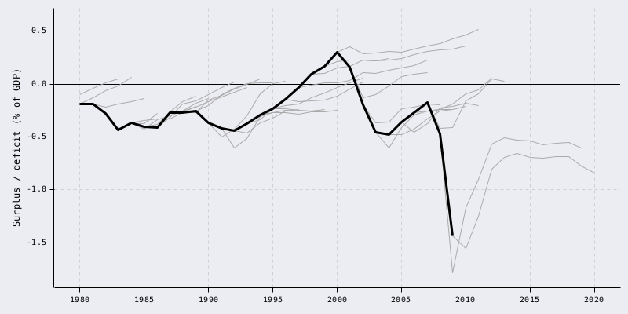
:::


### Timelines

The first five US presidents: their lives (thin) and terms (thick, red), with four events as labelled rules (labels
staggered in an empty top row; the original tilts them above the chart).

Source: [Vega - Timelines](https://vega.github.io/vega/examples/timelines/).


::: {.sourceClojure}
```clojure
(let [day (fn [ms] (.toLocalDate (.atZone (java.time.Instant/ofEpochMilli ms) java.time.ZoneOffset/UTC)))
      people (map (fn [[label born died enter leave]]
                    {:label label :born (day born) :died (day died) :enter (day enter) :leave (day leave)})
                  [["Washington" -7506057600000 -5366196000000 -5701424400000 -5453884800000]
                   ["Adams" -7389766800000 -4528285200000 -5453884800000 -5327740800000]
                   ["Jefferson" -7154586000000 -4528285200000 -5327740800000 -5075280000000]
                   ["Madison" -6904544400000 -4213184400000 -5075280000000 -4822819200000]
                   ["Monroe" -6679904400000 -4370518800000 -4822819200000 -4570358400000]])
      events [["Decl. of Independence" (LocalDate/of 1776 7 4)] ["U.S. Constitution" (LocalDate/of 1789 3 4)]
              ["Louisiana Purchase" (LocalDate/of 1803 4 30)] ["Monroe Doctrine" (LocalDate/of 1823 12 2)]]
      names (mapv :label people)]
  (plot/render-image
   {:data people
    :charts [(chart/rule {:x (mapv second events) :color [136 136 136]})
             (chart/text {:x (mapv second events) :y [[:panel 1.0] [:panel 0.93] [:panel 1.0] [:panel 0.93]]
                          :text (mapv first events) :anchor [:left :top] :offset [3 -2] :size 10})
             (chart/rect {:mapping {:x0 :born :x1 :died :y0 :label :y1 :label} :fill [85 85 119] :band-width 0.08})
             (chart/rect {:mapping {:x0 :enter :x1 :leave :y0 :label :y1 :label} :fill [238 68 68] :band-width 0.25})
             (chart/text {:mapping {:x :born :y :label :label :label} :anchor [:left :bottom] :offset [0 6] :size 10})]
    :scales {:y {:domain (into [" "] names) :reverse true :axis false}}
    :labels {:x nil :y nil}}
   {:width 800 :height 380}))
```
:::


::: {.clay-image}

:::


### U district cuisine

Restaurants of Seattle's University District by latitude (south to north), a density ridge per cuisine coloured by
kind, the cross streets as rules.

Source: [Vega - U district cuisine](https://vega.github.io/vega/examples/u-district-cuisine/). Data: Restaurant and cafe latitudes in Seattle's University District, vega-datasets 3.3.1 `udistrict.json` (https://cdn.jsdelivr.net/npm/vega-datasets@3.3.1/data/udistrict.json); licence: none listed - see vega-datasets (cite Vega as the source).


::: {.sourceClojure}
```clojure
(let [categories ["coffee" "drinks" "bubbletea" "vietnamese" "thai" "chinese" "japanese" "korean" "mideastern" "indian"
                  "burgers" "pizza" "american" "breakfast" "bakeries" "seafood" "hawaiian" "veg" "latin"]
      names ["Coffee" "Pubs, Lounges" "Bubble Tea, Juice" "Vietnamese" "Thai" "Chinese" "Japanese" "Korean"
             "Middle Eastern" "Indian, Pakistani" "Pizza" "Burgers" "American" "Breakfast, Brunch" "Bakeries" "Seafood"
             "Hawaiian" "Vegetarian, Vegan" "Mexican, Latin American"]
      colors ["#7f7f7f" "#7f7f7f" "#7f7f7f" "#1f77b4" "#1f77b4" "#1f77b4" "#1f77b4" "#1f77b4" "#2ca02c" "#2ca02c"
              "#ff7f0e" "#ff7f0e" "#ff7f0e" "#8c564b" "#8c564b" "#e377c2" "#e377c2" "#bcbd22" "#17becf"]
      name-of (zipmap categories names)
      streets [["Boat St." 47.6516] ["40th St." 47.655363] ["42nd St." 47.6584] ["45th St." 47.6614]
               ["50th St." 47.664924] ["55th St." 47.668519]]]
  (plot/render-image
   {:data (keep #(when-let [n (name-of (:key %))] (assoc % :cuisine n)) (nu/dataset :udistrict))
    :mapping {:x :lat :y :cuisine :color :cuisine}
    :charts [(chart/rule {:x (mapv second streets) :color [200 200 200]})
             (chart/text {:x (mapv second streets) :y [:panel 1.0] :text (mapv first streets) :anchor [:center :top]
                          :offset [0 -2] :size 9 :background [236 236 243 200]})
             (chart/density {:bandwidth 0.0005 :fill :color :alpha 0.8 :overlap 2.3})]
    :scales {:y {:domain names :reverse true} :color {:domain names :range (mapv c/to-color colors) :legend false}}
    :labels {:x "latitude" :y nil}}
   {:width 800 :height 800}))
```
:::


::: {.clay-image}

:::


### Warming stripes

Global temperature anomaly per year, 1880 onward, as stripes from blue (cold) to red (warm) - E. Hawkins' design.

Source: [Vega - Warming stripes](https://vega.github.io/vega/examples/warming-stripes/). Data: Global land and ocean temperature anomalies, vega-datasets 3.3.1 `global-temp.csv` (https://cdn.jsdelivr.net/npm/vega-datasets@3.3.1/data/global-temp.csv); original: NASA Goddard Institute for Space Studies; licence: other-pd (vega-datasets `datapackage.json`).


::: {.sourceClojure}
```clojure
(plot/render-image
 {:data (nu/dataset :global-temp) :mapping {:x :year :y (constantly "1") :color :temp}
  :charts [(chart/tile)]
  :scales {:y {:axis false}
           :color {:range (mapv c/to-color (reverse ["#67000D" "#A50F15" "#CB181D" "#EF3B2C" "#FB6A4A" "#FC9272" "#FCBBA1"
                                                     "#FEE0D2" "#FFFFFF" "#DEEBF7" "#C6DBEF" "#9ECAE1" "#6BAED6" "#4292C6"
                                                     "#2171B5" "#08519C" "#08306B"]))
                   :title "°C"}
           :x {:formatter #(str (m/round (double %)))}}
  :labels {:title "Global temperature change (1880 onward)" :x nil :y nil}}
 {:width 900 :height 300})
```
:::


::: {.clay-image}
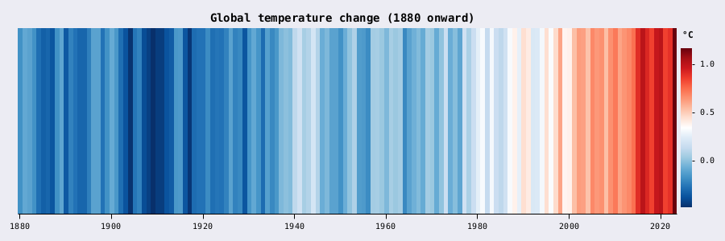
:::


## Not reproduced

The gallery examples left out - interactive (selection, brushing, tooltips, widgets; two are shown above as static
variants), geographic, animated, or needing a feature cljplot2 doesn't have.

| Example | Reason |
|---|---|
| [Ternary chart](https://vega.github.io/vega-lite/examples/ternary.html) | not supported: ternary coordinates |
| [Layered Plot with Dual-Axis](https://vega.github.io/vega-lite/examples/layer_dual_axis.html) | not supported: dual y axis |
| [Choropleth of Unemployment Rate per County](https://vega.github.io/vega-lite/examples/geo_choropleth.html) | geographic (no maps in cljplot2) |
| [One Dot per Zipcode in the U.S.](https://vega.github.io/vega-lite/examples/geo_circle.html) | geographic (no maps in cljplot2) |
| [One Dot per Airport in the U.S. Overlayed on Geoshape](https://vega.github.io/vega-lite/examples/geo_layer.html) | geographic (no maps in cljplot2) |
| [Rules (line segments) Connecting SEA to every Airport Reachable via Direct Flights](https://vega.github.io/vega-lite/examples/geo_rule.html) | geographic (no maps in cljplot2) |
| [Three Choropleths Representing Disjoint Data from the Same Table](https://vega.github.io/vega-lite/examples/geo_repeat.html) | geographic (no maps in cljplot2) |
| [U.S. State Capitals Overlayed on a Map of U.S.](https://vega.github.io/vega-lite/examples/geo_text.html) | geographic (no maps in cljplot2) |
| [Line between Airports in the U.S.](https://vega.github.io/vega-lite/examples/geo_line.html) | geographic (no maps in cljplot2) |
| [Income in the U.S. by State, Faceted over Income Brackets](https://vega.github.io/vega-lite/examples/geo_trellis.html) | geographic (no maps in cljplot2) |
| [London Tube Lines](https://vega.github.io/vega-lite/examples/geo_layer_line_london.html) | geographic (no maps in cljplot2) |
| [Projection explorer](https://vega.github.io/vega-lite/examples/geo_params_projections.html) | geographic (no maps in cljplot2) |
| [Earthquakes Example](https://vega.github.io/vega-lite/examples/interactive_geo_earthquakes.html) | geographic (no maps in cljplot2) |
| [Faceted County-Level Species Habitat Maps](https://vega.github.io/vega-lite/examples/interactive_geo_facet_species.html) | geographic (no maps in cljplot2) |
| [Bar Chart with Highlighting on Hover and Selection on Click](https://vega.github.io/vega-lite/examples/interactive_bar_select_highlight.html) | interactive |
| [Histogram with Full-Height Hover Targets for Tooltip](https://vega.github.io/vega-lite/examples/interactive_histogram_full_height_hover.html) | interactive |
| [Scatterplot with External Links and Tooltips](https://vega.github.io/vega-lite/examples/point_href.html) | interactive |
| [Rectangular Brush](https://vega.github.io/vega-lite/examples/interactive_brush.html) | interactive |
| [Area Chart with Rectangular Brush](https://vega.github.io/vega-lite/examples/interactive_area_brush.html) | interactive |
| [Paintbrush Highlight](https://vega.github.io/vega-lite/examples/interactive_paintbrush.html) | interactive |
| [Scatterplot Pan & Zoom](https://vega.github.io/vega-lite/examples/selection_translate_scatterplot_drag.html) | interactive |
| [Query Widgets](https://vega.github.io/vega-lite/examples/interactive_query_widgets.html) | interactive |
| [Interactive Average](https://vega.github.io/vega-lite/examples/selection_layer_bar_month.html) | interactive |
| [Multi Series Line Chart with an Interactive Line Highlight](https://vega.github.io/vega-lite/examples/interactive_line_hover.html) | interactive |
| [Multi Series Line Chart with an Interactive Point Highlight](https://vega.github.io/vega-lite/examples/interactive_line_point_hover.html) | interactive |
| [Multi Series Line Chart with Labels](https://vega.github.io/vega-lite/examples/interactive_multi_line_label.html) | interactive |
| [Multi Series Line Chart with Tooltip via Pivot](https://vega.github.io/vega-lite/examples/interactive_multi_line_pivot_tooltip.html) | interactive |
| [Multi Series Line Chart with Tooltip](https://vega.github.io/vega-lite/examples/interactive_multi_line_tooltip.html) | interactive |
| [Isotype Grid](https://vega.github.io/vega-lite/examples/isotype_grid.html) | interactive |
| [Brushing Scatter Plot to show data on a table](https://vega.github.io/vega-lite/examples/brush_table.html) | interactive |
| [Selectable Heatmap](https://vega.github.io/vega-lite/examples/selection_heatmap.html) | interactive |
| [Bar Chart with a Minimap](https://vega.github.io/vega-lite/examples/bar_count_minimap.html) | interactive |
| [Interactive Index Chart](https://vega.github.io/vega-lite/examples/interactive_index_chart.html) ([Vega](https://vega.github.io/vega/examples/stock-index-chart/)) | interactive |
| [Focus + Context - Smooth Histogram Zooming](https://vega.github.io/vega-lite/examples/interactive_bin_extent.html) | interactive |
| [Dynamic Color Legend](https://vega.github.io/vega-lite/examples/dynamic_color_legend.html) | interactive |
| [Search Input](https://vega.github.io/vega-lite/examples/param_search_input.html) | interactive |
| [Change zorder on hover](https://vega.github.io/vega-lite/examples/selection_type_point_zorder.html) | interactive |
| [Overview and Detail](https://vega.github.io/vega-lite/examples/interactive_overview_detail.html) ([Vega](https://vega.github.io/vega/examples/overview-plus-detail/)) | interactive |
| [Crossfilter (Filter)](https://vega.github.io/vega-lite/examples/interactive_crossfilter.html) ([Vega](https://vega.github.io/vega/examples/crossfilter-flights/)) | interactive |
| [Crossfilter (Highlight)](https://vega.github.io/vega-lite/examples/interactive_layered_crossfilter.html) | interactive |
| [Interactive Dashboard with Cross Highlight](https://vega.github.io/vega-lite/examples/interactive_concat_layer.html) | interactive |
| [Seattle Weather Exploration](https://vega.github.io/vega-lite/examples/interactive_seattle_weather.html) | interactive |
| [Connections among Major U.S. Airports.](https://vega.github.io/vega-lite/examples/airport_connections.html) ([Vega](https://vega.github.io/vega/examples/airport-connections/)) | interactive |
| [An interactive scatter plot of global health statistics by country and year.](https://vega.github.io/vega-lite/examples/interactive_global_development.html) ([Vega](https://vega.github.io/vega/examples/global-development/)) | interactive |
| [Labeled scatter plot](https://vega.github.io/vega/examples/labeled-scatter-plot/) (Vega) | not supported: label placement |
| [Hypothetical outcome plots](https://vega.github.io/vega/examples/hypothetical-outcome-plots/) (Vega) | animated |
| [County unemployment](https://vega.github.io/vega/examples/county-unemployment/) (Vega) | geographic (no maps in cljplot2) |
| [Dorling cartogram](https://vega.github.io/vega/examples/dorling-cartogram/) (Vega) | geographic (no maps in cljplot2) |
| [World map](https://vega.github.io/vega/examples/world-map/) (Vega) | geographic (no maps in cljplot2) |
| [Earthquakes](https://vega.github.io/vega/examples/earthquakes/) (Vega) | geographic (no maps in cljplot2) |
| [Projections](https://vega.github.io/vega/examples/projections/) (Vega) | geographic (no maps in cljplot2) |
| [Zoomable world map](https://vega.github.io/vega/examples/zoomable-world-map/) (Vega) | geographic (no maps in cljplot2) |
| [Distortion comparison](https://vega.github.io/vega/examples/distortion-comparison/) (Vega) | geographic (no maps in cljplot2) |
| [Annual precipitation](https://vega.github.io/vega/examples/annual-precipitation/) (Vega) | geographic (no maps in cljplot2) |
| [Parallel coordinates interactive](https://vega.github.io/vega/examples/parallel-coordinates-interactive/) (Vega) | interactive |
| [Word cloud](https://vega.github.io/vega/examples/word-cloud/) (Vega) | not supported: word cloud layout |
| [Clock](https://vega.github.io/vega/examples/clock/) (Vega) | animated |
| [Watch](https://vega.github.io/vega/examples/watch/) (Vega) | animated |
| [Earthquakes globe](https://vega.github.io/vega/examples/earthquakes-globe/) (Vega) | geographic (no maps in cljplot2) |
| [Serpentine timeline](https://vega.github.io/vega/examples/serpentine-timeline/) (Vega) | not supported: serpentine path |
| [Brushing scatter plots](https://vega.github.io/vega/examples/brushing-scatter-plots/) (Vega) | interactive |
| [Zoomable scatter plot](https://vega.github.io/vega/examples/zoomable-scatter-plot/) (Vega) | interactive |
| [Zoomable binned plot](https://vega.github.io/vega/examples/zoomable-binned-plot/) (Vega) | interactive |
| [Pi monte carlo](https://vega.github.io/vega/examples/pi-monte-carlo/) (Vega) | animated |
| [Zoomable circle packing](https://vega.github.io/vega/examples/zoomable-circle-packing/) (Vega) | interactive |
| [Table scrollbar](https://vega.github.io/vega/examples/table-scrollbar/) (Vega) | interactive |
| [Bar line toggle](https://vega.github.io/vega/examples/bar-line-toggle/) (Vega) | interactive |
| [Map with tooltip](https://vega.github.io/vega/examples/map-with-tooltip/) (Vega) | interactive |
| [Pacman](https://vega.github.io/vega/examples/pacman/) (Vega) | animated |
| [Platformer](https://vega.github.io/vega/examples/platformer/) (Vega) | animated |


```{=html}
<div style="background-color:grey;height:2px;width:100%;"></div>
```


```{=html}
<div><pre><small><small>source: notebooks/galleries/vega.clj</small></small></pre></div>
```